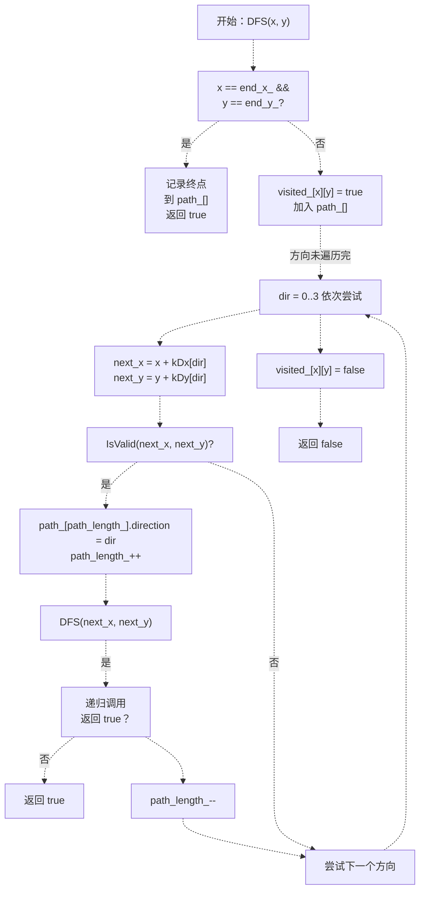
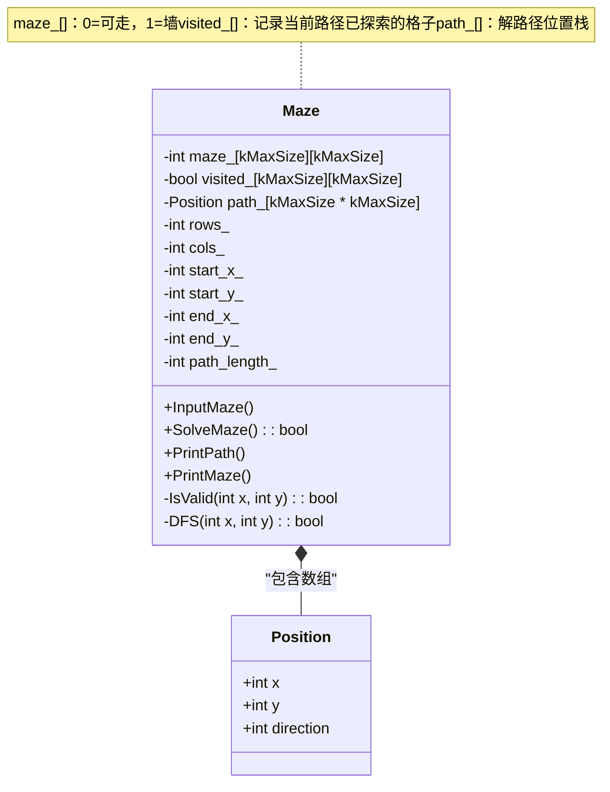
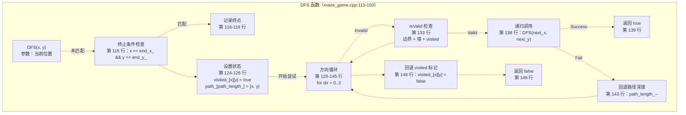
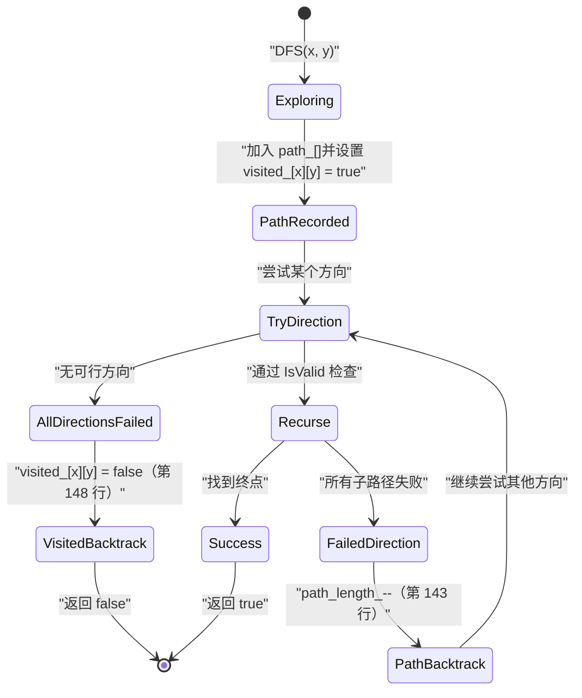
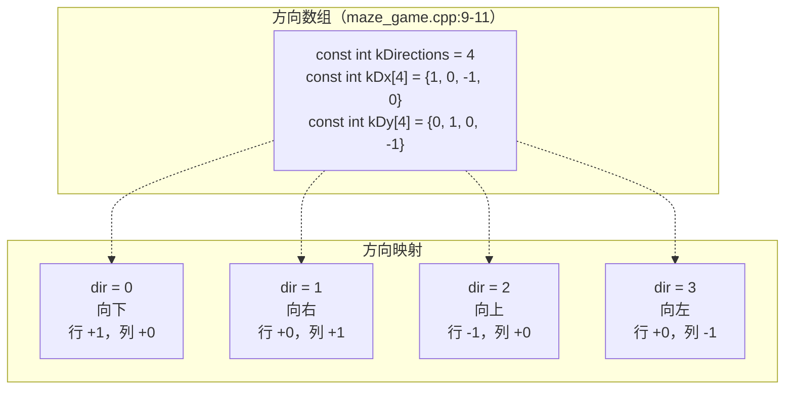
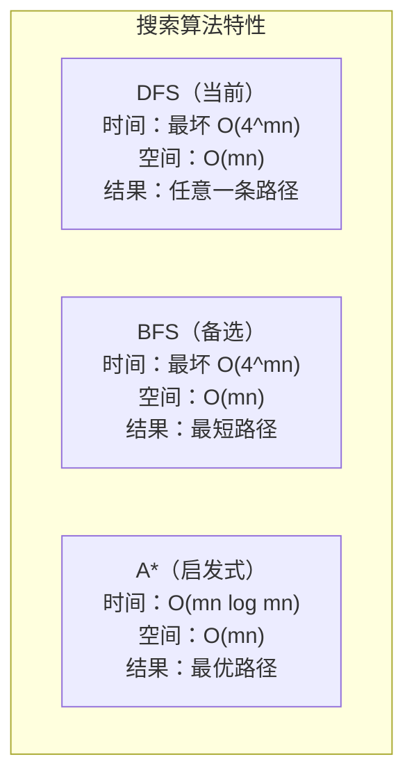

# DFS 回溯算法

> **相关源文件**
> * [p3/CODE_EXPLANATION.md](https://github.com/lilong555/DataStruct/blob/660fbbaa/p3/CODE_EXPLANATION.md)
> * [p3/maze_game.cpp](https://github.com/lilong555/DataStruct/blob/660fbbaa/p3/maze_game.cpp)

## 目的与范围

本页说明项目三「迷宫寻路系统」中使用的深度优先搜索（DFS）回溯算法实现。该算法在基于网格的迷宫上进行递归探索，以寻找从起点到终点的一条路径。如需了解迷宫游戏的编译与测试流程，请参见 [Building and Testing](编译与测试.md)。如需项目三总体说明，请参见 [Project 3: Maze Game](项目三-勇闯迷宫游戏.md)。

**来源：** [p3/maze_game.cpp L1-L249](https://github.com/lilong555/DataStruct/blob/660fbbaa/p3/maze_game.cpp#L1-L249)

 [p3/CODE_EXPLANATION.md L1-L253](https://github.com/lilong555/DataStruct/blob/660fbbaa/p3/CODE_EXPLANATION.md#L1-L253)

---

## 算法概览

`Maze` 类中的 DFS 回溯实现，通过递归探索从起点出发的所有可行路径，直到找到终点为止。算法使用 `visited_` 状态数组避免在当前路径中形成环，并用 `path_` 作为“路径栈”记录解。

### 高层流程



**来源：** [p3/maze_game.cpp L113-L150](https://github.com/lilong555/DataStruct/blob/660fbbaa/p3/maze_game.cpp#L113-L150)

 [p3/CODE_EXPLANATION.md L70-L101](https://github.com/lilong555/DataStruct/blob/660fbbaa/p3/CODE_EXPLANATION.md#L70-L101)

---

## 核心数据结构

算法依赖 `Maze` 类的 3 组核心私有成员数据结构。

### Position 结构体

`Position` 结构体封装了解路径上每个位置的状态信息：

| 字段 | 类型 | 用途 |
| --- | --- | --- |
| `x` | `int` | 行坐标（0 基） |
| `y` | `int` | 列坐标（0 基） |
| `direction` | `int` | 到达该位置后，下一步要走的方向下标（0-3） |

**来源：** [p3/maze_game.cpp L31-L35](https://github.com/lilong555/DataStruct/blob/660fbbaa/p3/maze_game.cpp#L31-L35)

 [p3/CODE_EXPLANATION.md L28-L37](https://github.com/lilong555/DataStruct/blob/660fbbaa/p3/CODE_EXPLANATION.md#L28-L37)

### 数据结构关系



**来源：** [p3/maze_game.cpp L17-L52](https://github.com/lilong555/DataStruct/blob/660fbbaa/p3/maze_game.cpp#L17-L52)

 [p3/CODE_EXPLANATION.md L42-L57](https://github.com/lilong555/DataStruct/blob/660fbbaa/p3/CODE_EXPLANATION.md#L42-L57)

### 关键成员变量

| 变量 | 类型 | 维度 | 用途 |
| --- | --- | --- | --- |
| `maze_` | `int[][]` | `kMaxSize × kMaxSize` | 迷宫网格（0=可走，1=墙） |
| `visited_` | `bool[][]` | `kMaxSize × kMaxSize` | 标记当前路径中已探索的格子，避免成环 |
| `path_` | `Position[]` | `kMaxSize * kMaxSize` | 存放解路径的位置序列（栈） |
| `path_length_` | `int` | 标量 | `path_` 的当前深度 |

**来源：** [p3/maze_game.cpp L38-L47](https://github.com/lilong555/DataStruct/blob/660fbbaa/p3/maze_game.cpp#L38-L47)

 [p3/CODE_EXPLANATION.md L42-L52](https://github.com/lilong555/DataStruct/blob/660fbbaa/p3/CODE_EXPLANATION.md#L42-L52)

---

## DFS 实现

核心 DFS 算法位于 `Maze::DFS`，通过递归实现深度优先探索。

### 函数签名与入口

公有方法 `SolveMaze()` 会初始化搜索状态，并从起点调用 DFS：

```cpp
bool Maze::SolveMaze() {
  std::memset(visited_, false, sizeof(visited_));
  path_length_ = 0;
  return DFS(start_x_, start_y_);
}
```

**来源：** [p3/maze_game.cpp L156-L160](https://github.com/lilong555/DataStruct/blob/660fbbaa/p3/maze_game.cpp#L156-L160)

### DFS 递归函数结构



**来源：** [p3/maze_game.cpp L113-L150](https://github.com/lilong555/DataStruct/blob/660fbbaa/p3/maze_game.cpp#L113-L150)

 [p3/CODE_EXPLANATION.md L70-L101](https://github.com/lilong555/DataStruct/blob/660fbbaa/p3/CODE_EXPLANATION.md#L70-L101)

### IsValid 校验逻辑

`IsValid` 在允许移动前会进行 4 项关键检查：

| 检查项 | 条件 | 用途 |
| --- | --- | --- |
| X 边界 | `x >= 0 && x < rows_` | 防止数组越界 |
| Y 边界 | `y >= 0 && y < cols_` | 防止数组越界 |
| 可通行 | `maze_[x][y] == 0` | 确保不是墙（1=墙） |
| 未访问 | `!visited_[x][y]` | 避免在当前路径中形成环 |

**来源：** [p3/maze_game.cpp L102-L105](https://github.com/lilong555/DataStruct/blob/660fbbaa/p3/maze_game.cpp#L102-L105)

 [p3/CODE_EXPLANATION.md L105-L108](https://github.com/lilong555/DataStruct/blob/660fbbaa/p3/CODE_EXPLANATION.md#L105-L108)

---

## 回溯机制

回溯是该算法能够在当前路径失败时转而探索其他路径的关键机制。实现中包含两层状态恢复。

### 两阶段回溯



**来源：** [p3/maze_game.cpp L142-L149](https://github.com/lilong555/DataStruct/blob/660fbbaa/p3/maze_game.cpp#L142-L149)

 [p3/CODE_EXPLANATION.md L117-L124](https://github.com/lilong555/DataStruct/blob/660fbbaa/p3/CODE_EXPLANATION.md#L117-L124)

### 关键回溯操作

**阶段 1：方向级回退**（[p3/maze_game.cpp L143](https://github.com/lilong555/DataStruct/blob/660fbbaa/p3/maze_game.cpp#L143-L143)）

```python
path_length_--;  // 从路径栈中移除失败方向
```

该操作发生在递归 `DFS` 返回 false 之后，使得循环可以继续尝试下一个方向。

**阶段 2：位置级回退**（[p3/maze_game.cpp L148](https://github.com/lilong555/DataStruct/blob/660fbbaa/p3/maze_game.cpp#L148-L148)）

```
visited_[x][y] = false;  // 取消该格子的访问标记
```

该操作只会在从 (x, y) 出发的 4 个方向都尝试失败后执行。关键点在于：它允许该格子在后续探索的“另一条路径”中再次被使用。

### 为什么阶段 2 必不可少

回溯时必须清除 `visited_`，原因如下：

1. 一个格子在某条路径下可能不可达，但在另一条路径下可能可达
2. 不同的探索顺序会导致访问序列不同
3. DFS 回溯旨在探索完整搜索空间，而不仅是一条分支

若不清除 `visited_[x][y]`，算法可能会错过“同一格子出现在不同路径中”的有效解。

**来源：** [p3/CODE_EXPLANATION.md L117-L124](https://github.com/lilong555/DataStruct/blob/660fbbaa/p3/CODE_EXPLANATION.md#L117-L124)

---

## 方向管理

算法通过常量数组定义四个方向的移动向量，从而探索上下左右四个方向。

### 方向向量常量



**来源：** [p3/maze_game.cpp L9-L11](https://github.com/lilong555/DataStruct/blob/660fbbaa/p3/maze_game.cpp#L9-L11)

 [p3/CODE_EXPLANATION.md L12-L23](https://github.com/lilong555/DataStruct/blob/660fbbaa/p3/CODE_EXPLANATION.md#L12-L23)

### 路径中的方向编码

`path_[]` 中的每个 `Position` 记录的是“到达该位置后，前往 *下一* 个位置时所使用的方向下标”：

| direction 值 | 含义 |
| --- | --- |
| `0` | 下一步向下 |
| `1` | 下一步向右 |
| `2` | 下一步向上 |
| `3` | 下一步向左 |
| `-1` | 终点（无后续移动） |

**来源：** [p3/maze_game.cpp L118](https://github.com/lilong555/DataStruct/blob/660fbbaa/p3/maze_game.cpp#L118-L118)

 [p3/maze_game.cpp L134](https://github.com/lilong555/DataStruct/blob/660fbbaa/p3/maze_game.cpp#L134-L134)

### 位移计算

对每个方向，下一个位置的计算为：

```
next_x = current_x + kDx[dir]
next_y = current_y + kDy[dir]
```

该逻辑实现位于 [p3/maze_game.cpp L130-L131](https://github.com/lilong555/DataStruct/blob/660fbbaa/p3/maze_game.cpp#L130-L131)，处于方向循环（[p3/maze_game.cpp L129-L145](https://github.com/lilong555/DataStruct/blob/660fbbaa/p3/maze_game.cpp#L129-L145)）内部。

**来源：** [p3/maze_game.cpp L129-L145](https://github.com/lilong555/DataStruct/blob/660fbbaa/p3/maze_game.cpp#L129-L145)

---

## 算法复杂度分析

### 时间复杂度

| 情况 | 复杂度 | 说明 |
| --- | --- | --- |
| **最坏情况** | O(4^(m×n)) | m×n 个格子每步最多 4 个方向选择，分支呈指数增长 |
| **实际情况** | 通常远低于最坏 | `visited_[]` 防止在当前路径中重复访问，显著剪枝 |
| **最好情况** | O(m+n) | 几乎无需回溯即可找到一条直达路径 |

理论最坏情况 O(4^(m×n)) 假设算法探索所有可能路径。实际运行中，`visited_` 机制保证每条探索路径中每个格子最多访问一次，只有当 4 个方向都失败时才回溯。

**来源：** [p3/CODE_EXPLANATION.md L178-L185](https://github.com/lilong555/DataStruct/blob/660fbbaa/p3/CODE_EXPLANATION.md#L178-L185)

### 空间复杂度

| 组成部分 | 大小 | 说明 |
| --- | --- | --- |
| `maze_[][]` | O(m×n) | 以 `kMaxSize × kMaxSize` 预分配 |
| `visited_[][]` | O(m×n) | 与迷宫同尺寸的布尔数组 |
| `path_[]` | O(m×n) | 最大路径长度不超过总格子数 |
| 递归调用栈 | O(m×n) | 最大深度不超过最长路径 |
| **总计** | **O(m×n)** | 与网格规模线性相关 |

所有数组均以 `kMaxSize = 100` 预分配，定义见 [p3/maze_game.cpp L6](https://github.com/lilong555/DataStruct/blob/660fbbaa/p3/maze_game.cpp#L6-L6)。

**来源：** [p3/CODE_EXPLANATION.md L187-L192](https://github.com/lilong555/DataStruct/blob/660fbbaa/p3/CODE_EXPLANATION.md#L187-L192)

### 复杂度对比图



当前 DFS 实现不保证最短路径。当存在多个解时，它会按方向优先级（下 → 右 → 上 → 左）返回首先找到的一条路径。

**来源：** [p3/CODE_EXPLANATION.md L196-L210](https://github.com/lilong555/DataStruct/blob/660fbbaa/p3/CODE_EXPLANATION.md#L196-L210)

---

## 实现代码映射

下表将算法概念映射到具体代码位置：

| 算法概念 | 代码实体 | 位置 |
| --- | --- | --- |
| 主入口 | `Maze::SolveMaze()` | [p3/maze_game.cpp L156-L160](https://github.com/lilong555/DataStruct/blob/660fbbaa/p3/maze_game.cpp#L156-L160) |
| 递归搜索 | `Maze::DFS(int x, int y)` | [p3/maze_game.cpp L113-L150](https://github.com/lilong555/DataStruct/blob/660fbbaa/p3/maze_game.cpp#L113-L150) |
| 合法性检查 | `Maze::IsValid(int x, int y)` | [p3/maze_game.cpp L102-L105](https://github.com/lilong555/DataStruct/blob/660fbbaa/p3/maze_game.cpp#L102-L105) |
| 位置存储 | `struct Position` | [p3/maze_game.cpp L31-L35](https://github.com/lilong555/DataStruct/blob/660fbbaa/p3/maze_game.cpp#L31-L35) |
| 状态记录 | `visited_[kMaxSize][kMaxSize]` | [p3/maze_game.cpp L39](https://github.com/lilong555/DataStruct/blob/660fbbaa/p3/maze_game.cpp#L39-L39) |
| 解路径数组 | `path_[kMaxSize * kMaxSize]` | [p3/maze_game.cpp L40](https://github.com/lilong555/DataStruct/blob/660fbbaa/p3/maze_game.cpp#L40-L40) |
| 方向向量 | `kDx[], kDy[]` | [p3/maze_game.cpp L10-L11](https://github.com/lilong555/DataStruct/blob/660fbbaa/p3/maze_game.cpp#L10-L11) |
| 网格数据 | `maze_[kMaxSize][kMaxSize]` | [p3/maze_game.cpp L38](https://github.com/lilong555/DataStruct/blob/660fbbaa/p3/maze_game.cpp#L38-L38) |
| 路径输出 | `Maze::PrintPath()` | [p3/maze_game.cpp L165-L179](https://github.com/lilong555/DataStruct/blob/660fbbaa/p3/maze_game.cpp#L165-L179) |
| 可视化输出 | `Maze::PrintMaze()` | [p3/maze_game.cpp L184-L219](https://github.com/lilong555/DataStruct/blob/660fbbaa/p3/maze_game.cpp#L184-L219) |

**来源：** [p3/maze_game.cpp L1-L249](https://github.com/lilong555/DataStruct/blob/660fbbaa/p3/maze_game.cpp#L1-L249)

---

## 算法局限与扩展

### 当前实现特性

| 特性 | 行为 |
| --- | --- |
| 路径最优性 | 不保证，返回第一条找到的路径 |
| 方向优先级 | 固定顺序：下 → 右 → 上 → 左 |
| 多解处理 | 仅返回一个解后结束 |
| 搜索策略 | 深度优先 + 回溯 |

### 可改进方向

如 [p3/CODE_EXPLANATION.md L196-L216](https://github.com/lilong555/DataStruct/blob/660fbbaa/p3/CODE_EXPLANATION.md#L196-L216) 所述，可以进行如下算法增强：

1. **广度优先搜索（BFS）**：可保证最短路径
2. **A* 搜索**：使用启发式距离，朝目标方向优化探索
3. **双向搜索**：从起点与终点同时推进
4. **枚举所有路径**：找到第一条解后继续搜索，以发现全部可行解
5. **允许对角移动**：将 `kDirections` 从 4 扩展到 8，加入对角方向偏移向量

**来源：** [p3/CODE_EXPLANATION.md L196-L216](https://github.com/lilong555/DataStruct/blob/660fbbaa/p3/CODE_EXPLANATION.md#L196-L216)
