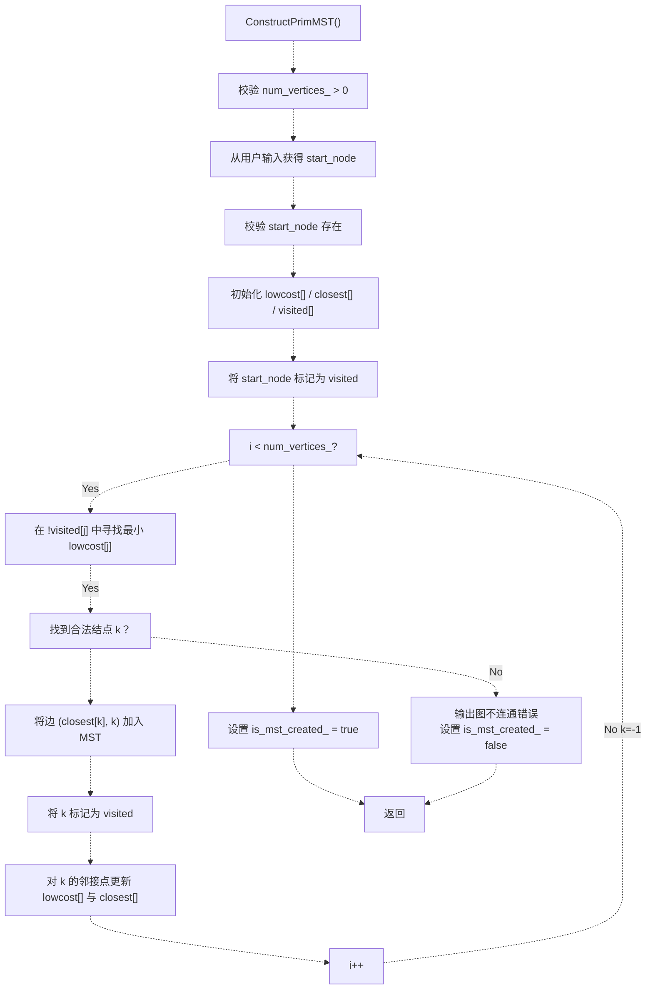
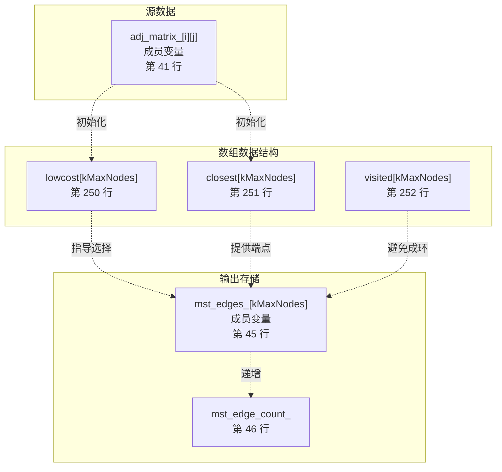
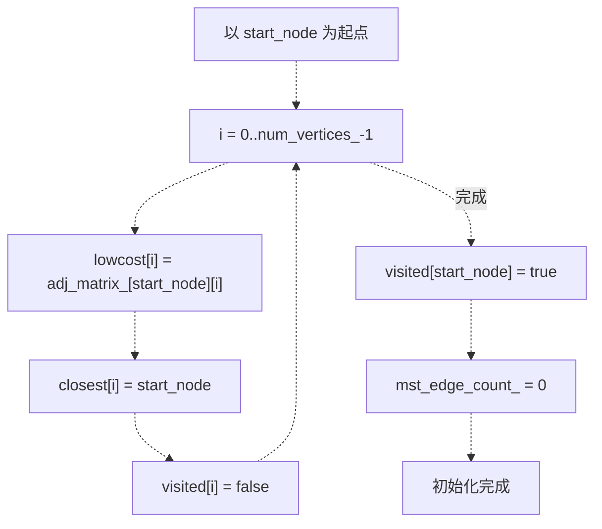
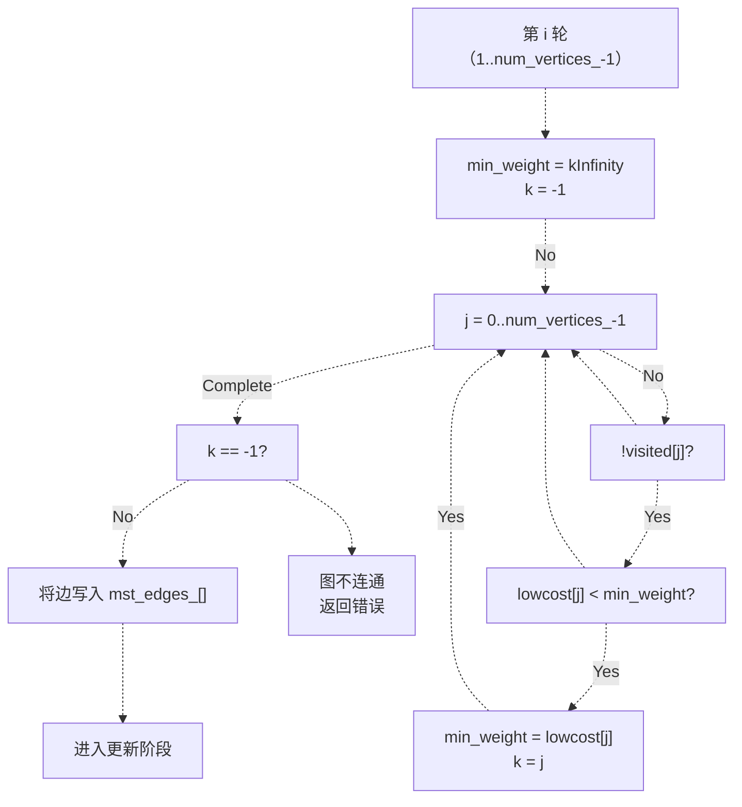
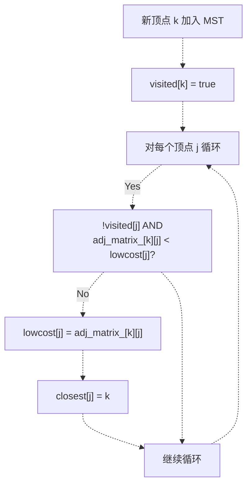
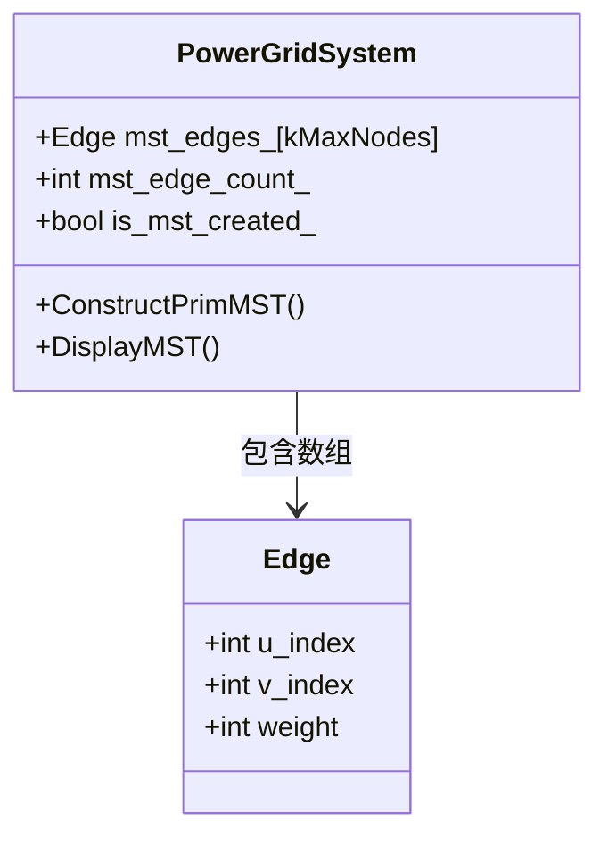
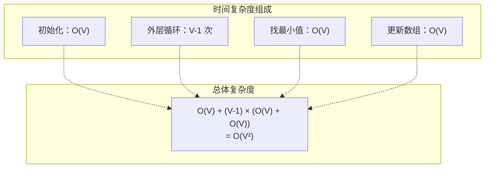
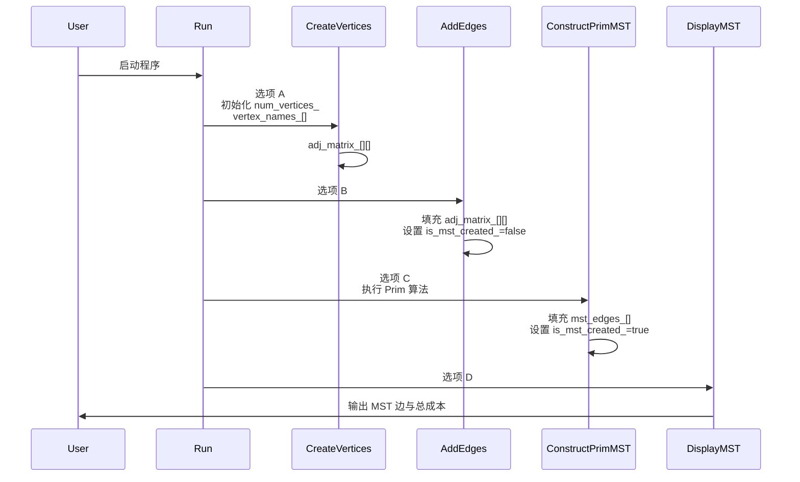

# Prim 算法实现

> **相关源文件**
> * [p8/p8.cpp](https://github.com/lilong555/DataStruct/blob/660fbbaa/p8/p8.cpp)

## 目的与范围

本文档对项目八中 Prim 最小生成树（MST）算法的实现进行详细技术说明。该实现基于邻接矩阵表示图结构，并采用贪心策略在无向带权图（电网网络）上构造最小生成树。

如需了解图的表示方式、邻接矩阵结构以及菜单交互界面，请参见 [Graph Representation and Menu Interface](图的表示与菜单交互.md)。如需项目八的整体背景，请参见 [Project 8: Power Grid Cost Simulation](项目八-电网建设造价模拟.md)。

**来源：** [p8/p8.cpp L227-L311](https://github.com/lilong555/DataStruct/blob/660fbbaa/p8/p8.cpp#L227-L311)

---

## 算法概览

Prim 算法从某个起始顶点出发，逐步“生长”一棵树。在每一步中，选择一条权值最小的边，使其连接“已在生成树中的顶点”与“尚未加入生成树的顶点”。本实现采用经典的数组版本，适用于用邻接矩阵表示的稠密图。

### 核心算法方法

主要实现位于 `PowerGridSystem` 类的 `ConstructPrimMST()` 方法中。



**图示：** `ConstructPrimMST()` 中 Prim 算法控制流程

**来源：** [p8/p8.cpp L227-L311](https://github.com/lilong555/DataStruct/blob/660fbbaa/p8/p8.cpp#L227-L311)

---

## 数据结构

### 主要数组

算法执行过程中维护 3 个并行数组：

| 数组 | 类型 | 大小 | 用途 |
| --- | --- | --- | --- |
| `lowcost[]` | `int` | `num_vertices_` | 当前 MST 到每个顶点的最小连接边权 |
| `closest[]` | `int` | `num_vertices_` | 对每个顶点，记录与其相连的 MST 内顶点下标 |
| `visited[]` | `bool` | `num_vertices_` | 记录顶点是否已加入 MST |



**图示：** Prim 算法中的数据结构关系

**来源：** [p8/p8.cpp L247-L252](https://github.com/lilong555/DataStruct/blob/660fbbaa/p8/p8.cpp#L247-L252)

 [p8/p8.cpp L39-L48](https://github.com/lilong555/DataStruct/blob/660fbbaa/p8/p8.cpp#L39-L48)

### 边的存储结构

MST 的边使用 `Edge` 结构体存储：

| 字段 | 类型 | 说明 |
| --- | --- | --- |
| `u_index` | `int` | MST 内顶点下标（边的起点） |
| `v_index` | `int` | 新加入顶点下标（边的终点） |
| `weight` | `int` | 边权（代价） |

**来源：** [p8/p8.cpp L11-L16](https://github.com/lilong555/DataStruct/blob/660fbbaa/p8/p8.cpp#L11-L16)

---

## 初始化阶段

算法首先根据用户选择的起始顶点，初始化 3 个跟踪数组。



**图示：** 初始化阶段逻辑

### 初始化代码映射

初始化位于 [p8/p8.cpp L254-L263](https://github.com/lilong555/DataStruct/blob/660fbbaa/p8/p8.cpp#L254-L263)：

* **第 255-260 行**：循环将 `lowcost[i]` 设为 `start_node` 到顶点 i 的直接边权，将 `closest[i]` 设为 `start_node`，并将所有顶点置为未访问
* **第 262 行**：将 `start_node` 标记为已访问，表示其已加入 MST
* **第 263 行**：重置 `mst_edge_count_` 计数器

**关键常量：**

* `kInfinity = 2147483647` 表示顶点之间无边（[p8/p8.cpp L8](https://github.com/lilong555/DataStruct/blob/660fbbaa/p8/p8.cpp#L8-L8)）
* `kMaxNodes = 100` 定义图的最大规模（[p8/p8.cpp L6](https://github.com/lilong555/DataStruct/blob/660fbbaa/p8/p8.cpp#L6-L6)）

**来源：** [p8/p8.cpp L254-L263](https://github.com/lilong555/DataStruct/blob/660fbbaa/p8/p8.cpp#L254-L263)

 [p8/p8.cpp L6-L8](https://github.com/lilong555/DataStruct/blob/660fbbaa/p8/p8.cpp#L6-L8)

---

## 边选择循环

主循环执行 `num_vertices_ - 1` 次，以找到 MST 的 `num_vertices_ - 1` 条边。

### 最小边选择



**图示：** 最小权值边的选择过程

### 实现细节

选择逻辑位于 [p8/p8.cpp L268-L289](https://github.com/lilong555/DataStruct/blob/660fbbaa/p8/p8.cpp#L268-L289)：

1. **第 270-271 行**：初始化 `min_weight = kInfinity`、`k = -1`
2. **第 274-281 行**：线性扫描所有顶点，在未访问顶点中寻找 `lowcost` 最小者
3. **第 284-289 行**：不连通检测——若未找到合法 `k`，说明图不连通
4. **第 292-295 行**：将选出的边存入 `mst_edges_[]`： * `u_index = closest[k]`（MST 内顶点） * `v_index = k`（新加入顶点） * `weight = min_weight`

**来源：** [p8/p8.cpp L268-L295](https://github.com/lilong555/DataStruct/blob/660fbbaa/p8/p8.cpp#L268-L295)

---

## 更新阶段

将顶点 `k` 加入 MST 后，需要更新 `lowcost[]` 与 `closest[]`，反映从 `k` 出发可能带来的更优连接边。



**图示：** 加入新顶点后的数组更新过程

### 更新逻辑

更新阶段实现位于 [p8/p8.cpp L297-L308](https://github.com/lilong555/DataStruct/blob/660fbbaa/p8/p8.cpp#L297-L308)：

1. **第 297 行**：将新加入的顶点 `k` 标记为已访问
2. **第 300-307 行**：对每个未访问顶点 `j`： * 若 `k` 到 `j` 的边权小于当前 `lowcost[j]`，则更新 `lowcost[j] = adj_matrix_[k][j]` * 同时更新 `closest[j] = k`，记录最佳连接点

该贪心更新保证 `lowcost[]` 始终保存“从当前 MST 连接到各外部顶点”的最小边权。

**来源：** [p8/p8.cpp L297-L308](https://github.com/lilong555/DataStruct/blob/660fbbaa/p8/p8.cpp#L297-L308)

---

## MST 的存储与显示

### 存储结构

MST 结果存储在类成员变量中：



**图示：** MST 存储的类结构

**来源：** [p8/p8.cpp L18-L48](https://github.com/lilong555/DataStruct/blob/660fbbaa/p8/p8.cpp#L18-L48)

### 输出方法

`DisplayMST()` 输出已构造的 MST：

| 操作 | 实现方式 | 行号参考 |
| --- | --- | --- |
| 校验 | 检查 `is_mst_created_` 标志 | [p8/p8.cpp L315-L319](https://github.com/lilong555/DataStruct/blob/660fbbaa/p8/p8.cpp#L315-L319) |
| 输出边 | 遍历 `mst_edges_[]` 数组 | [p8/p8.cpp L323-L331](https://github.com/lilong555/DataStruct/blob/660fbbaa/p8/p8.cpp#L323-L331) |
| 计算总成本 | 累加所有边权 | [p8/p8.cpp L322-L328](https://github.com/lilong555/DataStruct/blob/660fbbaa/p8/p8.cpp#L322-L328) |
| 格式 | 输出为 "vertex_name-(weight)-vertex_name" | [p8/p8.cpp L330](https://github.com/lilong555/DataStruct/blob/660fbbaa/p8/p8.cpp#L330-L330) |

**来源：** [p8/p8.cpp L313-L333](https://github.com/lilong555/DataStruct/blob/660fbbaa/p8/p8.cpp#L313-L333)

---

## 复杂度分析

### 时间复杂度



**图示：** 时间复杂度拆解

| 阶段 | 复杂度 | 实现对应 |
| --- | --- | --- |
| 初始化 | O(V) | 对顶点做一次循环（[p8/p8.cpp L255-L260](https://github.com/lilong555/DataStruct/blob/660fbbaa/p8/p8.cpp#L255-L260)） |
| 主循环次数 | V-1 | 外层循环（[p8/p8.cpp L268](https://github.com/lilong555/DataStruct/blob/660fbbaa/p8/p8.cpp#L268-L268)） |
| 找最小值 | O(V) | 每轮线性扫描（[p8/p8.cpp L274-L281](https://github.com/lilong555/DataStruct/blob/660fbbaa/p8/p8.cpp#L274-L281)） |
| 数组更新 | O(V) | 更新 lowcost/closest（[p8/p8.cpp L300-L307](https://github.com/lilong555/DataStruct/blob/660fbbaa/p8/p8.cpp#L300-L307)） |
| **总计** | **O(V²)** | 适合稠密图 |

### 空间复杂度

| 数据结构 | 大小 | 用途 |
| --- | --- | --- |
| `lowcost[]` | O(V) | 记录最小边权 |
| `closest[]` | O(V) | 记录最佳连接点 |
| `visited[]` | O(V) | 记录 MST 成员关系 |
| `mst_edges_[]` | O(V) | 存储结果边 |
| `adj_matrix_[][]` | O(V²) | 图的邻接矩阵（成员变量） |
| **总计** | **O(V²)** | 由邻接矩阵主导 |

**来源：** [p8/p8.cpp L247-L252](https://github.com/lilong555/DataStruct/blob/660fbbaa/p8/p8.cpp#L247-L252)

 [p8/p8.cpp L41](https://github.com/lilong555/DataStruct/blob/660fbbaa/p8/p8.cpp#L41-L41)

 [p8/p8.cpp L45](https://github.com/lilong555/DataStruct/blob/660fbbaa/p8/p8.cpp#L45-L45)

---

## 算法状态转换

### 执行过程中的关键变量

```

```

**图示：** MST 构造状态机

**来源：** [p8/p8.cpp L227-L311](https://github.com/lilong555/DataStruct/blob/660fbbaa/p8/p8.cpp#L227-L311)

---

## 与 PowerGridSystem 的集成

### 方法调用顺序



**图示：** 与菜单系统的集成关系

### 成员变量依赖

| 变量 | 类型 | 在算法中的用途 |
| --- | --- | --- |
| `vertex_names_[][]` | `char[kMaxNodes][kMaxNameLen]` | 将顶点下标映射为可读名称，供显示使用 |
| `adj_matrix_[][]` | `int[kMaxNodes][kMaxNodes]` | 提供边权数据（[p8/p8.cpp L257-L302](https://github.com/lilong555/DataStruct/blob/660fbbaa/p8/p8.cpp#L257-L302)） |
| `num_vertices_` | `int` | 循环边界与输入校验（[p8/p8.cpp L268](https://github.com/lilong555/DataStruct/blob/660fbbaa/p8/p8.cpp#L268-L268)） |
| `mst_edges_[]` | `Edge[kMaxNodes]` | 存储算法输出（[p8/p8.cpp L292-L295](https://github.com/lilong555/DataStruct/blob/660fbbaa/p8/p8.cpp#L292-L295)） |
| `mst_edge_count_` | `int` | 记录已加入的边数（[p8/p8.cpp L295](https://github.com/lilong555/DataStruct/blob/660fbbaa/p8/p8.cpp#L295-L295)） |
| `is_mst_created_` | `bool` | 显示阶段校验标志（[p8/p8.cpp L310-L315](https://github.com/lilong555/DataStruct/blob/660fbbaa/p8/p8.cpp#L310-L315)） |

**来源：** [p8/p8.cpp L39-L48](https://github.com/lilong555/DataStruct/blob/660fbbaa/p8/p8.cpp#L39-L48)

 [p8/p8.cpp L227-L333](https://github.com/lilong555/DataStruct/blob/660fbbaa/p8/p8.cpp#L227-L333)

---

## 错误处理

实现中包含多处校验检查：

| 检查项 | 位置 | 错误处理 |
| --- | --- | --- |
| 顶点已创建 | [p8/p8.cpp L229-L233](https://github.com/lilong555/DataStruct/blob/660fbbaa/p8/p8.cpp#L229-L233) | 打印提示并提前返回 |
| 起始顶点合法 | [p8/p8.cpp L240-L245](https://github.com/lilong555/DataStruct/blob/660fbbaa/p8/p8.cpp#L240-L245) | 打印提示并提前返回 |
| 图连通性 | [p8/p8.cpp L284-L289](https://github.com/lilong555/DataStruct/blob/660fbbaa/p8/p8.cpp#L284-L289) | 打印不连通错误并返回，`is_mst_created_ = false` |
| MST 已构造 | [p8/p8.cpp L315-L319](https://github.com/lilong555/DataStruct/blob/660fbbaa/p8/p8.cpp#L315-L319) | 要求先构造再显示 |

**来源：** [p8/p8.cpp L227-L333](https://github.com/lilong555/DataStruct/blob/660fbbaa/p8/p8.cpp#L227-L333)

---

## 总结

本 Prim 算法实现采用经典的数组版本，基于邻接矩阵，适合稠密图场景。其 O(V²) 的时间复杂度对于电网建设问题中“顶点规模较小且较稠密”的图模型是可接受的。`lowcost`、`closest`、`visited` 三数组提供了清晰的状态跟踪，而 `mst_edges_` 则完整保留构造出的 MST，便于后续显示与分析。

**来源：** [p8/p8.cpp L1-L365](https://github.com/lilong555/DataStruct/blob/660fbbaa/p8/p8.cpp#L1-L365)
