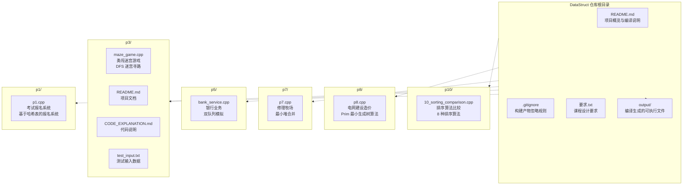
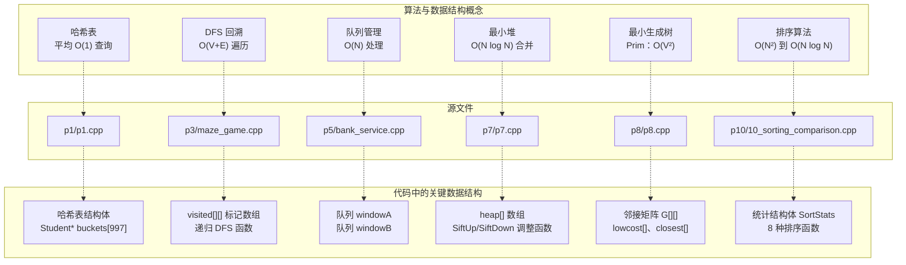

# 主页

> **相关源文件**
> * [.gitignore](https://github.com/lilong555/DataStruct/blob/660fbbaa/.gitignore)
> * [README.md](https://github.com/lilong555/DataStruct/blob/660fbbaa/README.md)

## 目的与范围

本 Wiki 用于说明 **DataStruct** 仓库。该仓库包含 6 个相互独立的数据结构课程设计项目（C++ 控制台程序）。每个项目通过一个可运行的完整程序演示特定的数据结构或算法。项目内容覆盖哈希表、图遍历、队列模拟、堆操作、最小生成树以及算法性能分析等主题，主要用于教学与学习。

编译与构建说明见：[Getting Started](快速开始.md)。各项目的详细文档见：[Projects Overview](项目概览.md)，也可以直接跳转到具体项目页面（[Project 1](项目一-考试报名系统.md)、[Project 3](项目三-勇闯迷宫游戏.md)、[Project 5](项目五-银行业务模拟.md)、[Project 7](项目七-修理牧场（最小花费）.md)、[Project 8](项目八-电网建设造价模拟.md)、[Project 10](项目十-排序算法比较.md)）。

**来源：**[README.md L1-L14](https://github.com/lilong555/DataStruct/blob/660fbbaa/README.md#L1-L14)

---

## 仓库结构

仓库采用扁平化组织方式：每个项目都放在独立目录中并自包含。下图展示了目录结构与实际代码文件之间的对应关系：

**来源：**[README.md L5-L14](https://github.com/lilong555/DataStruct/blob/660fbbaa/README.md#L5-L14)

 [.gitignore L1-L14](https://github.com/lilong555/DataStruct/blob/660fbbaa/.gitignore#L1-L14)

---

## 项目清单

下表对仓库中的 6 个项目进行整体概览：

| 项目 | 目录 | 源文件 | 数据结构 | 算法 | 说明 |
| --- | --- | --- | --- | --- | --- |
| **P1** | `p1/` | `p1.cpp` | 哈希表（拉链法） | 哈希函数、链表 | 考试报名系统：对考生信息进行增删改查管理 |
| **P3** | `p3/` | `maze_game.cpp` | 二维网格、栈（隐式） | 深度优先搜索、回溯 | 勇闯迷宫游戏：在网格迷宫中进行寻路求解 |
| **P5** | `p5/` | `bank_service.cpp` | 双队列 | 调度/优先级模拟 | 银行业务：双窗口不同速度的服务完成顺序模拟 |
| **P7** | `p7/` | `p7.cpp` | 最小堆（1 下标数组） | 哈夫曼式合并 | 修理牧场：最优合并求最小总花费 |
| **P8** | `p8/` | `p8.cpp` | 图（邻接矩阵） | Prim 算法 | 电网建设造价：最小生成树求最小总造价 |
| **P10** | `p10/` | `10_sorting_comparison.cpp` | 数组 | 8 种排序算法 | 排序算法比较：多种排序算法性能对比 |

**来源：**[README.md L8-L13](https://github.com/lilong555/DataStruct/blob/660fbbaa/README.md#L8-L13)

 [README.md L44-L50](https://github.com/lilong555/DataStruct/blob/660fbbaa/README.md#L44-L50)

---

## 代码与概念映射

下图将抽象的算法/数据结构概念与仓库中的具体源文件及关键实现要点对应起来：

**来源：**[README.md L44-L50](https://github.com/lilong555/DataStruct/blob/660fbbaa/README.md#L44-L50)

 项目文件结构来自仓库目录

---

## 开发环境

所有项目共享统一的编译配置：

| 配置项 | 值 | 用途 |
| --- | --- | --- |
| **编译器** | `g++` | GNU C++ 编译器 |
| **标准** | `-std=c++17` | 使用 C++17 语言特性 |
| **优化** | `-O2` | 二级优化（兼顾性能与编译耗时） |
| **告警** | `-Wall -Wextra -pedantic` | 输出更全面的告警信息 |
| **目标环境** | WSL2/Linux | Unix-like 环境要求 |

`.gitignore`（见 [.gitignore L1-L14](https://github.com/lilong555/DataStruct/blob/660fbbaa/.gitignore#L1-L14)）

配置中排除了构建产物（`output/`、`*.exe`）、IDE 设置（`.vscode/`、`.claude/`）以及系统元数据文件（`*:Zone.Identifier`），以保持仓库整洁且便于迁移。

完整的构建与环境说明见：[Getting Started](快速开始.md)。

**来源：**[README.md L16-L29](https://github.com/lilong555/DataStruct/blob/660fbbaa/README.md#L16-L29)

 [.gitignore L1-L14](https://github.com/lilong555/DataStruct/blob/660fbbaa/.gitignore#L1-L14)

---

## 项目组织原则

每个项目遵循以下组织原则：

1. **自包含**：项目之间无依赖关系；每个项目都可独立编译并运行
2. **单一源文件**：为简化实现，每个项目由一个 `.cpp` 文件构成
3. **统一交互**：全部项目使用控制台 I/O；有的采用菜单交互，有的采用批处理流程
4. **标准与质量**：使用严格告警编译参数以提升代码质量
5. **教学导向**：代码优先保证清晰与概念演示，而非追求生产级极限优化

例外是项目三（`p3/`）：它包含额外的说明文件（`README.md`、`CODE_EXPLANATION.md`）以及测试输入（`test_input.txt`），用于支持更完整的测试流程。

**来源：**[README.md L1-L14](https://github.com/lilong555/DataStruct/blob/660fbbaa/README.md#L1-L14)

 [.gitignore L2-L3](https://github.com/lilong555/DataStruct/blob/660fbbaa/.gitignore#L2-L3)

---

## 项目交互模式

根据用户交互方式，项目可分为两类：

**菜单交互型系统：**

* **Project 1**（[p1/p1.cpp](https://github.com/lilong555/DataStruct/blob/660fbbaa/p1/p1.cpp)）：持续会话，包含插入、删除、查找、修改、统计等操作
* **Project 8**（[p8/p8.cpp](https://github.com/lilong555/DataStruct/blob/660fbbaa/p8/p8.cpp)）：交互式构建图（创建顶点/边），并生成最小生成树
* **Project 10**（[p10/10_sorting_comparison.cpp](https://github.com/lilong555/DataStruct/blob/660fbbaa/p10/10_sorting_comparison.cpp)）：选择排序算法并配置数据规模的菜单系统

**批处理型系统：**

* **Project 3**（[p3/maze_game.cpp](https://github.com/lilong555/DataStruct/blob/660fbbaa/p3/maze_game.cpp)）：输入迷宫参数 → 计算路径 → 输出结果
* **Project 5**（[p5/bank_service.cpp](https://github.com/lilong555/DataStruct/blob/660fbbaa/p5/bank_service.cpp)）：输入顾客编号 → 模拟排队 → 输出办理顺序
* **Project 7**（[p7/p7.cpp](https://github.com/lilong555/DataStruct/blob/660fbbaa/p7/p7.cpp)）：输入木头长度 → 计算最小花费 → 输出结果

更详细的交互模式说明见：[Projects Overview](项目概览.md)。

**来源：**[README.md L44-L50](https://github.com/lilong555/DataStruct/blob/660fbbaa/README.md#L44-L50)

---

## 快速导航

可通过以下链接跳转到指定的文档章节：

### 构建与环境

* [Getting Started](快速开始.md) - 编译命令与环境配置

### 项目文档

* [Project 1: Exam Registration System](项目一-考试报名系统.md) - 拉链法哈希表 * [Hash Table Implementation](哈希表实现.md) * [CRUD Operations and Menu System](增删改查与菜单系统.md)
* [Project 3: Maze Game](项目三-勇闯迷宫游戏.md) - DFS 迷宫寻路 * [DFS Backtracking Algorithm](DFS回溯算法.md) * [Building and Testing](编译与测试.md)
* [Project 5: Bank Service Simulation](项目五-银行业务模拟.md) - 双队列调度 * [Queue Management and Scheduling](队列管理与调度.md)
* [Project 7: Repair Ranch](项目七-修理牧场（最小花费）.md) - 最小堆最优合并 * [Min-Heap Implementation](最小堆实现.md)
* [Project 8: Power Grid Cost Simulation](项目八-电网建设造价模拟.md) - Prim 最小生成树 * [Prim's Algorithm Implementation](Prim算法实现.md) * [Graph Representation and Menu Interface](图的表示与菜单交互.md)
* [Project 10: Sorting Algorithm Comparison](项目十-排序算法比较.md) - 8 种排序性能对比 * [Sorting Algorithm Implementations](排序算法实现说明.md) * [Performance Metrics System](性能统计系统.md)

### 参考资料

* [Data Structures Reference](数据结构参考.md) - 跨项目的数据结构目录
* [Algorithms Reference](算法参考.md) - 算法复杂度分析与对比

**来源：**目录结构来自 Wiki 页面定义

---

## 仓库元信息

| 属性 | 值 |
| --- | --- |
| **GitHub URL** | `https://github.com/lilong555/DataStruct` |
| **语言** | C++（C++17 标准） |
| **课程** | 数据结构课程设计（Data Structures Course Design） |
| **项目数量** | 6 个独立项目 |
| **源文件数量** | 6 个主要 `.cpp` 文件及配套文档 |

**来源：**[README.md L54](https://github.com/lilong555/DataStruct/blob/660fbbaa/README.md#L54-L54)
