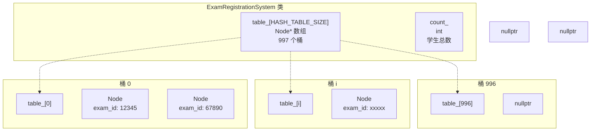
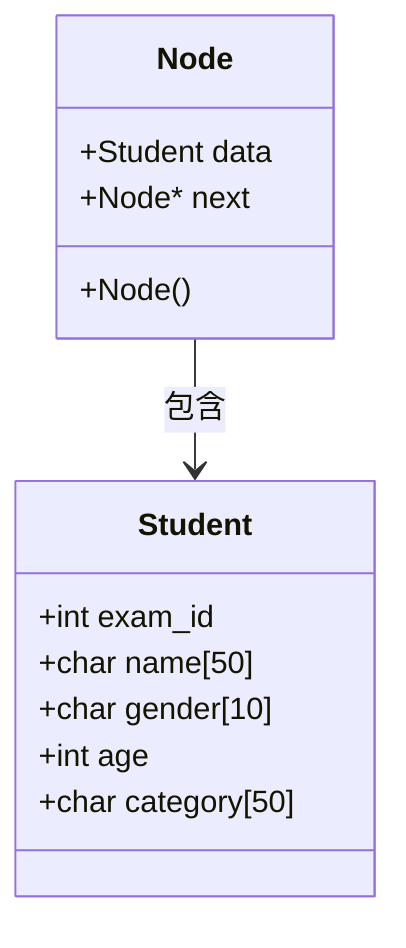
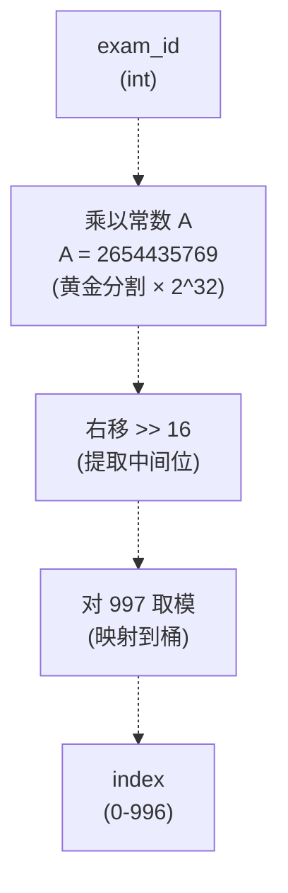
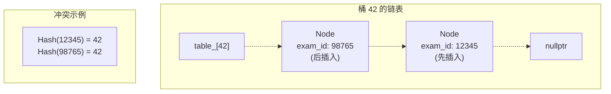
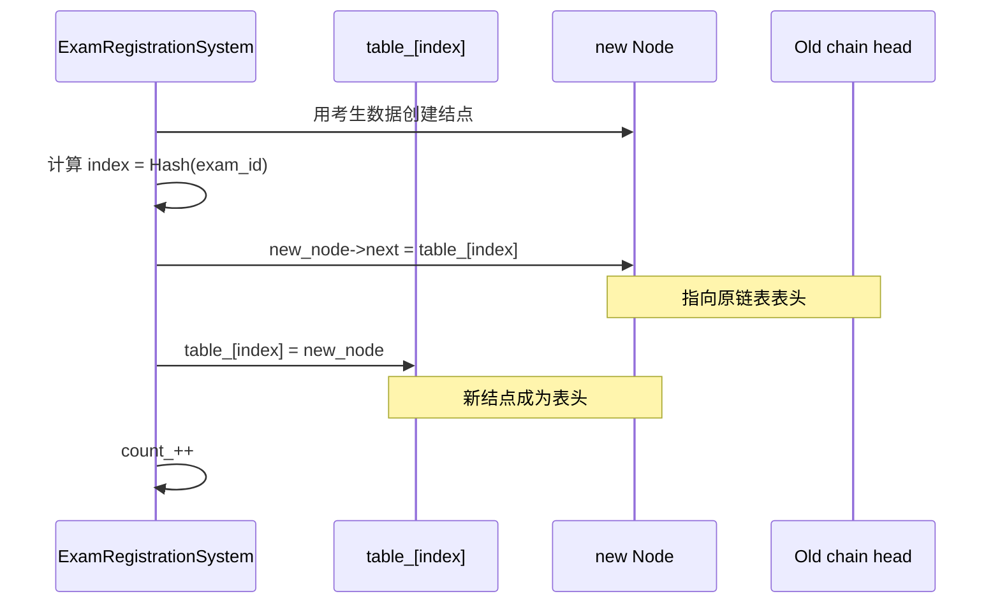
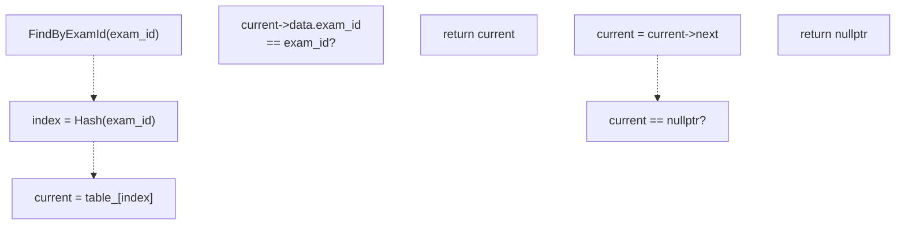
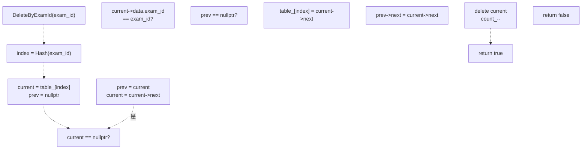
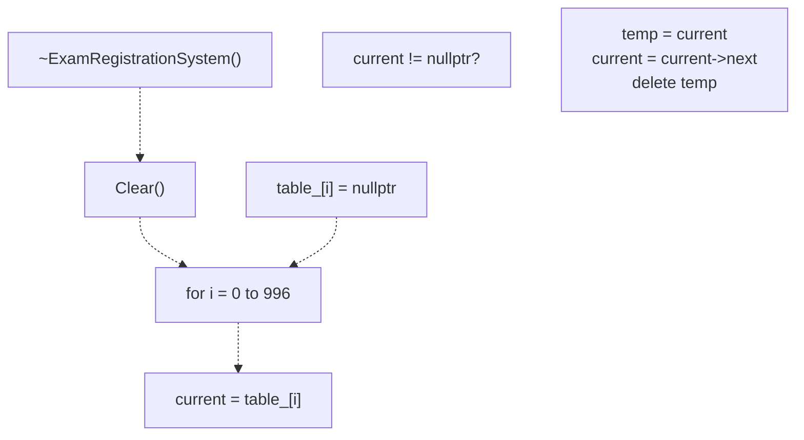
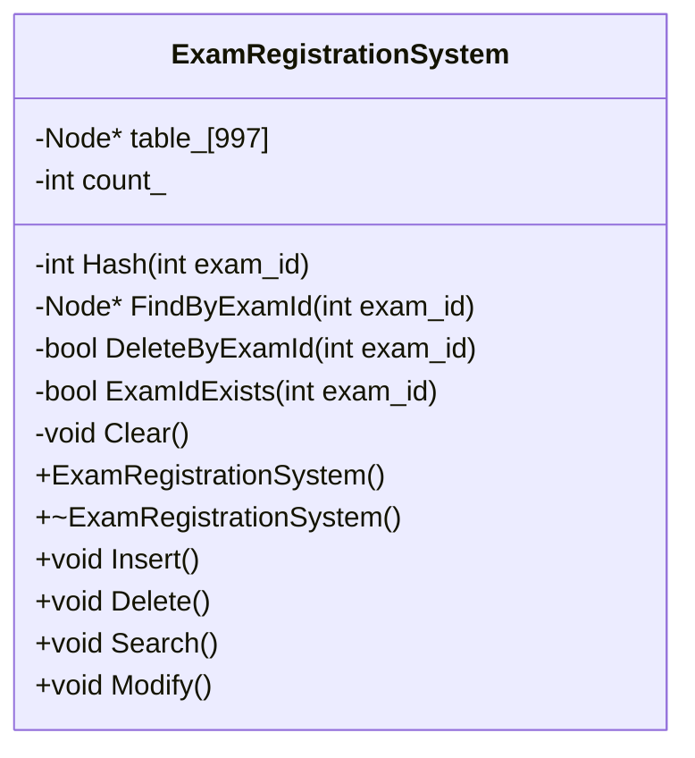

# 哈希表实现

> **相关源文件**
> * [CLAUDE.md](https://github.com/lilong555/DataStruct/blob/660fbbaa/CLAUDE.md)
> * [p1/p1.cpp](https://github.com/lilong555/DataStruct/blob/660fbbaa/p1/p1.cpp)

## 目的与范围

本页说明项目一「考试报名系统」中使用的哈希表实现。内容包括：997 桶（bucket）的哈希表设计、乘法散列函数、拉链法冲突解决，以及核心数据结构操作。

如需了解基于该哈希表实现的增删改查与菜单交互，请参见 [CRUD Operations and Menu System](增删改查与菜单系统.md)。

**来源：** [p1/p1.cpp L1-L723](https://github.com/lilong555/DataStruct/blob/660fbbaa/p1/p1.cpp#L1-L723)

---

## 哈希表架构

### 整体结构

该哈希表采用固定大小数组实现：`table_` 为长度 997 的指针数组，每个元素作为单链表表头，用拉链法（separate chaining）处理冲突。



**表规模选择：** 常量 `HASH_TABLE_SIZE = 997` 位于 [p1/p1.cpp L16](https://github.com/lilong555/DataStruct/blob/660fbbaa/p1/p1.cpp#L16-L16)，选择质数以改善散列分布、降低聚簇。与取模操作配合时，质数表长通常能减少周期性冲突模式。

**来源：** [p1/p1.cpp L16](https://github.com/lilong555/DataStruct/blob/660fbbaa/p1/p1.cpp#L16-L16)

 [p1/p1.cpp L55](https://github.com/lilong555/DataStruct/blob/660fbbaa/p1/p1.cpp#L55-L55)

 [p1/p1.cpp L56](https://github.com/lilong555/DataStruct/blob/660fbbaa/p1/p1.cpp#L56-L56)

---

### 数据结构

#### Student 结构体

`Student` 结构体位于 [p1/p1.cpp L5-L13](https://github.com/lilong555/DataStruct/blob/660fbbaa/p1/p1.cpp#L5-L13)，保存每位考生的核心信息：

| 字段 | 类型 | 说明 | 约束 |
| --- | --- | --- | --- |
| `exam_id` | `int` | 唯一考号（哈希键） | 1-999999 |
| `name` | `char[50]` | 姓名 | 1-49 字符 |
| `gender` | `char[10]` | 性别 | "男" 或 "女" |
| `age` | `int` | 年龄 | 10-100 |
| `category` | `char[50]` | 报考类别 | 1-49 字符 |

**来源：** [p1/p1.cpp L5-L13](https://github.com/lilong555/DataStruct/blob/660fbbaa/p1/p1.cpp#L5-L13)

 [p1/p1.cpp L247-L250](https://github.com/lilong555/DataStruct/blob/660fbbaa/p1/p1.cpp#L247-L250)

 [p1/p1.cpp L242-L245](https://github.com/lilong555/DataStruct/blob/660fbbaa/p1/p1.cpp#L242-L245)

 [p1/p1.cpp L237-L240](https://github.com/lilong555/DataStruct/blob/660fbbaa/p1/p1.cpp#L237-L240)

#### Node 结构体

`Node` 结构体位于 [p1/p1.cpp L18-L25](https://github.com/lilong555/DataStruct/blob/660fbbaa/p1/p1.cpp#L18-L25)，用于实现冲突链表：



每个 `Node` 包含：

* `data`：一条 `Student` 记录
* `next`：指向链表下一结点的指针（或 `nullptr`）

构造函数位于 [p1/p1.cpp L24](https://github.com/lilong555/DataStruct/blob/660fbbaa/p1/p1.cpp#L24-L24)，将 `next` 初始化为 `nullptr`。

**来源：** [p1/p1.cpp L18-L25](https://github.com/lilong555/DataStruct/blob/660fbbaa/p1/p1.cpp#L18-L25)

 [p1/p1.cpp L5-L13](https://github.com/lilong555/DataStruct/blob/660fbbaa/p1/p1.cpp#L5-L13)

---

## 哈希函数设计

### 算法实现

哈希函数位于 [p1/p1.cpp L122-L128](https://github.com/lilong555/DataStruct/blob/660fbbaa/p1/p1.cpp#L122-L128)，采用乘法散列方案，其常数来自黄金分割共轭：



**实现细节：**

```javascript
int Hash(int exam_id) {
    const unsigned long long A = 2654435769;  // ~(sqrt(5)-1)/2 * 2^32
    unsigned long long hash = A * exam_id;
    return (hash >> 16) % HASH_TABLE_SIZE;
}
```

**算法步骤：**

1. **乘法：** 用常数 `A = 2654435769` 乘以 `exam_id`（[p1/p1.cpp L125](https://github.com/lilong555/DataStruct/blob/660fbbaa/p1/p1.cpp#L125-L125)）
2. **取位：** 右移 16 位（[p1/p1.cpp L127](https://github.com/lilong555/DataStruct/blob/660fbbaa/p1/p1.cpp#L127-L127)）以提取中间位，降低相关性
3. **取模：** 对 997 取模以得到合法桶下标

**设计动机：**

* 2654435769 近似 φ⁻¹ × 2³²，其中 φ = (1+√5)/2（黄金分割）
* 乘法散列对连续考号具有较好的分布特性
* 右移 16 位可提取乘法结果中更“随机”的位
* 表长取质数（997）可减少聚簇模式

**来源：** [p1/p1.cpp L122-L128](https://github.com/lilong555/DataStruct/blob/660fbbaa/p1/p1.cpp#L122-L128)

---

## 冲突解决策略

### 拉链法（Separate Chaining）

该哈希表采用 **拉链法**（separate chaining），见 [p1/p1.cpp L55](https://github.com/lilong555/DataStruct/blob/660fbbaa/p1/p1.cpp#L55-L55)。每个桶对应一条链表，当多个考号散列到同一桶时，会形成冲突链。



**特点：**

* 每个桶维护一条独立链表
* 链表长度无固定上限
* 查找需要沿链表顺序遍历
* 若分布均匀，平均链长 = count_ / 997

**来源：** [p1/p1.cpp L55](https://github.com/lilong555/DataStruct/blob/660fbbaa/p1/p1.cpp#L55-L55)

 [p1/p1.cpp L18-L25](https://github.com/lilong555/DataStruct/blob/660fbbaa/p1/p1.cpp#L18-L25)

### 头插法（Head Insertion）

新结点通过 **头插法** 插入链表（见 [p1/p1.cpp L404-L412](https://github.com/lilong555/DataStruct/blob/660fbbaa/p1/p1.cpp#L404-L412)），可实现 O(1) 插入：



**Initialize() 中的实现（[p1/p1.cpp L404-L412](https://github.com/lilong555/DataStruct/blob/660fbbaa/p1/p1.cpp#L404-L412)）：**

```
Node *new_node = new Node();
new_node->data = stu;
int index = Hash(stu.exam_id);
new_node->next = table_[index];  // 指向原有链表
table_[index] = new_node;         // 成为新表头
count_++;
```

**Insert() 中同样使用该模式（[p1/p1.cpp L430-L436](https://github.com/lilong555/DataStruct/blob/660fbbaa/p1/p1.cpp#L430-L436)）**

**来源：** [p1/p1.cpp L404-L412](https://github.com/lilong555/DataStruct/blob/660fbbaa/p1/p1.cpp#L404-L412)

 [p1/p1.cpp L430-L436](https://github.com/lilong555/DataStruct/blob/660fbbaa/p1/p1.cpp#L430-L436)

---

## 核心操作

### 插入操作

插入流程包括：对考号做哈希、创建新结点并头插到冲突链表：

| 步骤 | 动作 | 代码位置 |
| --- | --- | --- |
| 1 | 校验与采集考生数据 | [p1/p1.cpp L257-L353](https://github.com/lilong555/DataStruct/blob/660fbbaa/p1/p1.cpp#L257-L353) |
| 2 | 创建新 `Node` 并填充 `data` | [p1/p1.cpp L405-L406](https://github.com/lilong555/DataStruct/blob/660fbbaa/p1/p1.cpp#L405-L406) |
| 3 | 调用 `Hash()` 计算桶下标 | [p1/p1.cpp L408](https://github.com/lilong555/DataStruct/blob/660fbbaa/p1/p1.cpp#L408-L408) |
| 4 | 将新结点链接到原链表 | [p1/p1.cpp L409](https://github.com/lilong555/DataStruct/blob/660fbbaa/p1/p1.cpp#L409-L409) |
| 5 | 更新桶表头指针 | [p1/p1.cpp L410](https://github.com/lilong555/DataStruct/blob/660fbbaa/p1/p1.cpp#L410-L410) |
| 6 | `count_` 自增 | [p1/p1.cpp L412](https://github.com/lilong555/DataStruct/blob/660fbbaa/p1/p1.cpp#L412-L412) |

**时间复杂度：** 平均 O(1)（哈希计算 + 头插）

**来源：** [p1/p1.cpp L421-L442](https://github.com/lilong555/DataStruct/blob/660fbbaa/p1/p1.cpp#L421-L442)

 [p1/p1.cpp L404-L412](https://github.com/lilong555/DataStruct/blob/660fbbaa/p1/p1.cpp#L404-L412)

---

### 查找操作

`FindByExamId()` 位于 [p1/p1.cpp L444-L457](https://github.com/lilong555/DataStruct/blob/660fbbaa/p1/p1.cpp#L444-L457)，实现哈希表查找：



**算法：**

1. 计算哈希下标：`index = Hash(exam_id)`（[p1/p1.cpp L446](https://github.com/lilong555/DataStruct/blob/660fbbaa/p1/p1.cpp#L446-L446)）
2. 取得链表表头：`current = table_[index]`（[p1/p1.cpp L447](https://github.com/lilong555/DataStruct/blob/660fbbaa/p1/p1.cpp#L447-L447)）
3. 沿链表遍历，直到匹配或到达末尾（[p1/p1.cpp L448-L455](https://github.com/lilong555/DataStruct/blob/660fbbaa/p1/p1.cpp#L448-L455)）
4. 返回匹配结点指针或 `nullptr`

**时间复杂度：**

* 最好：O(1)（目标在链表表头）
* 平均：O(1 + α)，其中 α = count_ / 997
* 最坏：O(n)（所有记录都散列到同一桶）

**来源：** [p1/p1.cpp L444-L457](https://github.com/lilong555/DataStruct/blob/660fbbaa/p1/p1.cpp#L444-L457)

---

### 删除操作

`DeleteByExamId()` 位于 [p1/p1.cpp L459-L492](https://github.com/lilong555/DataStruct/blob/660fbbaa/p1/p1.cpp#L459-L492)，用于从冲突链中删除结点：



**关键分支：**

1. **删除表头结点**（[p1/p1.cpp L469-L471](https://github.com/lilong555/DataStruct/blob/660fbbaa/p1/p1.cpp#L469-L471)）：将 `table_[index]` 更新为 `current->next`
2. **删除中间/尾部结点**（[p1/p1.cpp L473-L476](https://github.com/lilong555/DataStruct/blob/660fbbaa/p1/p1.cpp#L473-L476)）：将 `prev->next` 连接到 `current->next`，跳过被删结点
3. **未找到结点**（[p1/p1.cpp L491](https://github.com/lilong555/DataStruct/blob/660fbbaa/p1/p1.cpp#L491-L491)）：遍历完整条链后返回 `false`

**时间复杂度：** 若散列分布均匀，平均 O(1 + α)

**来源：** [p1/p1.cpp L459-L492](https://github.com/lilong555/DataStruct/blob/660fbbaa/p1/p1.cpp#L459-L492)

---

## 内存管理

### 初始化与清理

#### 构造函数初始化

构造函数位于 [p1/p1.cpp L108-L114](https://github.com/lilong555/DataStruct/blob/660fbbaa/p1/p1.cpp#L108-L114)，用于初始化哈希表：

```
ExamRegistrationSystem::ExamRegistrationSystem() : count_(0) {
    for (int i = 0; i < HASH_TABLE_SIZE; ++i) {
        table_[i] = nullptr;
    }
}
```

所有 997 个桶指针都被设为 `nullptr`，表示每条链为空。

**来源：** [p1/p1.cpp L108-L114](https://github.com/lilong555/DataStruct/blob/660fbbaa/p1/p1.cpp#L108-L114)

#### 析构函数清理

析构函数位于 [p1/p1.cpp L116-L119](https://github.com/lilong555/DataStruct/blob/660fbbaa/p1/p1.cpp#L116-L119)，并将清理工作委托给 `Clear()`：



`Clear()` 位于 [p1/p1.cpp L130-L144](https://github.com/lilong555/DataStruct/blob/660fbbaa/p1/p1.cpp#L130-L144)，流程为：

1. 遍历全部 997 个桶
2. 对每个桶顺序遍历链表
3. 逐个 `delete` 结点
4. 将桶指针置为 `nullptr`
5. 将 `count_` 重置为 0

**内存安全：** 所有动态分配的结点都会被释放，可避免内存泄漏。

**来源：** [p1/p1.cpp L116-L119](https://github.com/lilong555/DataStruct/blob/660fbbaa/p1/p1.cpp#L116-L119)

 [p1/p1.cpp L130-L144](https://github.com/lilong555/DataStruct/blob/660fbbaa/p1/p1.cpp#L130-L144)

---

## 性能特性

### 复杂度分析

| 操作 | 平均情况 | 最坏情况 | 空间 |
| --- | --- | --- | --- |
| `Hash()` | O(1) | O(1) | O(1) |
| 插入 | O(1) | O(n) | 每次插入 O(1) |
| 查找（`FindByExamId`） | O(1) | O(n) | O(1) |
| 删除（`DeleteByExamId`） | O(1) | O(n) | O(1) |
| `Clear()` | O(n + 997) | O(n + 997) | O(1) |

**装载因子：** α = count_ / 997

* 若分布均匀，平均链长 ≈ α
* 当 α &lt; 1 时通常能保持较好性能
* 系统支持最多 10000 名学生（α ≈ 10），见 [p1/p1.cpp L380-L384](https://github.com/lilong555/DataStruct/blob/660fbbaa/p1/p1.cpp#L380-L384)

**最坏情况：** 所有考号都散列到同一桶，操作退化为链表 O(n)。

**来源：** [p1/p1.cpp L122-L128](https://github.com/lilong555/DataStruct/blob/660fbbaa/p1/p1.cpp#L122-L128)

 [p1/p1.cpp L444-L457](https://github.com/lilong555/DataStruct/blob/660fbbaa/p1/p1.cpp#L444-L457)

 [p1/p1.cpp L459-L492](https://github.com/lilong555/DataStruct/blob/660fbbaa/p1/p1.cpp#L459-L492)

 [p1/p1.cpp L130-L144](https://github.com/lilong555/DataStruct/blob/660fbbaa/p1/p1.cpp#L130-L144)

 [p1/p1.cpp L380-L384](https://github.com/lilong555/DataStruct/blob/660fbbaa/p1/p1.cpp#L380-L384)

---

## 实现细节

### 哈希表类成员

`ExamRegistrationSystem` 类位于 [p1/p1.cpp L27-L105](https://github.com/lilong555/DataStruct/blob/660fbbaa/p1/p1.cpp#L27-L105)，通过以下私有成员管理哈希表：



**关键私有方法：**

* `Hash(int exam_id)`（[p1/p1.cpp L122-L128](https://github.com/lilong555/DataStruct/blob/660fbbaa/p1/p1.cpp#L122-L128)）：哈希函数实现
* `FindByExamId(int exam_id)`（[p1/p1.cpp L444-L457](https://github.com/lilong555/DataStruct/blob/660fbbaa/p1/p1.cpp#L444-L457)）：沿冲突链查找
* `DeleteByExamId(int exam_id)`（[p1/p1.cpp L459-L492](https://github.com/lilong555/DataStruct/blob/660fbbaa/p1/p1.cpp#L459-L492)）：从冲突链删除结点
* `ExamIdExists(int exam_id)`（[p1/p1.cpp L252-L255](https://github.com/lilong555/DataStruct/blob/660fbbaa/p1/p1.cpp#L252-L255)）：重复考号检测封装
* `Clear()`（[p1/p1.cpp L130-L144](https://github.com/lilong555/DataStruct/blob/660fbbaa/p1/p1.cpp#L130-L144)）：内存清理

**关键数据成员：**

* `table_[HASH_TABLE_SIZE]`（[p1/p1.cpp L55](https://github.com/lilong555/DataStruct/blob/660fbbaa/p1/p1.cpp#L55-L55)）：997 个桶指针数组
* `count_`（[p1/p1.cpp L56](https://github.com/lilong555/DataStruct/blob/660fbbaa/p1/p1.cpp#L56-L56)）：当前存储的学生数量

**来源：** [p1/p1.cpp L27-L105](https://github.com/lilong555/DataStruct/blob/660fbbaa/p1/p1.cpp#L27-L105)

 [p1/p1.cpp L55-L56](https://github.com/lilong555/DataStruct/blob/660fbbaa/p1/p1.cpp#L55-L56)
