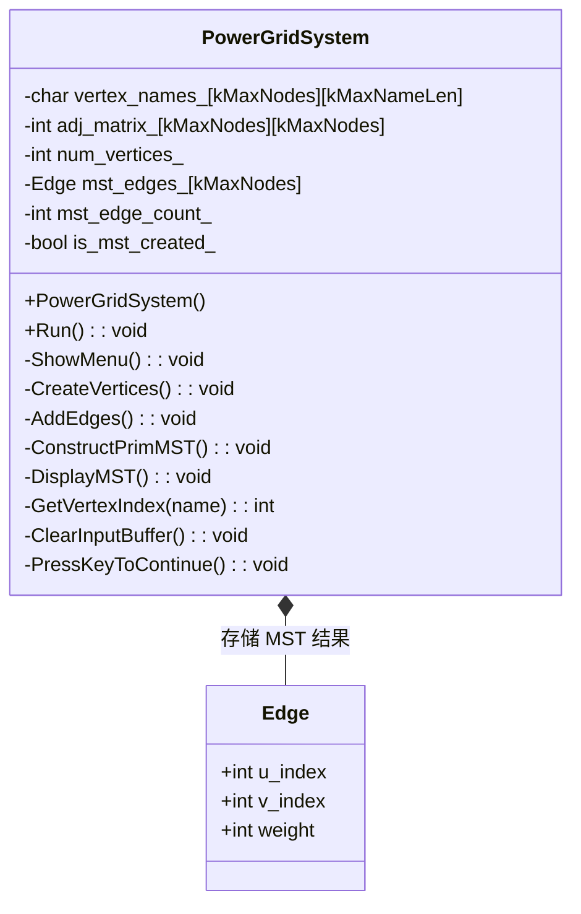
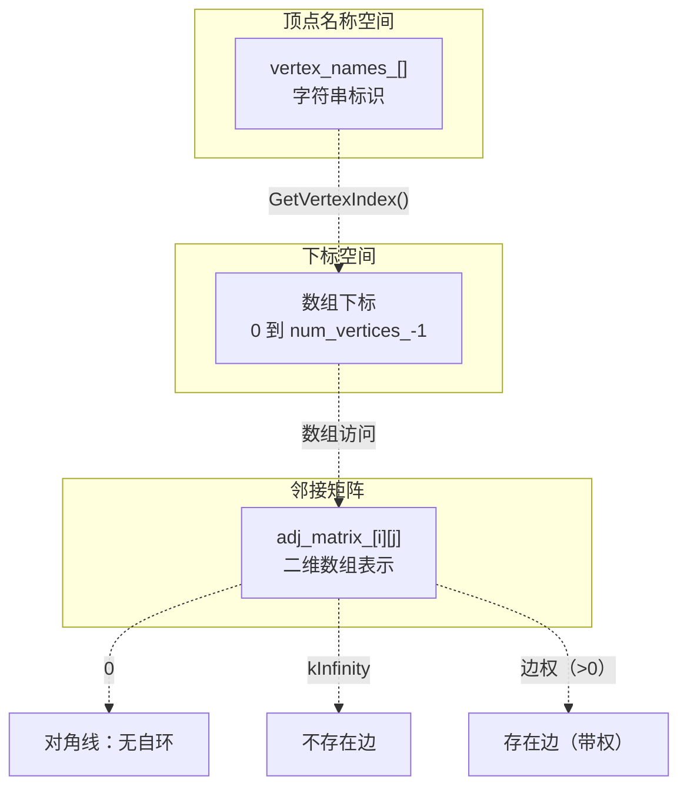
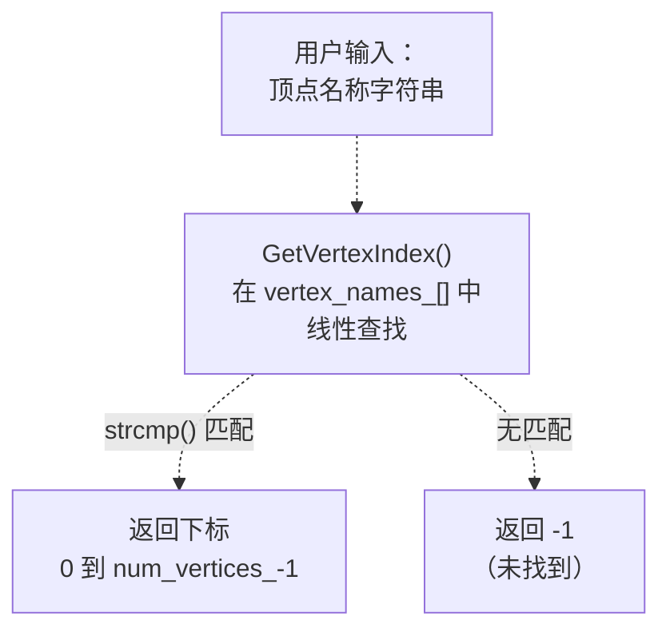
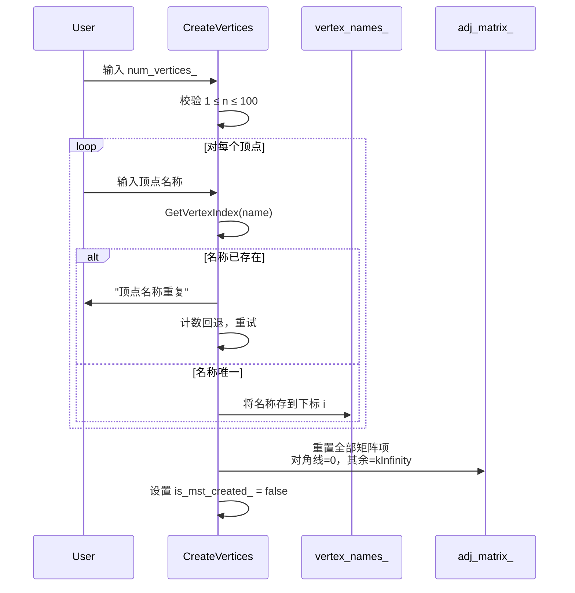
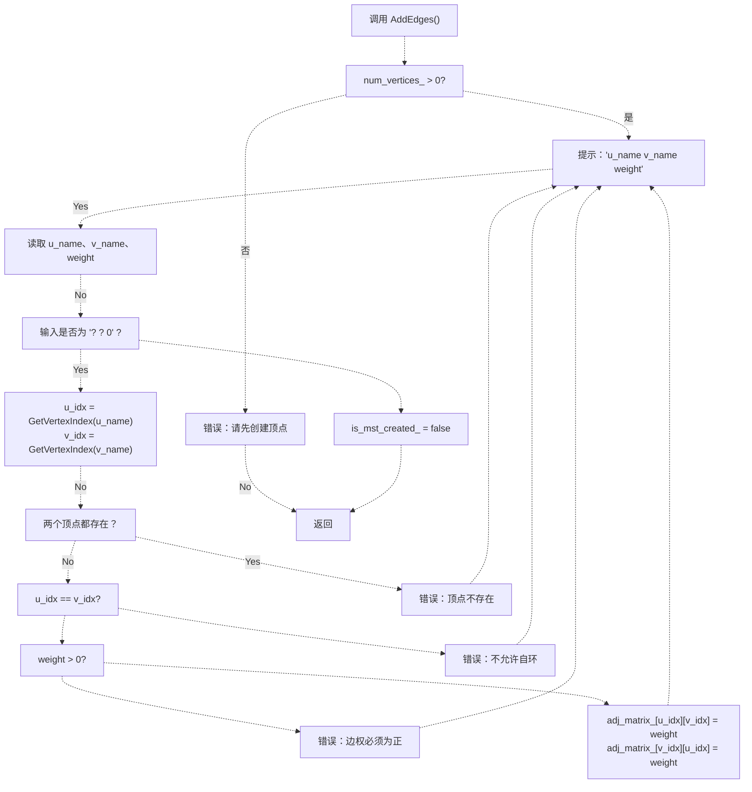
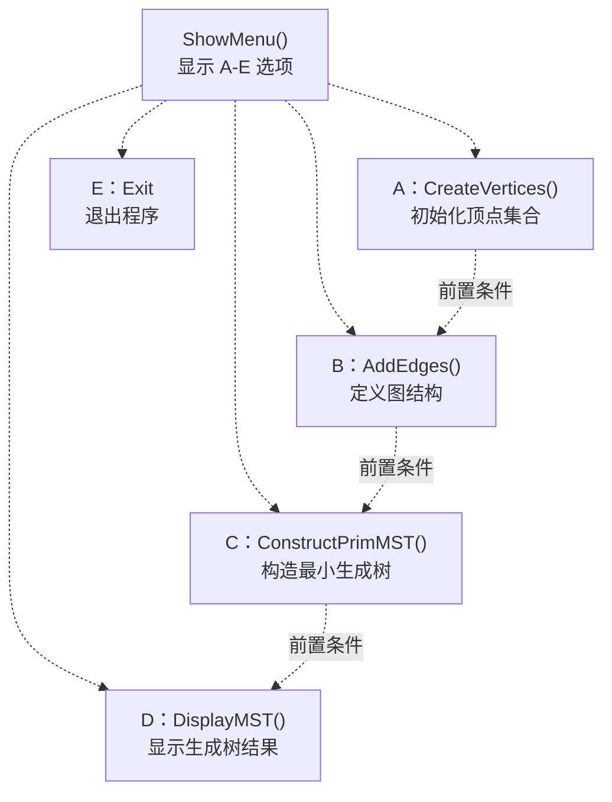
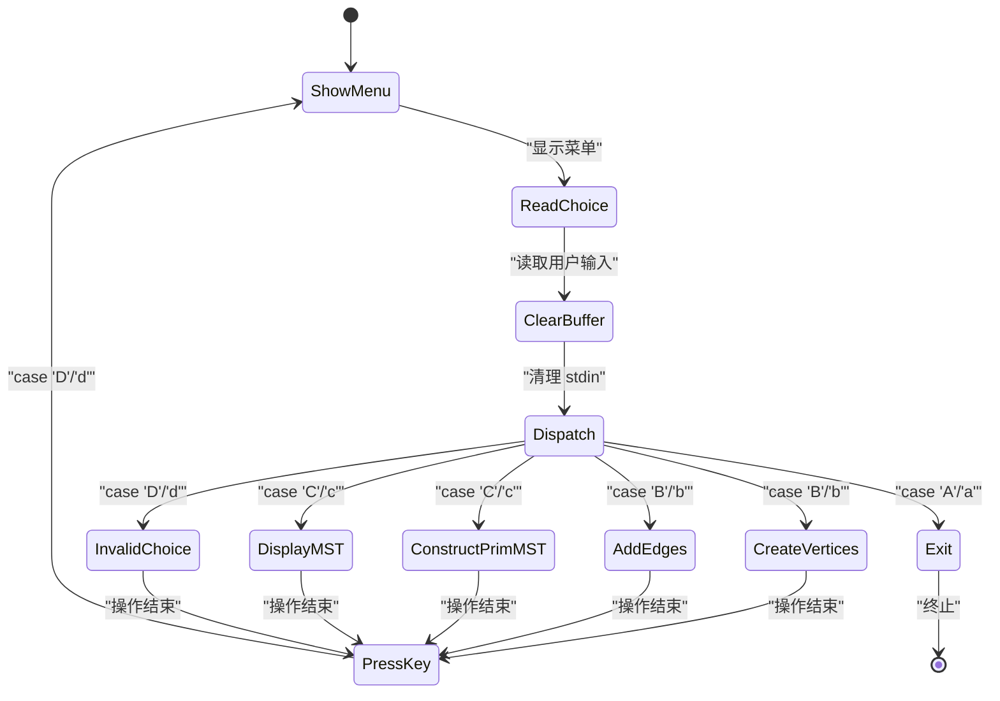
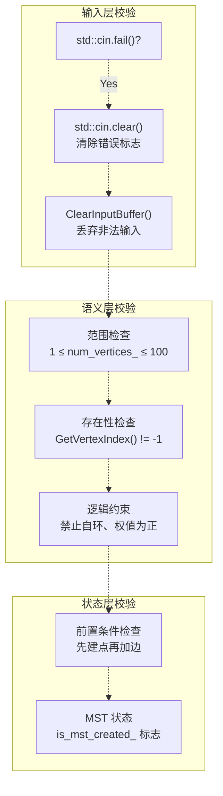
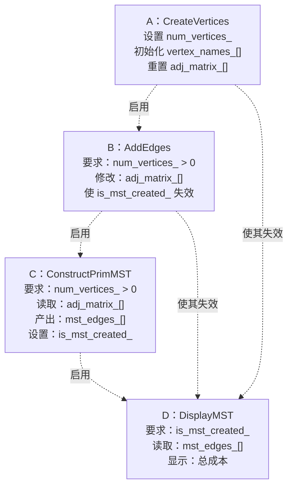

# 图的表示与菜单交互

> **相关源文件**
> * [p8/p8.cpp](https://github.com/lilong555/DataStruct/blob/660fbbaa/p8/p8.cpp)

**目的：** 本文档说明项目八（Power Grid Cost Simulation）中图的表示策略与菜单式交互界面。内容涵盖邻接矩阵数据结构、顶点/边管理操作，以及允许用户构建与查询图结构的交互式菜单系统。如需了解在该图结构上运行的最小生成树算法，请参见 [Prim's Algorithm Implementation](Prim算法实现.md)。

**范围：** 本页关注 `PowerGridSystem` 类的数据表示与用户交互组件，不包含 MST 构造算法本身的细节。

---

## 图表示架构

系统使用 **邻接矩阵（adjacency matrix）** 表示无向带权图。该表示方式支持 O(1) 的边权查询，与 Prim 算法在稠密图上的遍历模式相匹配。

### 类结构与数据成员



**来源：** [p8/p8.cpp L18-L48](https://github.com/lilong555/DataStruct/blob/660fbbaa/p8/p8.cpp#L18-L48)

### 邻接矩阵结构

邻接矩阵 `adj_matrix_[kMaxNodes][kMaxNodes]` 用于存储图，具备如下性质：

| 属性 | 实现方式 | 取值 |
| --- | --- | --- |
| **最大顶点数** | `kMaxNodes` 常量 | 100 |
| **对角元素** | `adj_matrix_[i][i]` | 0（禁止自环） |
| **无边表示** | 不连通的顶点对 | `kInfinity`（2147483647） |
| **对称性** | 无向图 | `adj_matrix_[i][j] == adj_matrix_[j][i]` |
| **合法边权** | 连通的顶点对 | 正整数（> 0） |



**矩阵初始化：** 构造函数在 [p8/p8.cpp L51-L65](https://github.com/lilong555/DataStruct/blob/660fbbaa/p8/p8.cpp#L51-L65) 初始化矩阵：对角线设为 0，其余位置设为 `kInfinity`：

```
adj_matrix_[i][j] = (i == j ? 0 : kInfinity)
```

**来源：** [p8/p8.cpp L6-L8](https://github.com/lilong555/DataStruct/blob/660fbbaa/p8/p8.cpp#L6-L8)

 [p8/p8.cpp L40-L42](https://github.com/lilong555/DataStruct/blob/660fbbaa/p8/p8.cpp#L40-L42)

 [p8/p8.cpp L51-L65](https://github.com/lilong555/DataStruct/blob/660fbbaa/p8/p8.cpp#L51-L65)

---

## 顶点管理系统

### 顶点名到下标的映射

系统维护 **两层标识体系**：

1. **面向用户**：字符串名称（例如 "A"、"B"、"Station1"），存储在 `vertex_names_[kMaxNodes][kMaxNameLen]`
2. **面向内部**：整数下标（0 到 `num_vertices_-1`），用于数组访问

`GetVertexIndex()` 通过线性查找连接两层标识：



**实现：** [p8/p8.cpp L335-L345](https://github.com/lilong555/DataStruct/blob/660fbbaa/p8/p8.cpp#L335-L345)

**复杂度：** O(n)，对于小规模图（n ≤ 100）可接受。

**来源：** [p8/p8.cpp L40](https://github.com/lilong555/DataStruct/blob/660fbbaa/p8/p8.cpp#L40-L40)

 [p8/p8.cpp L335-L345](https://github.com/lilong555/DataStruct/blob/660fbbaa/p8/p8.cpp#L335-L345)

### CreateVertices 操作

创建顶点会进行输入校验并初始化图结构：



**关键校验规则**（由 [p8/p8.cpp L126-L167](https://github.com/lilong555/DataStruct/blob/660fbbaa/p8/p8.cpp#L126-L167) 实现）：

* 顶点数量必须在 1 到 100 之间
* 顶点名称必须唯一（通过 `GetVertexIndex()` 检查）
* 创建新顶点会重置邻接矩阵
* 通过 `is_mst_created_` 失效标志要求重新计算 MST

**来源：** [p8/p8.cpp L126-L167](https://github.com/lilong555/DataStruct/blob/660fbbaa/p8/p8.cpp#L126-L167)

---

## 边管理系统

### AddEdges 操作

添加边使用 **循环输入**，并包含较完整的校验逻辑：



**校验规则**（实现见 [p8/p8.cpp L169-L225](https://github.com/lilong555/DataStruct/blob/660fbbaa/p8/p8.cpp#L169-L225)）：

| 规则 | 检查 | 错误提示 |
| --- | --- | --- |
| **前置条件** | `num_vertices_ > 0` | "请先创建顶点 (选项 A)" |
| **顶点存在性** | `GetVertexIndex() != -1` | "顶点不存在，请重新输入" |
| **禁止自环** | `u_idx != v_idx` | "不允许自环边，请重新输入" |
| **正权值** | `weight > 0` | "边权必须为正整数，请重新输入" |
| **结束输入** | `u_name==\"?\" && v_name==\"?\" && weight==0` | 退出循环 |

**无向图对称性：** 代码在 [p8/p8.cpp L220-L221](https://github.com/lilong555/DataStruct/blob/660fbbaa/p8/p8.cpp#L220-L221) 同时设置 `adj_matrix_[u_idx][v_idx]` 与 `adj_matrix_[v_idx][u_idx]` 以保持对称。

**来源：** [p8/p8.cpp L169-L225](https://github.com/lilong555/DataStruct/blob/660fbbaa/p8/p8.cpp#L169-L225)

---

## 菜单交互系统

### 菜单结构

系统实现了 **基于字符输入** 的菜单，共 5 个操作：



**菜单文本**（由 [p8/p8.cpp L114-L124](https://github.com/lilong555/DataStruct/blob/660fbbaa/p8/p8.cpp#L114-L124) 输出）：

```
**              电网造价模拟系统              **
================================================
**              A --- 创建电网顶点            **
**              B --- 添加电网的边            **
**              C --- 构造最小生成树          **
**              D --- 显示最小生成树          **
**              E --- 退出  程序              **
================================================
```

**来源：** [p8/p8.cpp L114-L124](https://github.com/lilong555/DataStruct/blob/660fbbaa/p8/p8.cpp#L114-L124)

### 主控制循环

`Run()` 实现菜单循环，并包含输入处理：



**实现要点**（来自 [p8/p8.cpp L67-L112](https://github.com/lilong555/DataStruct/blob/660fbbaa/p8/p8.cpp#L67-L112)）：

1. **大小写不敏感**：同时接受大写/小写字母（例如 `case 'A'` 与 `case 'a'`）
2. **输入缓冲管理**：每次选择后调用 `ClearInputBuffer()`，避免残留字符影响后续读取
3. **暂停机制**：`PressKeyToContinue()` 显示“按回车键继续...”，等待回车后再显示菜单
4. **循环控制**：直到选择 'E' 或 'e' 才退出

**来源：** [p8/p8.cpp L67-L112](https://github.com/lilong555/DataStruct/blob/660fbbaa/p8/p8.cpp#L67-L112)

### 输入校验与错误处理

系统采用 **防御式编程**，包含多层校验：



**错误处理函数：**

* **`ClearInputBuffer()`**（[p8/p8.cpp L347-L351](https://github.com/lilong555/DataStruct/blob/660fbbaa/p8/p8.cpp#L347-L351)）：清除错误标志并忽略最多 10000 个字符直到换行
* **`PressKeyToContinue()`**（[p8/p8.cpp L353-L357](https://github.com/lilong555/DataStruct/blob/660fbbaa/p8/p8.cpp#L353-L357)）：提供用户提示并控制交互节奏

**状态管理：** `is_mst_created_` 用于标记 MST 是否有效：

* 创建顶点时置为 `false`（[p8/p8.cpp L165](https://github.com/lilong555/DataStruct/blob/660fbbaa/p8/p8.cpp#L165-L165)）
* 修改边时置为 `false`（[p8/p8.cpp L223](https://github.com/lilong555/DataStruct/blob/660fbbaa/p8/p8.cpp#L223-L223)）
* MST 构造成功时置为 `true`（[p8/p8.cpp L310](https://github.com/lilong555/DataStruct/blob/660fbbaa/p8/p8.cpp#L310-L310)）
* 显示 MST 前检查该标志（[p8/p8.cpp L315-L318](https://github.com/lilong555/DataStruct/blob/660fbbaa/p8/p8.cpp#L315-L318)）

**来源：** [p8/p8.cpp L67-L112](https://github.com/lilong555/DataStruct/blob/660fbbaa/p8/p8.cpp#L67-L112)

 [p8/p8.cpp L347-L357](https://github.com/lilong555/DataStruct/blob/660fbbaa/p8/p8.cpp#L347-L357)

---

## 操作依赖关系

菜单操作之间存在严格的前置依赖：



**前置条件校验示例：**

* `AddEdges()` 在 [p8/p8.cpp L171-L175](https://github.com/lilong555/DataStruct/blob/660fbbaa/p8/p8.cpp#L171-L175) 检查 `num_vertices_ == 0`
* `ConstructPrimMST()` 在 [p8/p8.cpp L229-L233](https://github.com/lilong555/DataStruct/blob/660fbbaa/p8/p8.cpp#L229-L233) 检查 `num_vertices_ == 0`
* `DisplayMST()` 在 [p8/p8.cpp L315-L319](https://github.com/lilong555/DataStruct/blob/660fbbaa/p8/p8.cpp#L315-L319) 检查 `!is_mst_created_`

**来源：** [p8/p8.cpp L126-L333](https://github.com/lilong555/DataStruct/blob/660fbbaa/p8/p8.cpp#L126-L333)

---

## 数据结构空间复杂度

| 组成部分 | 大小 | 总内存（最坏） |
| --- | --- | --- |
| `vertex_names_` | `kMaxNodes × kMaxNameLen` = 100 × 50 字节 | 5,000 字节 |
| `adj_matrix_` | `kMaxNodes² × sizeof(int)` = 100² × 4 字节 | 40,000 字节 |
| `mst_edges_` | `kMaxNodes × sizeof(Edge)` = 100 × 12 字节 | 1,200 字节 |
| **总计** |  | **~46 KB** |

**观察：** 邻接矩阵的空间复杂度为 O(V²)，在稠密图中合适，但对稀疏图会浪费空间。对电网应用而言，典型顶点数往往 n &lt; 20，因此该开销可接受，同时可获得实现简单与 O(1) 的边查询性能。

**来源：** [p8/p8.cpp L6-L8](https://github.com/lilong555/DataStruct/blob/660fbbaa/p8/p8.cpp#L6-L8)

 [p8/p8.cpp L11-L16](https://github.com/lilong555/DataStruct/blob/660fbbaa/p8/p8.cpp#L11-L16)

 [p8/p8.cpp L40-L47](https://github.com/lilong555/DataStruct/blob/660fbbaa/p8/p8.cpp#L40-L47)
