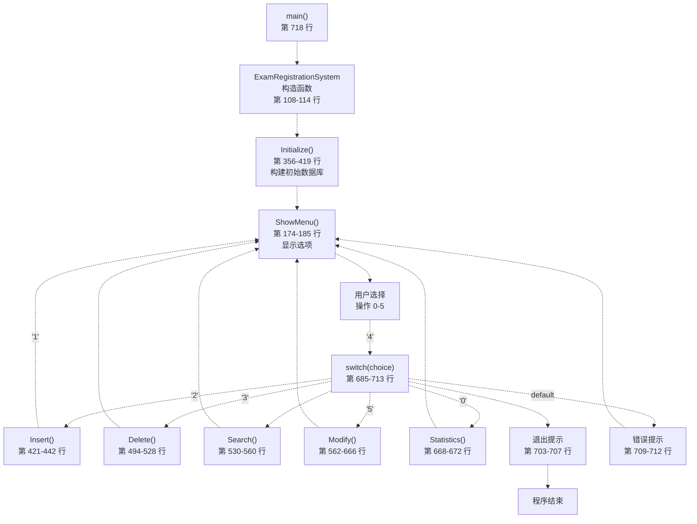
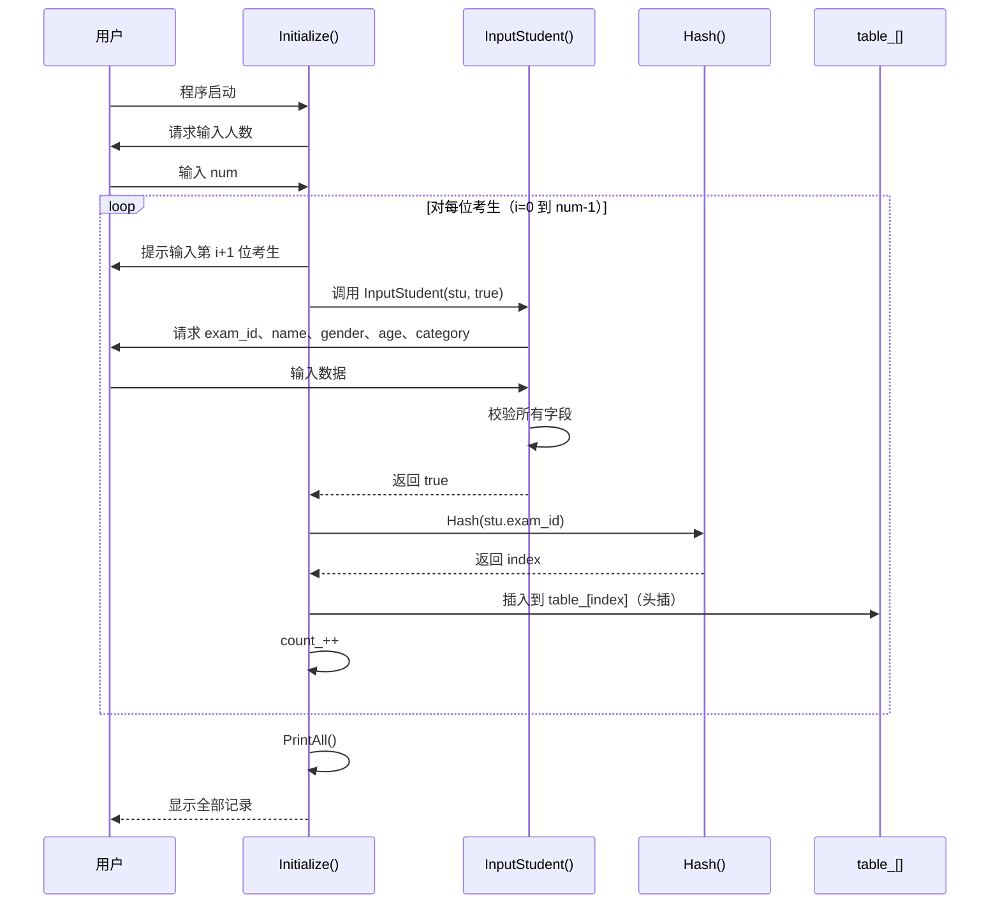
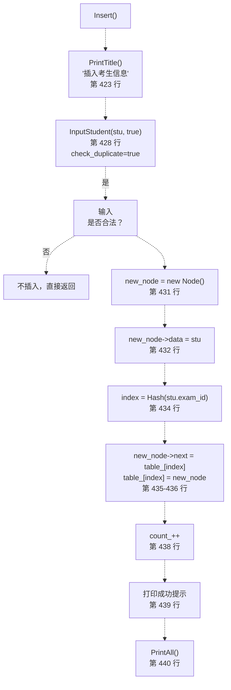
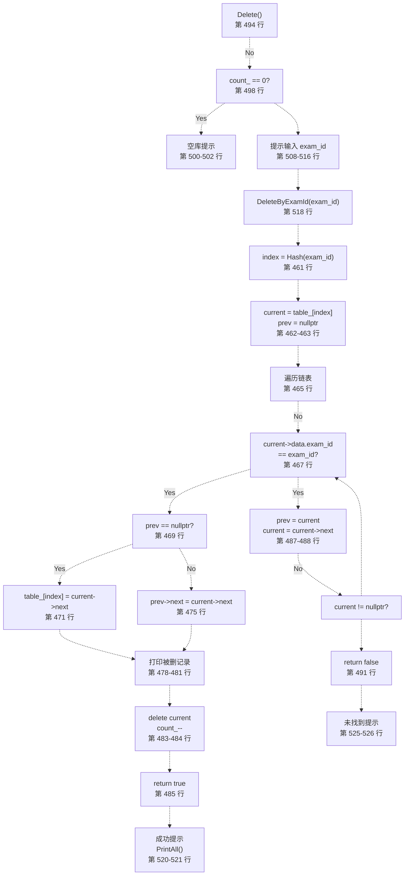
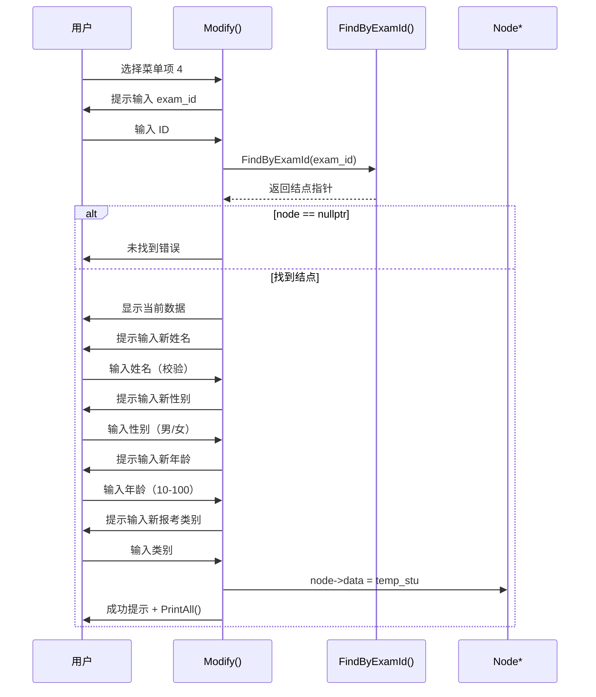
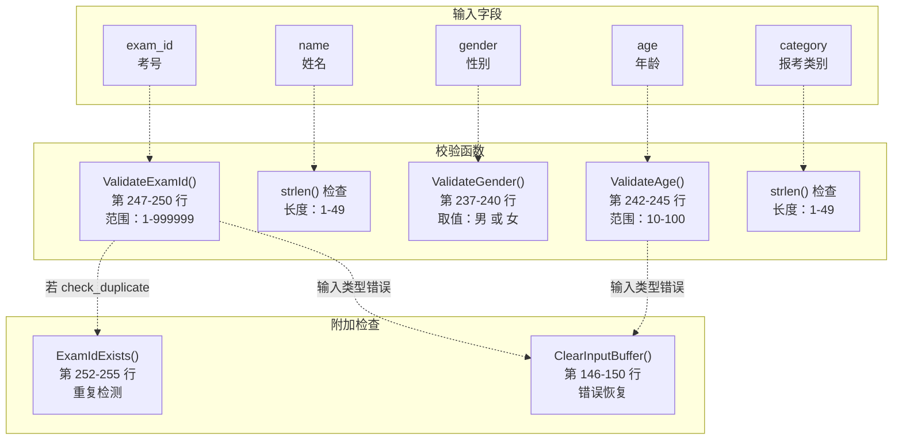
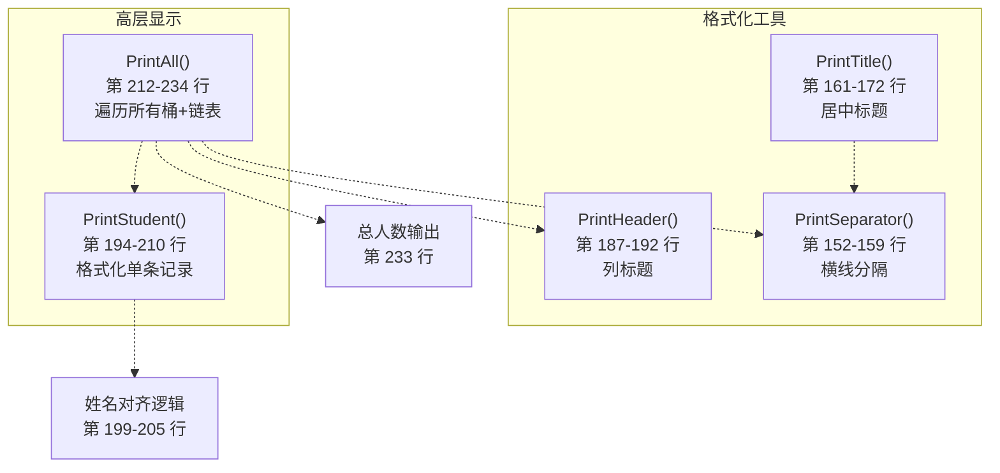
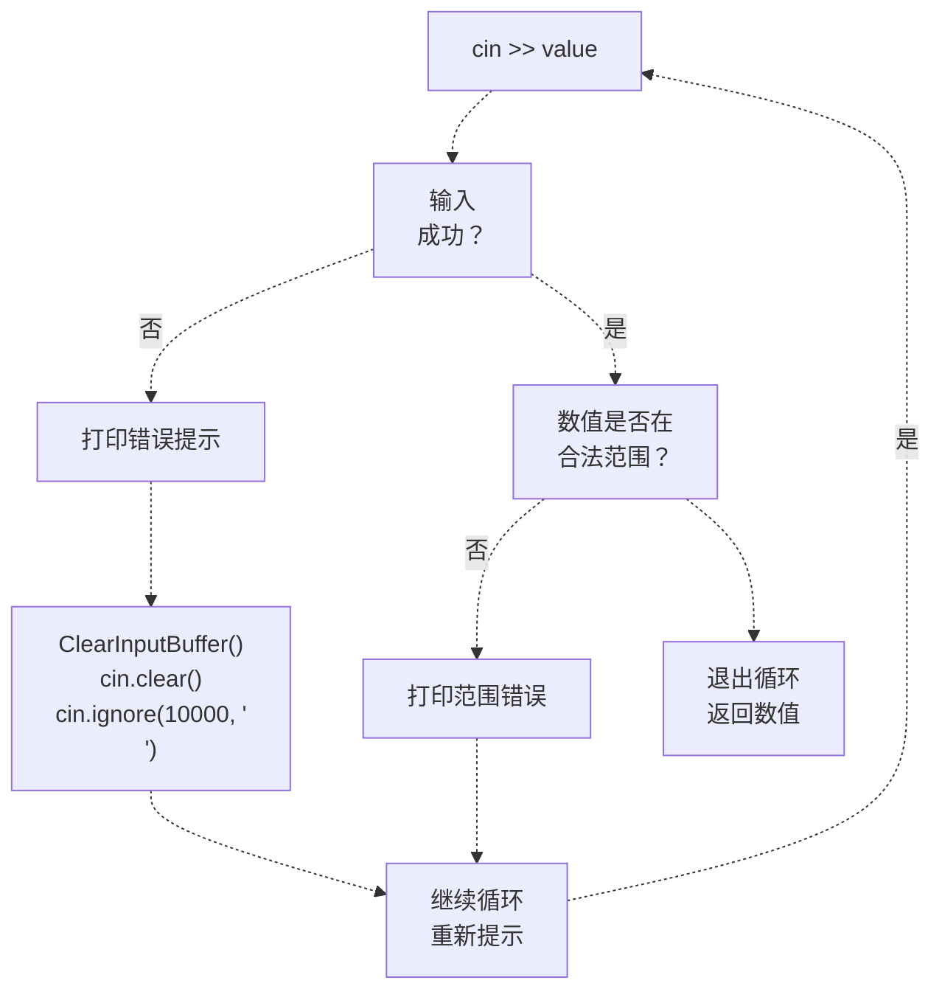

# 增删改查操作与菜单系统

> **相关源文件**
> * [CLAUDE.md](https://github.com/lilong555/DataStruct/blob/660fbbaa/CLAUDE.md)
> * [p1/p1.cpp](https://github.com/lilong555/DataStruct/blob/660fbbaa/p1/p1.cpp)

本文档说明项目一「考试报名系统」中基于交互式菜单的界面与数据操作流程，详细描述 Create（插入）、Read（查找/统计）、Update（修改）与 Delete（删除）的实现方式，以及用户交互流程、输入校验机制与输出格式化工具。

如需了解底层哈希表数据结构与冲突解决策略，请参见 [Hash Table Implementation](哈希表实现.md)。

---

## 菜单系统架构

系统通过编号菜单实现“持续交互会话”：用户可在同一次运行中连续执行多种操作。`ExamRegistrationSystem::Run()`（[p1/p1.cpp L674-L715](https://github.com/lilong555/DataStruct/blob/660fbbaa/p1/p1.cpp#L674-L715)）负责驱动主交互循环。

### 菜单流程图



**来源：** [p1/p1.cpp L674-L722](https://github.com/lilong555/DataStruct/blob/660fbbaa/p1/p1.cpp#L674-L722)

### 菜单显示结构

`ShowMenu()` 向用户展示 6 个编号选项：

| 选项 | 描述 | 处理函数 |
| --- | --- | --- |
| 1 | 插入考生信息（插入记录） | `Insert()` |
| 2 | 删除考生信息（删除记录） | `Delete()` |
| 3 | 查找考生信息（查找记录） | `Search()` |
| 4 | 修改考生信息（修改记录） | `Modify()` |
| 5 | 统计考生信息（显示统计） | `Statistics()` |
| 0 | 退出系统（结束循环） | Terminates loop |

菜单界面通过 `PrintSeparator()`（[p1/p1.cpp L152-L159](https://github.com/lilong555/DataStruct/blob/660fbbaa/p1/p1.cpp#L152-L159)）与 `PrintTitle()`（[p1/p1.cpp L161-L172](https://github.com/lilong555/DataStruct/blob/660fbbaa/p1/p1.cpp#L161-L172)）实现装饰分隔线与居中标题，以提升可读性。

**来源：** [p1/p1.cpp L174-L185](https://github.com/lilong555/DataStruct/blob/660fbbaa/p1/p1.cpp#L174-L185)

---

## 系统初始化

进入主菜单循环前，系统需要通过 `Initialize()`（[p1/p1.cpp L356-L419](https://github.com/lilong555/DataStruct/blob/660fbbaa/p1/p1.cpp#L356-L419)）完成初始数据库构建。该过程：

1. **输入人数**：接收考生数量（校验范围：1-10000）
2. **采集记录**：逐条录入考生信息
3. **插入哈希表**：在 `table_[Hash(exam_id)]` 处进行头插
4. **展示结果**：调用 `PrintAll()` 显示全部录入记录



**来源：** [p1/p1.cpp L356-L419](https://github.com/lilong555/DataStruct/blob/660fbbaa/p1/p1.cpp#L356-L419)

---

## 增删改查操作实现

### 插入操作（Insert）

`Insert()`（[p1/p1.cpp L421-L442](https://github.com/lilong555/DataStruct/blob/660fbbaa/p1/p1.cpp#L421-L442)）向哈希表中添加一条新考生记录，整体步骤如下：

1. **采集输入**：调用 `InputStudent(stu, true)`，开启重复考号检测
2. **创建结点**：`new Node` 并复制学生数据
3. **计算哈希**：通过 `Hash(stu.exam_id)` 得到桶下标
4. **头插链表**：将结点插到 `table_[index]` 对应冲突链表表头
5. **数量自增**：更新 `count_`
6. **确认展示**：显示成功提示，并调用 `PrintAll()`



**来源：** [p1/p1.cpp L421-L442](https://github.com/lilong555/DataStruct/blob/660fbbaa/p1/p1.cpp#L421-L442)

### 删除操作（Delete）

`Delete()`（[p1/p1.cpp L494-L528](https://github.com/lilong555/DataStruct/blob/660fbbaa/p1/p1.cpp#L494-L528)）通过考号删除记录，核心删除逻辑封装在 `DeleteByExamId()`（[p1/p1.cpp L459-L492](https://github.com/lilong555/DataStruct/blob/660fbbaa/p1/p1.cpp#L459-L492)）中，其流程为：

1. **校验输入**：提示输入考号并做数字校验
2. **空表判断**：若数据库为空则提前返回
3. **查找冲突链**：在散列桶对应链表中遍历
4. **断链删除**：更新指针，将结点从链表中移除
5. **展示被删记录**：释放前打印该考生信息
6. **释放内存**：`delete current` 并维护计数



**来源：** [p1/p1.cpp L459-L492](https://github.com/lilong555/DataStruct/blob/660fbbaa/p1/p1.cpp#L459-L492)

 [p1/p1.cpp L494-L528](https://github.com/lilong555/DataStruct/blob/660fbbaa/p1/p1.cpp#L494-L528)

### 查找操作（Search）

`Search()`（[p1/p1.cpp L530-L560](https://github.com/lilong555/DataStruct/blob/660fbbaa/p1/p1.cpp#L530-L560)）用于定位并展示考生记录，其查找逻辑委托给 `FindByExamId()`（[p1/p1.cpp L444-L457](https://github.com/lilong555/DataStruct/blob/660fbbaa/p1/p1.cpp#L444-L457)）：

1. **输入考号**：带数字校验循环提示输入
2. **映射桶下标**：计算 `index = Hash(exam_id)`
3. **遍历冲突链**：从 `table_[index]` 开始遍历
4. **逐结点比较**：比较 `exam_id` 字段
5. **输出结果**：找到则显示记录，否则打印错误提示

辅助方法 `FindByExamId()` 返回 `Node*`，因此可在多个操作中复用（Delete、Modify、ExamIdExists）。

**来源：** [p1/p1.cpp L444-L457](https://github.com/lilong555/DataStruct/blob/660fbbaa/p1/p1.cpp#L444-L457)

 [p1/p1.cpp L530-L560](https://github.com/lilong555/DataStruct/blob/660fbbaa/p1/p1.cpp#L530-L560)

### 修改操作（Modify）

`Modify()`（[p1/p1.cpp L562-L666](https://github.com/lilong555/DataStruct/blob/660fbbaa/p1/p1.cpp#L562-L666)）更新已有考生信息。由于考号是不可变主键，修改时不会改变 `exam_id`：



修改流程会先将原考号复制到 `temp_stu.exam_id`（[p1/p1.cpp L590](https://github.com/lilong555/DataStruct/blob/660fbbaa/p1/p1.cpp#L590-L590)），再采集其余 4 个字段的新值，从而保证该记录在哈希表中的位置不会变化。

**来源：** [p1/p1.cpp L562-L666](https://github.com/lilong555/DataStruct/blob/660fbbaa/p1/p1.cpp#L562-L666)

### 统计操作（Statistics）

`Statistics()`（[p1/p1.cpp L668-L672](https://github.com/lilong555/DataStruct/blob/660fbbaa/p1/p1.cpp#L668-L672)）是一个简单封装，用于展示全部考生信息：

```
void ExamRegistrationSystem::Statistics()
{
    PrintTitle("统计考生信息");
    PrintAll();
}
```

其内部调用 `PrintAll()`（[p1/p1.cpp L212-L234](https://github.com/lilong555/DataStruct/blob/660fbbaa/p1/p1.cpp#L212-L234)），遍历所有桶及其冲突链表并打印每个结点。

**来源：** [p1/p1.cpp L668-L672](https://github.com/lilong555/DataStruct/blob/660fbbaa/p1/p1.cpp#L668-L672)

---

## 输入校验系统

系统通过多个专用方法实现较完整的输入校验，以保证数据正确性。

### 校验函数映射



**来源：** [p1/p1.cpp L237-L250](https://github.com/lilong555/DataStruct/blob/660fbbaa/p1/p1.cpp#L237-L250)

 [p1/p1.cpp L252-L255](https://github.com/lilong555/DataStruct/blob/660fbbaa/p1/p1.cpp#L252-L255)

 [p1/p1.cpp L146-L150](https://github.com/lilong555/DataStruct/blob/660fbbaa/p1/p1.cpp#L146-L150)

### InputStudent 的校验流程

`InputStudent()`（[p1/p1.cpp L257-L353](https://github.com/lilong555/DataStruct/blob/660fbbaa/p1/p1.cpp#L257-L353)）通过一系列校验循环组织各字段的输入与检查：

| 字段 | 校验规则 | 错误处理 |
| --- | --- | --- |
| **exam_id** | • 必须为数字<br />• 范围：1-999999<br />• 唯一（当 `check_duplicate=true`） | 循环直到合法 |
| **name** | • 非空<br />• 长度：1-49 字符 | 循环直到合法 |
| **gender** | • 必须严格为 "男" 或 "女" | 循环直到合法 |
| **age** | • 必须为数字<br />• 范围：10-100 | 类型错误时调用 `ClearInputBuffer()` |
| **category** | • 非空<br />• 长度：1-49 字符 | 循环直到合法 |

每个字段都使用 `while(true)` 循环，只有在输入合法时才会 `break`。对 `exam_id` 与 `age` 的非数字输入会触发 `ClearInputBuffer()`（[p1/p1.cpp L146-L150](https://github.com/lilong555/DataStruct/blob/660fbbaa/p1/p1.cpp#L146-L150)）以清空输入流缓冲区。

**来源：** [p1/p1.cpp L257-L353](https://github.com/lilong555/DataStruct/blob/660fbbaa/p1/p1.cpp#L257-L353)

### 重复考号检测机制

`ExamIdExists()`（[p1/p1.cpp L252-L255](https://github.com/lilong555/DataStruct/blob/660fbbaa/p1/p1.cpp#L252-L255)）用于阻止重复考号插入：

```
bool ExamRegistrationSystem::ExamIdExists(int exam_id)
{
    return FindByExamId(exam_id) != nullptr;
}
```

该检查仅在 `InputStudent()` 以 `check_duplicate=true` 调用时启用，主要发生在：

* 初始建库（`Initialize()` 中的插入）
* 交互式插入操作

修改操作会以 `check_duplicate=false` 调用 `InputStudent()`，因为它更新的是已有记录。

**来源：** [p1/p1.cpp L252-L255](https://github.com/lilong555/DataStruct/blob/660fbbaa/p1/p1.cpp#L252-L255)

---

## 输出格式化系统

系统通过一组格式化工具函数，将数据以可读的表格形式输出。

### 显示函数层次结构



**来源：** [p1/p1.cpp L152-L172](https://github.com/lilong555/DataStruct/blob/660fbbaa/p1/p1.cpp#L152-L172)

 [p1/p1.cpp L187-L210](https://github.com/lilong555/DataStruct/blob/660fbbaa/p1/p1.cpp#L187-L210)

 [p1/p1.cpp L212-L234](https://github.com/lilong555/DataStruct/blob/660fbbaa/p1/p1.cpp#L212-L234)

### 表格输出格式

`PrintAll()` 输出结构化内容，并保持列对齐：

```
----------------------------------------------------------------------
考号	姓名		性别	年龄	报考类别
----------------------------------------------------------------------
123456	张三		男	20	计算机科学
123457	李四		女	19	软件工程
----------------------------------------------------------------------
总计: 2 名考生
```

`PrintStudent()` 中的对齐处理（[p1/p1.cpp L199-L205](https://github.com/lilong555/DataStruct/blob/660fbbaa/p1/p1.cpp#L199-L205)）会对短姓名额外输出制表符，以保持列对齐：

```cpp
int name_len = std::strlen(stu.name);
std::cout << stu.name;
if (name_len < 8)
{
    std::cout << "\t";
}
std::cout << "\t";
```

该做法用于补偿中文字符宽度变化带来的显示差异。

**来源：** [p1/p1.cpp L194-L210](https://github.com/lilong555/DataStruct/blob/660fbbaa/p1/p1.cpp#L194-L210)

### 分隔线与标题

系统使用两类分隔线：

* **`PrintSeparator('=', 70)`**：主分区分隔（[p1/p1.cpp L152-L159](https://github.com/lilong555/DataStruct/blob/660fbbaa/p1/p1.cpp#L152-L159)）
* **`PrintSeparator('-', 70)`**：表格边界与菜单分隔

`PrintTitle()`（[p1/p1.cpp L161-L172](https://github.com/lilong555/DataStruct/blob/660fbbaa/p1/p1.cpp#L161-L172)）在 70 字符宽度内居中输出标题：

```cpp
int title_len = std::strlen(title);
int padding = (70 - title_len) / 2;
for (int i = 0; i < padding; ++i) {
    std::cout << " ";
}
std::cout << title << std::endl;
```

**来源：** [p1/p1.cpp L152-L172](https://github.com/lilong555/DataStruct/blob/660fbbaa/p1/p1.cpp#L152-L172)

---

## 错误处理模式

系统在各操作中保持一致的错误处理逻辑：

### 输入错误恢复



**来源：** [p1/p1.cpp L146-L150](https://github.com/lilong555/DataStruct/blob/660fbbaa/p1/p1.cpp#L146-L150)

 [p1/p1.cpp L257-L353](https://github.com/lilong555/DataStruct/blob/660fbbaa/p1/p1.cpp#L257-L353)

### 操作错误提示

所有增删改查操作都会向用户返回较清晰的错误反馈：

| 场景 | 提示模式 | 示例 |
| --- | --- | --- |
| **数据库为空** | `"*** 当前系统中暂无考生信息! ***"` | 空库时执行删除 |
| **记录未找到** | `"*** 错误: 未找到考号为 X 的考生! ***"` | 查找/删除/修改 |
| **输入类型错误** | `"*** 错误: [field] 必须是数字! ***"` | 年龄/考号输入非数字 |
| **范围非法** | `"*** 错误: [field] 必须在 X-Y 之间! ***"` | 年龄不在 10-100 |
| **主键重复** | `"*** 错误: 考号 X 已存在! ***"` | 插入重复考号 |
| **菜单选择无效** | `"*** 错误: 无效的操作! 请输入 0-5 之间的数字。***"` | 选择菜单项 |

界面中广泛使用三连星号（`***`）突出错误信息的视觉强调效果。

**来源：** [p1/p1.cpp L216-L217](https://github.com/lilong555/DataStruct/blob/660fbbaa/p1/p1.cpp#L216-L217)

 [p1/p1.cpp L265-L278](https://github.com/lilong555/DataStruct/blob/660fbbaa/p1/p1.cpp#L265-L278)

 [p1/p1.cpp L500-L502](https://github.com/lilong555/DataStruct/blob/660fbbaa/p1/p1.cpp#L500-L502)

 [p1/p1.cpp L525-L526](https://github.com/lilong555/DataStruct/blob/660fbbaa/p1/p1.cpp#L525-L526)

 [p1/p1.cpp L557-L558](https://github.com/lilong555/DataStruct/blob/660fbbaa/p1/p1.cpp#L557-L558)

 [p1/p1.cpp L663-L664](https://github.com/lilong555/DataStruct/blob/660fbbaa/p1/p1.cpp#L663-L664)

 [p1/p1.cpp L709-L710](https://github.com/lilong555/DataStruct/blob/660fbbaa/p1/p1.cpp#L709-L710)
