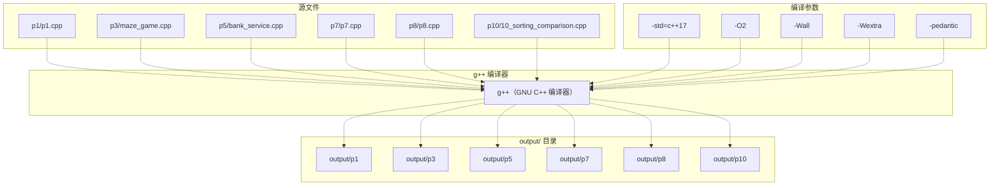
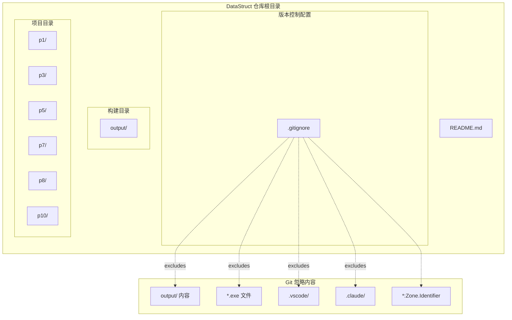
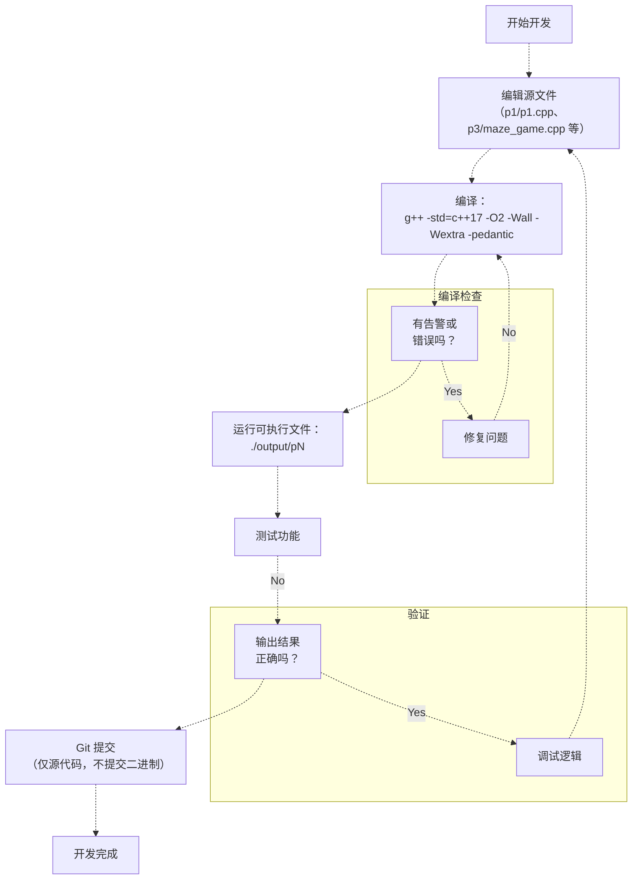

# 快速开始

> **相关源文件**
> * [.gitignore](https://github.com/lilong555/DataStruct/blob/660fbbaa/.gitignore)
> * [README.md](https://github.com/lilong555/DataStruct/blob/660fbbaa/README.md)

## 目的与范围

本文档给出 DataStruct 仓库中全部 6 个项目的编译与运行指南，涵盖统一的编译方式、编译器配置、目录结构以及开发流程。由于所有项目使用相同的构建配置与编译参数，因此可以在整个仓库内保持一致的构建体验。

如需了解各项目的功能细节，请参见 [Projects Overview](项目概览.md)。如需了解数据结构与算法细节，请参见 [Data Structures Reference](数据结构参考.md) 与 [Algorithms Reference](算法参考.md)。

## 前置条件

构建系统需要以下环境：

| 组件 | 要求 | 说明 |
| --- | --- | --- |
| 操作系统 | WSL2 或 Linux | 与 [README.md L16](https://github.com/lilong555/DataStruct/blob/660fbbaa/README.md#L16-L16) 中的说明一致 |
| 编译器 | 支持 C++17 的 `g++` | 推荐 7.0+ |
| 标准库 | C++17 STL | 需要完整支持 |
| 构建目录 | `output/`（自动创建） | 不纳入版本控制 |

**来源：**[README.md L16-L18](https://github.com/lilong555/DataStruct/blob/660fbbaa/README.md#L16-L18)

 [.gitignore L2-L5](https://github.com/lilong555/DataStruct/blob/660fbbaa/.gitignore#L2-L5)

## 编译系统架构

仓库采用“扁平化”构建方式：每个项目独立编译，统一输出到同一个 `output/` 目录中。

### 构建流程概览



**来源：**[README.md L20-L29](https://github.com/lilong555/DataStruct/blob/660fbbaa/README.md#L20-L29)

### 目录结构与构建产物



**来源：**[.gitignore L1-L14](https://github.com/lilong555/DataStruct/blob/660fbbaa/.gitignore#L1-L14)

 [README.md L5-L14](https://github.com/lilong555/DataStruct/blob/660fbbaa/README.md#L5-L14)

## 编译项目

### 步骤 1：创建输出目录

首先确保存在 `output/` 目录：

```
mkdir -p output
```

`-p` 参数会按需创建父目录，并且当目录已存在时不会报错。

**来源：**[README.md L21](https://github.com/lilong555/DataStruct/blob/660fbbaa/README.md#L21-L21)

### 步骤 2：编译单个项目

每个项目都遵循同一种命令模式进行编译：

```
g++ -std=c++17 -O2 -Wall -Wextra -pedantic <source_file> -o output/<executable_name>
```

### 完整编译命令

| 项目 | 源文件 | 编译命令 | 输出可执行文件 |
| --- | --- | --- | --- |
| P1：考试报名系统 | `p1/p1.cpp` | `g++ -std=c++17 -O2 -Wall -Wextra -pedantic p1/p1.cpp -o output/p1` | `output/p1` |
| P3：勇闯迷宫游戏 | `p3/maze_game.cpp` | `g++ -std=c++17 -O2 -Wall -Wextra -pedantic p3/maze_game.cpp -o output/p3` | `output/p3` |
| P5：银行业务模拟 | `p5/bank_service.cpp` | `g++ -std=c++17 -O2 -Wall -Wextra -pedantic p5/bank_service.cpp -o output/p5` | `output/p5` |
| P7：修理牧场（最小花费） | `p7/p7.cpp` | `g++ -std=c++17 -O2 -Wall -Wextra -pedantic p7/p7.cpp -o output/p7` | `output/p7` |
| P8：电网建设造价模拟 | `p8/p8.cpp` | `g++ -std=c++17 -O2 -Wall -Wextra -pedantic p8/p8.cpp -o output/p8` | `output/p8` |
| P10：排序算法比较 | `p10/10_sorting_comparison.cpp` | `g++ -std=c++17 -O2 -Wall -Wextra -pedantic p10/10_sorting_comparison.cpp -o output/p10` | `output/p10` |

**来源：**[README.md L23-L28](https://github.com/lilong555/DataStruct/blob/660fbbaa/README.md#L23-L28)

### 一次编译全部项目（脚本）

如果希望一次性编译全部项目，可按顺序执行以下命令：

```
mkdir -p output
g++ -std=c++17 -O2 -Wall -Wextra -pedantic p1/p1.cpp -o output/p1
g++ -std=c++17 -O2 -Wall -Wextra -pedantic p3/maze_game.cpp -o output/p3
g++ -std=c++17 -O2 -Wall -Wextra -pedantic p5/bank_service.cpp -o output/p5
g++ -std=c++17 -O2 -Wall -Wextra -pedantic p7/p7.cpp -o output/p7
g++ -std=c++17 -O2 -Wall -Wextra -pedantic p8/p8.cpp -o output/p8
g++ -std=c++17 -O2 -Wall -Wextra -pedantic p10/10_sorting_comparison.cpp -o output/p10
```

**来源：**[README.md L20-L28](https://github.com/lilong555/DataStruct/blob/660fbbaa/README.md#L20-L28)

## 运行可执行文件

编译完成后，从 `output/` 目录运行对应可执行文件：

```markdown
./output/p1   # 考试报名系统
./output/p3   # 勇闯迷宫游戏
./output/p5   # 银行业务模拟
./output/p7   # 修理牧场（最小花费）
./output/p8   # 电网建设造价（Prim 最小生成树）
./output/p10  # 排序算法比较
```

所有可执行文件均通过标准输入/输出进行交互。具体输入输出格式可参见 [Projects Overview](项目概览.md)，或查看各项目页面（[Project 1](项目一-考试报名系统.md)、[Project 3](项目三-勇闯迷宫游戏.md)、[Project 5](项目五-银行业务模拟.md)、[Project 7](项目七-修理牧场（最小花费）.md)、[Project 8](项目八-电网建设造价模拟.md)、[Project 10](项目十-排序算法比较.md)）。

**来源：**[README.md L31-L40](https://github.com/lilong555/DataStruct/blob/660fbbaa/README.md#L31-L40)

## 编译参数说明

统一的编译参数各自承担不同作用：

| 参数 | 目的 | 影响 |
| --- | --- | --- |
| `-std=c++17` | 启用 C++17 语言标准 | 提供现代 C++ 特性（结构化绑定、`if constexpr` 等） |
| `-O2` | 二级优化 | 在编译耗时与运行性能之间折中；对 P10 的基准对比准确性较关键 |
| `-Wall` | 开启常用告警 | 检测潜在 bug（未初始化变量、未使用的值等） |
| `-Wextra` | 开启额外告警 | 捕获 `-Wall` 之外的问题（符号比较、缺少字段初始化等） |
| `-pedantic` | 强制严格 ISO C++ 兼容 | 拒绝编译器扩展，确保可移植性 |

### 为什么选择这些参数？

* **C++17**：满足仓库中使用的现代语言特性需求
* **-O2**：为项目十的经验性性能对比提供更贴近真实的运行表现，同时避免过高编译耗时
* **告警参数**：在编译阶段尽早发现常见错误，提升代码质量
* **严格模式**：在课程设计场景中强调可移植性与标准一致性

**来源：**[README.md L18](https://github.com/lilong555/DataStruct/blob/660fbbaa/README.md#L18-L18)

 [README.md L23-L28](https://github.com/lilong555/DataStruct/blob/660fbbaa/README.md#L23-L28)

## 版本控制与构建产物

`.gitignore` 配置用于将构建产物与开发环境文件排除在版本管理之外：

### 忽略规则

| 规则 | 用途 | 示例 |
| --- | --- | --- |
| `output/` | 构建产物目录 | 所有编译得到的可执行文件 |
| `p3/output/` | 项目特定输出 | 历史遗留的项目输出目录 |
| `p5/output/` | 项目特定输出 | 历史遗留的项目输出目录 |
| `*.exe` | Windows 可执行文件 | `p1.exe`、`p10.exe` |
| `.vscode/` | VS Code 配置 | IDE 设置、启动配置等 |
| `.claude/` | Claude Code 系统文件 | AI 助手相关配置 |
| `*:Zone.Identifier` | WSL 文件元数据 | Windows-Linux 互操作元数据 |

**说明**：`.gitignore` 第 5 行（`!output/*.exe`）看起来是一个“反向匹配”规则，但它会被第 4 行更宽泛的 `output/` 排除规则所覆盖，因此实际效果可能并不明显。

**来源：**[.gitignore L1-L14](https://github.com/lilong555/DataStruct/blob/660fbbaa/.gitignore#L1-L14)

## 开发流程



**来源：**[README.md L16-L40](https://github.com/lilong555/DataStruct/blob/660fbbaa/README.md#L16-L40)

 [.gitignore L1-L14](https://github.com/lilong555/DataStruct/blob/660fbbaa/.gitignore#L1-L14)

### 典型开发循环

1. **编辑**：修改各项目目录中的源文件（`p1/`、`p3/` 等）
2. **编译**：在仓库根目录执行对应的 `g++` 编译命令
3. **检查**：处理告警或错误（已启用的参数会报告潜在问题）
4. **运行**：从 `output/` 执行生成的二进制文件
5. **测试**：使用测试输入验证功能是否正确
6. **提交**：仅暂存并提交源文件（构建产物会被自动忽略）

## 故障排除

### 常见问题

| 问题 | 原因 | 解决方法 |
| --- | --- | --- |
| `g++: command not found` | 未安装 g++ 或不在 PATH 中 | 通过包管理器安装：`sudo apt install g++` |
| `output/: No such file or directory` | 输出目录不存在 | 编译前先执行 `mkdir -p output` |
| 无法识别 C++17 特性 | g++ 版本过旧 | 升级到 g++ 7.0+（可用 `g++ --version` 检查） |
| 运行时报 Permission denied | 文件无可执行权限 | 执行 `chmod +x output/p1`（或对应二进制文件） |
| 出现编译告警 | 代码质量问题 | 按告警信息定位并修复问题 |

### 验证构建成功

编译后可检查可执行文件是否存在且具备执行权限：

```
ls -lh output/
```

期望输出中能看到 6 个二进制文件，并且权限包含可执行位（`-rwxr-xr-x`）：

```
-rwxr-xr-x 1 user user  XXK DATE output/p1
-rwxr-xr-x 1 user user  XXK DATE output/p3
-rwxr-xr-x 1 user user  XXK DATE output/p5
-rwxr-xr-x 1 user user  XXK DATE output/p7
-rwxr-xr-x 1 user user  XXK DATE output/p8
-rwxr-xr-x 1 user user  XXK DATE output/p10
```

### 编译器版本检查

确认 g++ 版本支持 C++17：

```
g++ --version
```

最低要求版本为 g++ 7.0（2017 年发布）。

**来源：**[README.md L16-L29](https://github.com/lilong555/DataStruct/blob/660fbbaa/README.md#L16-L29)

## 下一步

在成功完成构建之后：

1. **浏览项目**：参见 [Projects Overview](项目概览.md) 对比了解 6 个项目
2. **运行单个项目**：在各项目页面查看更详细的使用说明：* [Project 1: Exam Registration System](项目一-考试报名系统.md) * [Project 3: Maze Game](项目三-勇闯迷宫游戏.md) * [Project 5: Bank Service Simulation](项目五-银行业务模拟.md) * [Project 7: Repair Ranch](项目七-修理牧场（最小花费）.md) * [Project 8: Power Grid Cost Simulation](项目八-电网建设造价模拟.md) * [Project 10: Sorting Algorithm Comparison](项目十-排序算法比较.md)
3. **理解数据结构**：参见 [Data Structures Reference](数据结构参考.md) 获取实现细节
4. **分析算法**：参见 [Algorithms Reference](算法参考.md) 查看复杂度分析

**来源：**[README.md L1-L56](https://github.com/lilong555/DataStruct/blob/660fbbaa/README.md#L1-L56)
