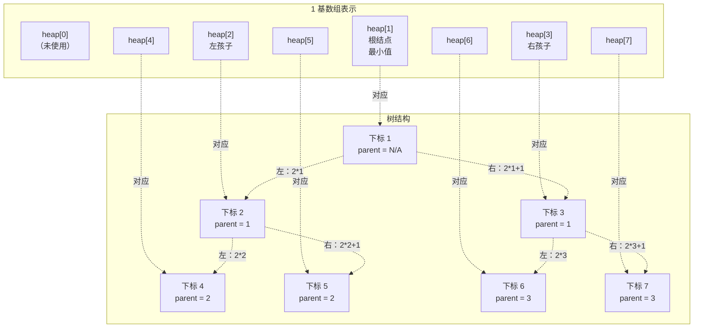
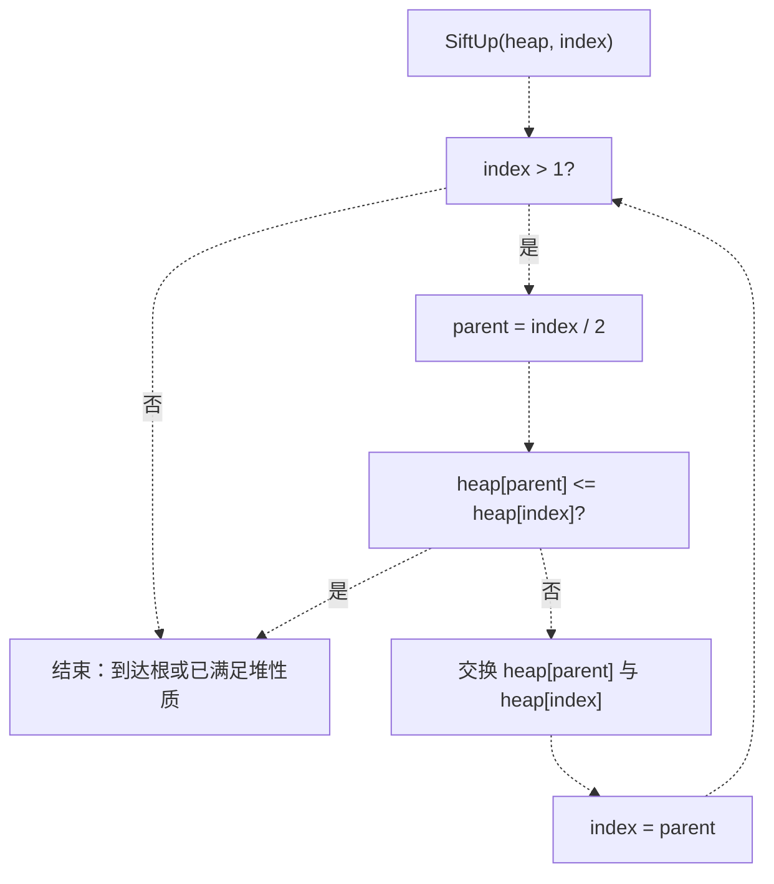
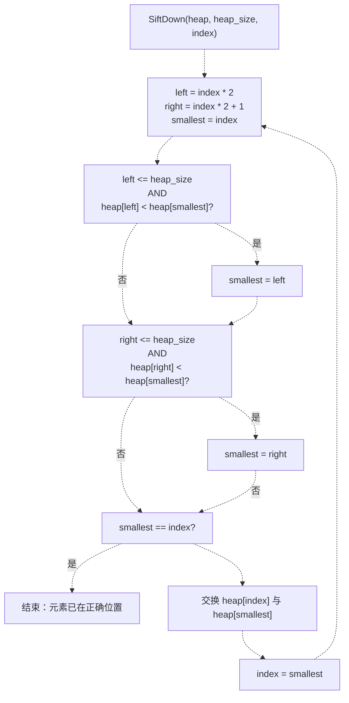
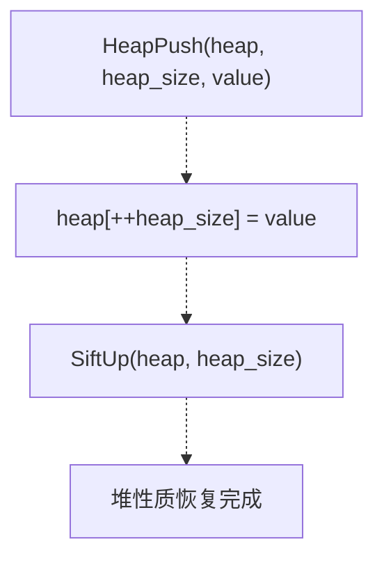
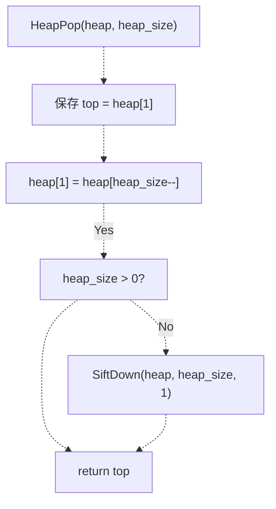
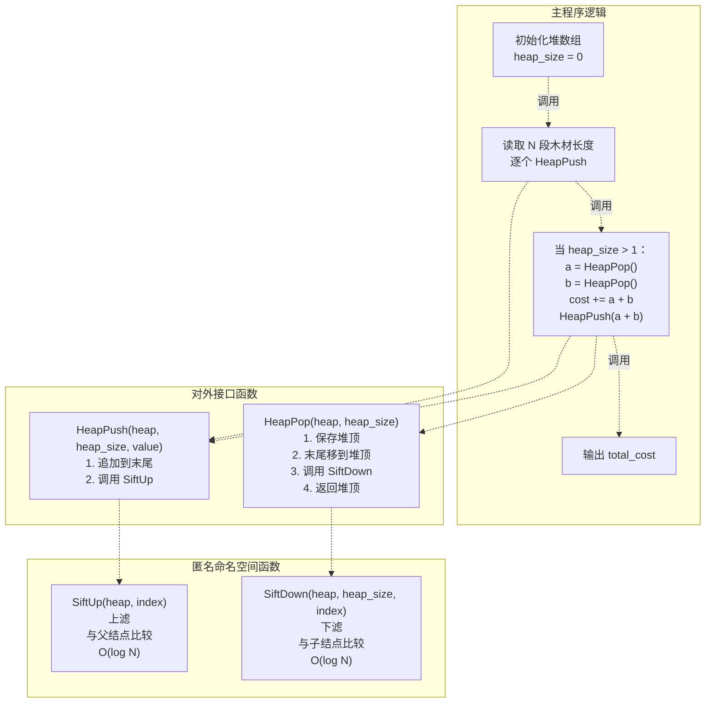

# 小根堆实现

> **相关源文件**
> * [p7/p7.cpp](https://github.com/lilong555/DataStruct/blob/660fbbaa/p7/p7.cpp)

## 目的与范围

本文档对项目七（Repair Ranch）中使用的小根堆（min-heap）数据结构实现进行详细技术说明。该小根堆采用 1 基下标的数组表示二叉树，并维持“父结点值 ≤ 子结点值”的堆性质。该实现支持 O(log N) 的插入与取最小值，从而使“最优木材合并问题”能够以 O(N log N) 的复杂度完成。

如需了解项目七整体背景及其使用的小根堆贪心合并算法，请参见 [Project 7: Repair Ranch (Minimum Cost)](项目七-修理牧场（最小花费）.md)。如需与仓库内其他数据结构进行对比，请参见 [Data Structures Reference](数据结构参考.md)。

**来源：** [p7/p7.cpp L1-L112](https://github.com/lilong555/DataStruct/blob/660fbbaa/p7/p7.cpp#L1-L112)

---

## 数据结构表示

该小根堆使用 1 基下标数组实现，堆元素占用下标 1 到 `heap_size`。下标 0 不使用，以简化父子下标运算。堆维持小根堆性质：对任意下标为 `i` 的结点，若其子结点存在，则满足 `heap[i] <= heap[2*i]` 与 `heap[i] <= heap[2*i + 1]`。

### 数组分配

```
long long *heap = new long long[(n > 0 ? n : 1) + 5];
int heap_size = 0;
```

该数组使用动态分配，并额外预留 `+ 5` 的空间以减小边界问题风险。`heap_size` 表示当前堆内元素个数，取值范围为 0 到 `n`。

**来源：** [p7/p7.cpp L85-L87](https://github.com/lilong555/DataStruct/blob/660fbbaa/p7/p7.cpp#L85-L87)

### 下标运算

| 关系 | 公式 | 用途 |
| --- | --- | --- |
| 下标 `i` 的父结点 | `i / 2` | `SiftUp` 时向上定位父结点 |
| 下标 `i` 的左孩子 | `i * 2` | `SiftDown` 时向下定位左孩子 |
| 下标 `i` 的右孩子 | `i * 2 + 1` | `SiftDown` 时向下定位右孩子 |
| 合法下标范围 | `1` 到 `heap_size` | 所有堆操作 |

**来源：** [p7/p7.cpp L11-L54](https://github.com/lilong555/DataStruct/blob/660fbbaa/p7/p7.cpp#L11-L54)

### 堆结构示意图



**来源：** [p7/p7.cpp L11-L71](https://github.com/lilong555/DataStruct/blob/660fbbaa/p7/p7.cpp#L11-L71)

---

## 堆的核心操作

该实现提供 4 个基础堆操作，并将它们放在匿名命名空间中以获得内部链接属性（internal linkage）。

### 操作概览

| 操作 | 函数 | 时间复杂度 | 用途 |
| --- | --- | --- | --- |
| 插入 | `HeapPush` | O(log N) | 插入元素并恢复堆性质 |
| 取最小值 | `HeapPop` | O(log N) | 删除并返回最小元素 |
| 向上修复 | `SiftUp` | O(log N) | 将元素向上移动直至满足堆性质 |
| 向下修复 | `SiftDown` | O(log N) | 将元素向下移动直至满足堆性质 |

**来源：** [p7/p7.cpp L9-L72](https://github.com/lilong555/DataStruct/blob/660fbbaa/p7/p7.cpp#L9-L72)

---

## SiftUp 操作

`SiftUp` 通过将元素沿树向上移动来恢复小根堆性质。它在“新元素被插入到堆尾”之后调用。

### 算法



**来源：** [p7/p7.cpp L11-L25](https://github.com/lilong555/DataStruct/blob/660fbbaa/p7/p7.cpp#L11-L25)

### 实现细节

该函数使用 while 循环，直到满足以下条件之一：

1. 元素到达根结点（`index == 1`），或
2. 父结点值小于等于当前结点值（堆性质已满足）

每一轮迭代：

* 计算父结点下标：`parent = index / 2`
* 比较：若 `heap[parent] <= heap[index]`，则堆性质成立
* 否则交换 `heap[parent]` 与 `heap[index]`
* 向上移动：`index = parent`

交换通过临时变量完成，避免使用 `std::swap`。

**来源：** [p7/p7.cpp L11-L25](https://github.com/lilong555/DataStruct/blob/660fbbaa/p7/p7.cpp#L11-L25)

---

## SiftDown 操作

`SiftDown` 通过将元素沿树向下移动来恢复小根堆性质。它在“删除根结点并用堆尾元素替换根结点”之后调用。

### 算法



**来源：** [p7/p7.cpp L27-L54](https://github.com/lilong555/DataStruct/blob/660fbbaa/p7/p7.cpp#L27-L54)

### 实现细节

该函数使用无限循环并在满足条件时显式 `break`。每轮迭代：

1. **计算孩子下标**：`left = index * 2`，`right = left + 1`
2. **在结点与孩子中找最小者**： * 初始 `smallest = index` * 若左孩子存在且更小：`smallest = left` * 若右孩子存在且更小：`smallest = right`
3. **终止判断**：若 `smallest == index`，则当前位置已满足堆性质
4. **交换并继续**：否则与最小孩子交换，并从孩子位置继续下滤

边界检查（`left <= heap_size`、`right <= heap_size`）用于避免访问越界。

**来源：** [p7/p7.cpp L27-L54](https://github.com/lilong555/DataStruct/blob/660fbbaa/p7/p7.cpp#L27-L54)

---

## HeapPush 操作

`HeapPush` 在保持小根堆性质的前提下向堆中插入新元素。

### 函数签名与流程



**来源：** [p7/p7.cpp L56-L60](https://github.com/lilong555/DataStruct/blob/660fbbaa/p7/p7.cpp#L56-L60)

### 实现

该操作由两步组成：

1. **尾部追加**：`heap_size` 自增，将新值放入 `heap[heap_size]`（注意：`heap_size` 以引用传入并会被直接修改）
2. **恢复堆性质**：调用 `SiftUp(heap, heap_size)`，按需将新元素上滤

前置自增（`++heap_size`）确保元素先被放到下一个可用位置，再执行 `SiftUp`。

**来源：** [p7/p7.cpp L56-L60](https://github.com/lilong555/DataStruct/blob/660fbbaa/p7/p7.cpp#L56-L60)

---

## HeapPop 操作

`HeapPop` 在保持小根堆性质的前提下，删除并返回最小元素（根结点）。

### 函数签名与流程



**来源：** [p7/p7.cpp L62-L71](https://github.com/lilong555/DataStruct/blob/660fbbaa/p7/p7.cpp#L62-L71)

### 实现

该操作遵循标准堆取出流程：

1. **保存最小值**：将 `heap[1]`（堆顶/最小值）保存到 `top`
2. **根结点替换**：用堆尾元素替换根：`heap[1] = heap[heap_size--]` * 后置自减保证先搬运堆尾元素，再缩小 `heap_size`
3. **恢复堆性质**：若删除后堆仍非空，则调用 `SiftDown(heap, heap_size, 1)` 将新根下滤
4. **返回结果**：返回保存的最小值

条件判断 `if (heap_size > 0)` 可避免对空堆调用 `SiftDown`（无意义且可能访问无效内存）。

**来源：** [p7/p7.cpp L62-L71](https://github.com/lilong555/DataStruct/blob/660fbbaa/p7/p7.cpp#L62-L71)

---

## 堆操作交互示意图



**来源：** [p7/p7.cpp L9-L111](https://github.com/lilong555/DataStruct/blob/660fbbaa/p7/p7.cpp#L9-L111)

---

## 性能特性

### 时间复杂度分析

| 操作 | 最坏情况 | 平均情况 | 说明 |
| --- | --- | --- | --- |
| `SiftUp` | O(log N) | O(log N) | 从叶到根，上移高度最多 log N |
| `SiftDown` | O(log N) | O(log N) | 从根到叶，下移高度最多 log N |
| `HeapPush` | O(log N) | O(log N) | 主要由 SiftUp 决定 |
| `HeapPop` | O(log N) | O(log N) | 主要由 SiftDown 决定 |
| 建堆（N 次 push） | O(N log N) | O(N log N) | N 次插入 × 每次 log N |
| 完整合并 | O(N log N) | O(N log N) | N-1 次合并，每次 2 pop + 1 push |

**来源：** [p7/p7.cpp L3-L8](https://github.com/lilong555/DataStruct/blob/660fbbaa/p7/p7.cpp#L3-L8)

### 空间复杂度

该堆使用 **O(N) 空间**，N 为最大元素个数：

* 数组分配：`new long long[n + 5]`（n 为输入规模）
* 无递归调用（所有操作均为迭代循环）
* 常量级辅助空间：用于交换与下标计算的临时变量

**来源：** [p7/p7.cpp L86-L87](https://github.com/lilong555/DataStruct/blob/660fbbaa/p7/p7.cpp#L86-L87)

---

## 实现设计选择

### 采用 1 基下标的原因

1 基下标能简化父子结点下标计算：

* **父结点**：`i / 2`（0 基时为 `(i-1) / 2`）
* **左孩子**：`2 * i`（0 基时为 `2*i + 1`）
* **右孩子**：`2 * i + 1`（0 基时为 `2*i + 2`）

这避免了 `i-1`、`i+1` 的调整，降低 off-by-one 错误风险。

**来源：** [p7/p7.cpp L11-L54](https://github.com/lilong555/DataStruct/blob/660fbbaa/p7/p7.cpp#L11-L54)

### 匿名命名空间

所有堆函数都在匿名命名空间（`namespace { ... }`）中声明，位置见 [p7/p7.cpp L9-L72](https://github.com/lilong555/DataStruct/blob/660fbbaa/p7/p7.cpp#L9-L72)，从而获得内部链接属性：

* 函数仅在 `p7.cpp` 内可见
* 避免与其他编译单元发生命名冲突
* 有利于编译器优化（可内联/消除未使用函数）

**来源：** [p7/p7.cpp L9-L72](https://github.com/lilong555/DataStruct/blob/660fbbaa/p7/p7.cpp#L9-L72)

### 手动交换

实现使用临时变量完成三步交换，而不是 `std::swap`：

```
long long tmp = heap[parent];
heap[parent] = heap[index];
heap[index] = tmp;
```

这种写法避免额外库依赖，并保持代码简洁，符合教学性质代码的风格。

**来源：** [p7/p7.cpp L20-L22](https://github.com/lilong555/DataStruct/blob/660fbbaa/p7/p7.cpp#L20-L22)

 [p7/p7.cpp L49-L51](https://github.com/lilong555/DataStruct/blob/660fbbaa/p7/p7.cpp#L49-L51)

### 动态分配

堆数组使用 `new` 动态分配，并在程序结束时用 `delete[]` 释放。分配时额外的 `+ 5` 预留空间提供了小缓冲，便于开发时避免边界相关问题。

**来源：** [p7/p7.cpp L86](https://github.com/lilong555/DataStruct/blob/660fbbaa/p7/p7.cpp#L86-L86)

 [p7/p7.cpp L109](https://github.com/lilong555/DataStruct/blob/660fbbaa/p7/p7.cpp#L109-L109)

---

## 在哈夫曼式合并中的使用

小根堆使得 `main` 中的最优木材合并算法能够高效运行：

1. **构建初始堆**：读取 N 段木材长度并逐个入堆（[p7/p7.cpp L89-L94](https://github.com/lilong555/DataStruct/blob/660fbbaa/p7/p7.cpp#L89-L94)）
2. **迭代合并**：当堆中元素多于 1 个时： * 取出两段最短木材 `a` 与 `b` * 将 `a+b` 加入总成本 * 将合并结果 `a+b` 再次入堆
3. **结束输出**：当仅剩 1 段木材时输出总成本

该贪心策略保证总成本最小：每一步都合并当前最短的两段，使即时成本最小，并且不会损失全局最优性；堆结构则保证能高效找到并取出这两段最短木材。

**来源：** [p7/p7.cpp L96-L108](https://github.com/lilong555/DataStruct/blob/660fbbaa/p7/p7.cpp#L96-L108)

---

## 示例执行轨迹

输入示例：`n=4`，长度为 `[8, 4, 6, 2]`

| 步骤 | 堆状态（array[1..size]） | 操作 | 成本累计 |
| --- | --- | --- | --- |
| 0 | `[2, 4, 6, 8]` | 4 次 push 后的初始堆 | 0 |
| 1 | `[4, 6, 8]` | Pop 2，Pop 4 | 0 |
| 2 | `[6, 8]` | Push 6（2+4） | 6 |
| 3 | `[8]` | Pop 6，Pop 6 | 6 |
| 4 | `[]` | Push 12（6+6） | 18 |
| 5 | `[]` | Pop 8，Pop 12 | 18 |
| 6 | `[20]` | Push 20（8+12） | 38 |
| 最终 | Exit（size=1） | Output: 38 | 38 |

堆性质在每次操作后都会通过 `SiftUp` 与 `SiftDown` 保持。

**来源：** [p7/p7.cpp L96-L108](https://github.com/lilong555/DataStruct/blob/660fbbaa/p7/p7.cpp#L96-L108)
