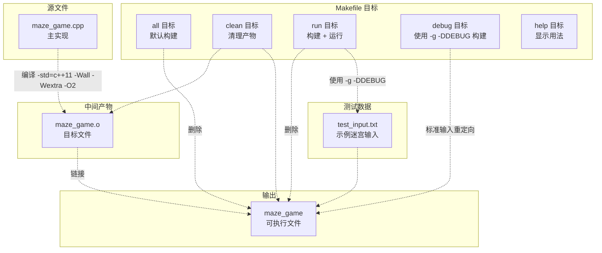
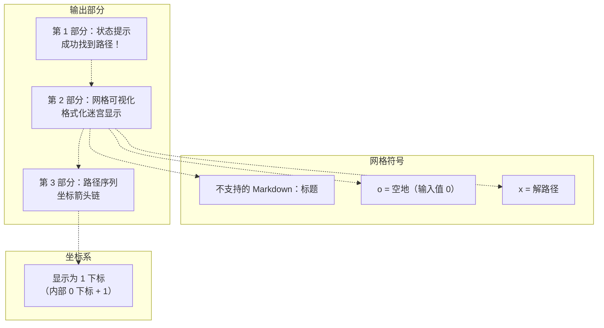

# 编译与测试

> **相关源文件**
> * [p3/Makefile](https://github.com/lilong555/DataStruct/blob/660fbbaa/p3/Makefile)
> * [p3/SAMPLE_OUTPUT.txt](https://github.com/lilong555/DataStruct/blob/660fbbaa/p3/SAMPLE_OUTPUT.txt)
> * [p3/test_input.txt](https://github.com/lilong555/DataStruct/blob/660fbbaa/p3/test_input.txt)

本页记录项目三「勇闯迷宫游戏（Maze Game）」的编译与测试流程，涵盖基于 Makefile 的构建系统、可用的编译目标、测试输入文件的使用方式以及输出格式的解读。关于 DFS 寻路算法本身的细节请参见 [DFS Backtracking Algorithm](DFS回溯算法.md)。关于仓库层面的通用构建说明请参见 [Getting Started](快速开始.md)。

## 目的与范围

本文档提供迷宫寻路程序的编译与测试技术说明，包括：

* Makefile 目标（target）的定义与用法
* 编译参数及其用途
* 使用输入重定向的测试驱动开发流程
* 预期输出格式与可视化表示
* 调试构建配置

## 构建系统架构

项目三提供了独立的 Makefile，用多个构建目标支持不同的开发流程。构建系统会从源文件 `maze_game.cpp` 生成一个可执行文件 `maze_game`。

### Makefile 目标概览



**来源：**[p3/Makefile L1-L56](https://github.com/lilong555/DataStruct/blob/660fbbaa/p3/Makefile#L1-L56)

### 编译参数

构建系统使用以下编译配置：

| 参数 | 目的 | 效果 |
| --- | --- | --- |
| `-std=c++11` | C++11 标准 | 启用现代 C++ 特性（`auto`、范围 for 等） |
| `-Wall` | 开启常用告警 | 捕获常见编程错误 |
| `-Wextra` | 额外告警 | 在 `-Wall` 之外启用更多检查 |
| `-O2` | 二级优化 | 平衡编译速度与运行性能 |
| `-g` | 调试符号 | 包含调试信息（仅 debug 目标） |
| `-DDEBUG` | 调试宏 | 定义预处理符号 `DEBUG`（仅 debug 目标） |

这些参数定义在 [p3/Makefile L8](https://github.com/lilong555/DataStruct/blob/660fbbaa/p3/Makefile#L8-L8)

并在调试构建中于 [p3/Makefile L41](https://github.com/lilong555/DataStruct/blob/660fbbaa/p3/Makefile#L41-L41) 进行扩展

**来源：**[p3/Makefile L8](https://github.com/lilong555/DataStruct/blob/660fbbaa/p3/Makefile#L8-L8)

 [p3/Makefile L41-L42](https://github.com/lilong555/DataStruct/blob/660fbbaa/p3/Makefile#L41-L42)

## 编译程序

### 标准构建

以优化方式编译迷宫程序：

```
cd p3
make
```

该命令会调用默认的 `all` 目标（见 [p3/Makefile L20](https://github.com/lilong555/DataStruct/blob/660fbbaa/p3/Makefile#L20-L20)）

其行为如下：

1. 将 `maze_game.cpp` 编译为 `maze_game.o`（见 [p3/Makefile L28-L29](https://github.com/lilong555/DataStruct/blob/660fbbaa/p3/Makefile#L28-L29)）
2. 链接目标文件生成 `maze_game` 可执行文件（见 [p3/Makefile L23-L24](https://github.com/lilong555/DataStruct/blob/660fbbaa/p3/Makefile#L23-L24)）
3. 显示成功提示 “编译完成！运行程序: ./maze_game”

### 调试构建

在开发阶段如需调试支持，可执行：

```
make debug
```

该目标见 [p3/Makefile L41-L43](https://github.com/lilong555/DataStruct/blob/660fbbaa/p3/Makefile#L41-L43)

:

1. 增加 `-g` 以便使用 GDB 调试
2. 定义 `DEBUG` 宏以启用条件调试代码
3. 先清理再重新构建，确保调试参数一致生效

### 清理构建产物

删除编译生成的文件：

```
make clean
```

该命令会删除 `maze_game.o` 与 `maze_game` 可执行文件（见 [p3/Makefile L32-L33](https://github.com/lilong555/DataStruct/blob/660fbbaa/p3/Makefile#L32-L33)）

**来源：**[p3/Makefile L20-L43](https://github.com/lilong555/DataStruct/blob/660fbbaa/p3/Makefile#L20-L43)

## 测试流程

### 测试输入文件结构

项目提供结构化测试文件 `test_input.txt`（见 [p3/test_input.txt L1-L11](https://github.com/lilong555/DataStruct/blob/660fbbaa/p3/test_input.txt#L1-L11)）

其格式如下：


| 行号 | 内容 | 示例 | 说明 |
| --- | --- | --- | --- |
| 1 | 网格规模 | `7 7` | 行数与列数 |
| 2-N | 迷宫网格 | `1 0 1 1 1 1 1` | 用空格分隔的网格值（0=可走，1=墙） |
| N+1 | 起点 | `0 0` | 起点坐标（行、列，0 下标） |
| N+2 | 终点 | `4 5` | 目标坐标（行、列，0 下标） |

**来源：**[p3/test_input.txt L1-L11](https://github.com/lilong555/DataStruct/blob/660fbbaa/p3/test_input.txt#L1-L11)

### 自动化测试

使用测试输入文件进行构建并运行：

```
make run
```

该目标见 [p3/Makefile L37-L38](https://github.com/lilong555/DataStruct/blob/660fbbaa/p3/Makefile#L37-L38)

:

1. 确保 `maze_game` 已编译
2. 将标准输入重定向为 `test_input.txt`
3. 将结果输出到标准输出

实际执行的命令为：`./maze_game < test_input.txt`

### 手动交互测试

如需手动输入（不使用测试文件）：

```
./maze_game
```

程序会按顺序提示输入以下内容：

1. 迷宫规模
2. 网格值（逐行输入）
3. 起点坐标
4. 终点坐标

**来源：**[p3/Makefile L37-L38](https://github.com/lilong555/DataStruct/blob/660fbbaa/p3/Makefile#L37-L38)

## 输出格式解读

### 输出结构（可视化）

当找到路径时，程序会输出三个部分：



**来源：**[p3/SAMPLE_OUTPUT.txt L1-L39](https://github.com/lilong555/DataStruct/blob/660fbbaa/p3/SAMPLE_OUTPUT.txt#L1-L39)

### 示例输出分析

预期输出格式记录在 [p3/SAMPLE_OUTPUT.txt L1-L39](https://github.com/lilong555/DataStruct/blob/660fbbaa/p3/SAMPLE_OUTPUT.txt#L1-L39)

:

**状态提示部分**（见 [p3/SAMPLE_OUTPUT.txt L15](https://github.com/lilong555/DataStruct/blob/660fbbaa/p3/SAMPLE_OUTPUT.txt#L15-L15)）

:

```
成功找到路径！
```

**迷宫网格可视化**（见 [p3/SAMPLE_OUTPUT.txt L17-L25](https://github.com/lilong555/DataStruct/blob/660fbbaa/p3/SAMPLE_OUTPUT.txt#L17-L25)）

:

* 列表头：`0列  1列  2列 ...`
* 行标签：`0行`、`1行` 等
* 符号：* `#`：墙（网格值 1） * `o`：可走空地（网格值 0） * `x`：解路径所在格子

**路径坐标序列**（见 [p3/SAMPLE_OUTPUT.txt L27-L28](https://github.com/lilong555/DataStruct/blob/660fbbaa/p3/SAMPLE_OUTPUT.txt#L27-L28)）

:

```
迷宫路径：
(1,1) ---> (2,1) ---> (3,1) ---> ... ---> (5,6)
```

重要说明：为便于阅读，路径坐标以 1 下标显示（见 [p3/SAMPLE_OUTPUT.txt L38](https://github.com/lilong555/DataStruct/blob/660fbbaa/p3/SAMPLE_OUTPUT.txt#L38-L38)）

而内部算法使用 0 下标数组。

### 符号说明

| 符号 | 含义 | 网格值 | 是否在解路径中 |
| --- | --- | --- | --- |
| `#` | 墙 | 1 | 不适用（不可通行） |
| `o` | 空地 | 0 | 否 |
| `x` | 路径格 | 0 | 是 |

**来源：**[p3/SAMPLE_OUTPUT.txt L34-L38](https://github.com/lilong555/DataStruct/blob/660fbbaa/p3/SAMPLE_OUTPUT.txt#L34-L38)

## 构建问题排查

### 常见构建问题

| 问题 | 现象 | 解决方法 |
| --- | --- | --- |
| 缺少编译器 | `g++: command not found` | 通过包管理器安装 g++ |
| 目录错误 | `make: *** No targets specified` | `cd p3` 进入项目目录 |
| 权限错误 | 运行 `./maze_game` 提示 `Permission denied` | `chmod +x maze_game` |
| 目标文件陈旧 | 修改代码后出现异常行为 | 先 `make clean` 再 `make` |

### Makefile 帮助

查看所有可用目标：

```
make help
```

该命令会显示完整的命令参考（见 [p3/Makefile L46-L53](https://github.com/lilong555/DataStruct/blob/660fbbaa/p3/Makefile#L46-L53)）

:

* `make` 或 `make all`：标准构建
* `make clean`：清理产物
* `make run`：使用 `test_input.txt` 构建并测试
* `make debug`：调试构建
* `make help`：显示帮助信息

**来源：**[p3/Makefile L46-L53](https://github.com/lilong555/DataStruct/blob/660fbbaa/p3/Makefile#L46-L53)

## 测试最佳实践

### 测试用例设计

1. **以 `test_input.txt` 为模板**：复制并修改以形成新用例
2. **核对网格规模**：确保行数与实际网格行数一致
3. **检查坐标范围**：起点/终点必须在 `0` 到 `维度-1` 之间
4. **覆盖边界情况**：* 起点等于终点 * 不存在可行路径 * 单格迷宫 * 最大规模网格

### 输出验证

建议按以下清单验证输出是否符合预期：

| 检查项 | 说明 | 参考 |
| --- | --- | --- |
| 路径有效 | 所有 `x` 连通起点与终点 | 网格可视化输出 |
| 不穿墙 | `#` 上不应出现 `x` | 网格一致性 |
| 坐标准确 | 路径序列与网格中的 `x` 位置一致 | 交叉比对各部分 |
| 下标一致 | 显示坐标 = 内部坐标 + 1 | 坐标变换规则 |

### 输入重定向

可通过文件重定向管理多组测试场景：

```markdown
# 使用自定义测试文件运行
./maze_game < my_test_case.txt

# 捕获输出并对比
./maze_game < test_input.txt > actual_output.txt
diff actual_output.txt expected_output.txt
```

**来源：**[p3/test_input.txt L1-L11](https://github.com/lilong555/DataStruct/blob/660fbbaa/p3/test_input.txt#L1-L11)

 [p3/SAMPLE_OUTPUT.txt L1-L39](https://github.com/lilong555/DataStruct/blob/660fbbaa/p3/SAMPLE_OUTPUT.txt#L1-L39)

 [p3/Makefile L37-L38](https://github.com/lilong555/DataStruct/blob/660fbbaa/p3/Makefile#L37-L38)

## 与开发环境的结合

### 仓库上下文中的编译方式

虽然项目三提供了自己的 Makefile，但仓库级构建说明（[README.md]）推荐对所有项目统一使用 g++ 直接编译：

```python
# 仓库统一方式（来自 README）
g++ p3/maze_game.cpp -o output/p3 -std=c++17 -O2 -Wall -Wextra -pedantic

# 项目专用 Makefile（C++11）
cd p3 && make
```

主要差异：

* 仓库统一方式使用 C++17；Makefile 使用 C++11（见 [p3/Makefile L8](https://github.com/lilong555/DataStruct/blob/660fbbaa/p3/Makefile#L8-L8)）
* 仓库统一方式输出到 `output/` 目录；Makefile 输出到 `p3/` 目录
* 仓库统一方式额外增加 `-pedantic`，强调严格标准一致性

两种方式最终得到的可执行程序在功能上等价。

**来源：**[p3/Makefile L8](https://github.com/lilong555/DataStruct/blob/660fbbaa/p3/Makefile#L8-L8)
