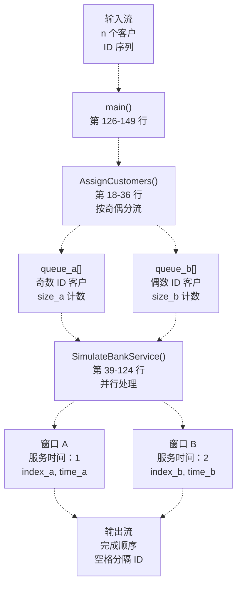
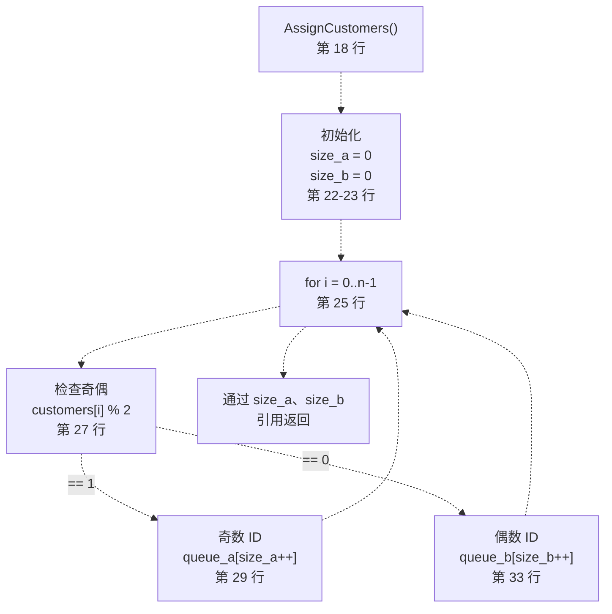
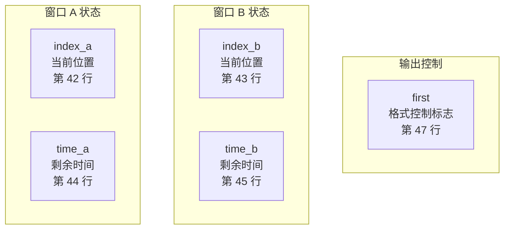
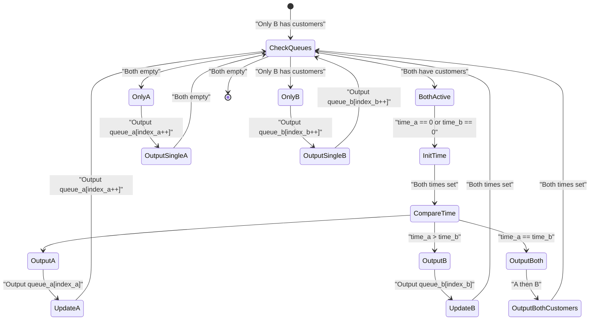
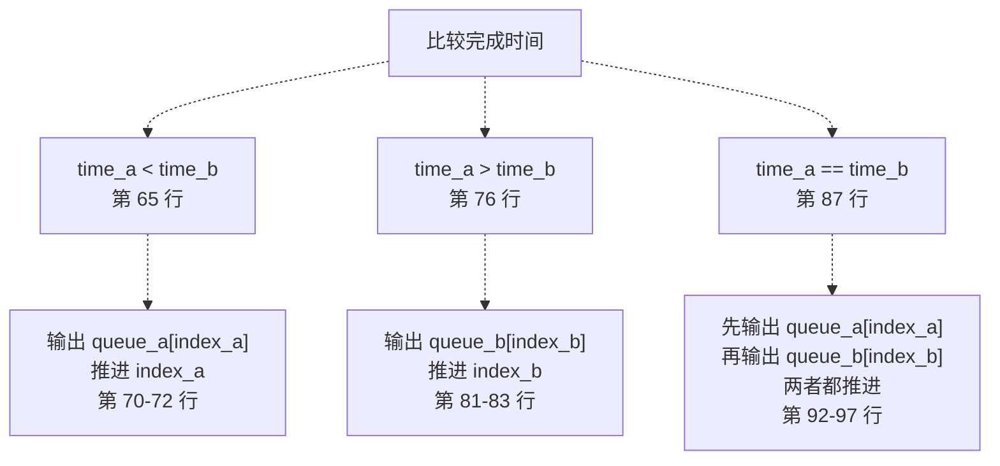
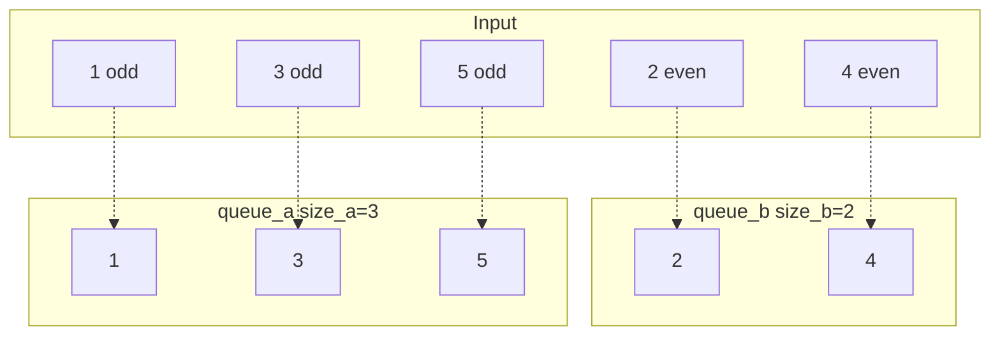
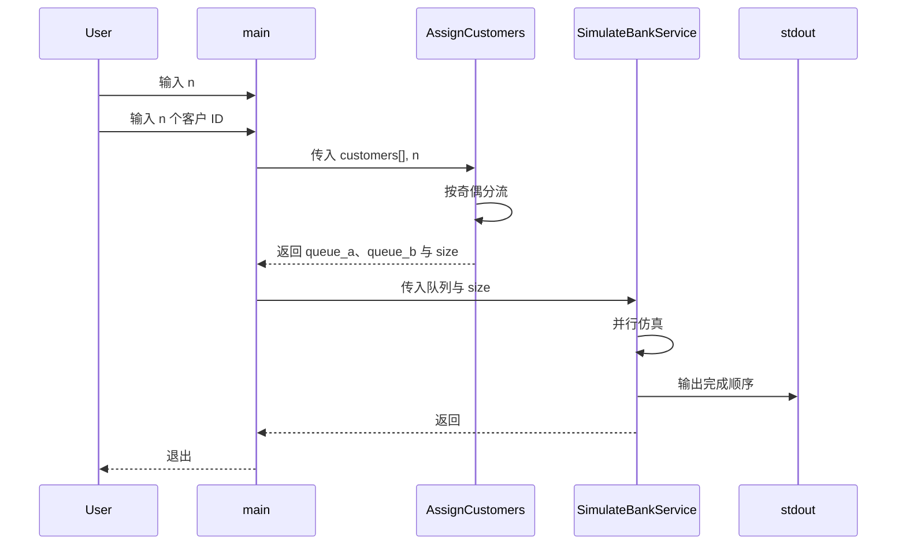

# 队列管理与调度

> **相关源文件**
> * [p5/bank_service.cpp](https://github.com/lilong555/DataStruct/blob/660fbbaa/p5/bank_service.cpp)
> * [p5/bank_service.exe](https://github.com/lilong555/DataStruct/blob/660fbbaa/p5/bank_service.exe)

本页说明项目五「银行业务模拟」中的队列管理与客户调度系统，包含客户分配算法、双窗口并行仿真逻辑、服务时间跟踪以及输出顺序规则。

如需项目五整体背景与编译运行说明，请参见 [Project 5: Bank Service Simulation](项目五-银行业务模拟.md)。

## 目的与范围

本文档聚焦以下调度机制：

* 根据 ID 奇偶性将客户分配到不同窗口
* 按不同窗口速度模拟并行服务过程
* 跟踪完成时间并确定输出顺序
* 处理同时完成的情况

实现采用数组队列与离散时间仿真，不引入面向对象抽象。

**来源：** [p5/bank_service.cpp L1-L149](https://github.com/lilong555/DataStruct/blob/660fbbaa/p5/bank_service.cpp#L1-L149)

## 系统架构



**来源：** [p5/bank_service.cpp L126-L149](https://github.com/lilong555/DataStruct/blob/660fbbaa/p5/bank_service.cpp#L126-L149)

 [p5/bank_service.cpp L18-L36](https://github.com/lilong555/DataStruct/blob/660fbbaa/p5/bank_service.cpp#L18-L36)

 [p5/bank_service.cpp L39-L124](https://github.com/lilong555/DataStruct/blob/660fbbaa/p5/bank_service.cpp#L39-L124)

## 数据结构

| 结构 | 声明 | 用途 | 使用方式 |
| --- | --- | --- | --- |
| `kMaxCustomers` | [line 7](https://github.com/lilong555/DataStruct/blob/660fbbaa/line 7) | 常量 `1000` | 数组最大容量 |
| `customers[]` | [line 132](https://github.com/lilong555/DataStruct/blob/660fbbaa/line 132) | `int[kMaxCustomers]` | 输入客户 ID |
| `queue_a[]` | [line 139](https://github.com/lilong555/DataStruct/blob/660fbbaa/line 139) | `int[kMaxCustomers]` | 分配给窗口 A 的队列 |
| `queue_b[]` | [line 140](https://github.com/lilong555/DataStruct/blob/660fbbaa/line 140) | `int[kMaxCustomers]` | 分配给窗口 B 的队列 |
| `size_a`, `size_b` | [line 141](https://github.com/lilong555/DataStruct/blob/660fbbaa/line 141) | `int` | 队列元素数量 |
| `Customer` struct | [line 10-15](https://github.com/lilong555/DataStruct/blob/660fbbaa/line 10-15) | 未使用 | 定义了但未采用 |

`Customer` 结构体在 [lines 10-15](https://github.com/lilong555/DataStruct/blob/660fbbaa/lines 10-15) 定义了 `id`、`finish_time` 与 `window`，但实现为简化起见使用并行整型数组。

**来源：** [p5/bank_service.cpp L7-L15](https://github.com/lilong555/DataStruct/blob/660fbbaa/p5/bank_service.cpp#L7-L15)

 [p5/bank_service.cpp L132-L141](https://github.com/lilong555/DataStruct/blob/660fbbaa/p5/bank_service.cpp#L132-L141)

## 客户分配算法



分配函数采用简单的按奇偶分流策略：

* **奇数客户 ID**（除以 2 余 1）→ 窗口 A 队列
* **偶数客户 ID**（除以 2 余 0）→ 窗口 B 队列

在随机 ID 分布下，该确定性策略能获得较为均衡的负载。

**来源：** [p5/bank_service.cpp L18-L36](https://github.com/lilong555/DataStruct/blob/660fbbaa/p5/bank_service.cpp#L18-L36)

## 并行仿真引擎

`SimulateBankService()` 位于 [lines 39-124](https://github.com/lilong555/DataStruct/blob/660fbbaa/lines 39-124)，实现了离散事件仿真，并模拟两个窗口并行处理。

### 状态变量



| 变量 | 类型 | 初值 | 用途 |
| --- | --- | --- | --- |
| `index_a` | `int` | `0` [line 42](https://github.com/lilong555/DataStruct/blob/660fbbaa/line 42) | `queue_a` 中当前客户下标 |
| `index_b` | `int` | `0` [line 43](https://github.com/lilong555/DataStruct/blob/660fbbaa/line 43) | `queue_b` 中当前客户下标 |
| `time_a` | `int` | `0` [line 44](https://github.com/lilong555/DataStruct/blob/660fbbaa/line 44) | 窗口 A 当前剩余服务时间 |
| `time_b` | `int` | `0` [line 45](https://github.com/lilong555/DataStruct/blob/660fbbaa/line 45) | 窗口 B 当前剩余服务时间 |
| `first` | `bool` | `true` [line 47](https://github.com/lilong555/DataStruct/blob/660fbbaa/line 47) | 控制输出是否需要前置空格 |

**来源：** [p5/bank_service.cpp L42-L47](https://github.com/lilong555/DataStruct/blob/660fbbaa/p5/bank_service.cpp#L42-L47)

## 调度逻辑



### 主循环结构

仿真循环位于 [lines 49-121](https://github.com/lilong555/DataStruct/blob/660fbbaa/lines 49-121)，当任一队列仍有客户未处理时持续执行：

1. **双队列均活跃**（[lines 52-101](https://github.com/lilong555/DataStruct/blob/660fbbaa/lines 52-101)）： * 如有需要初始化服务时间（窗口 A：1，窗口 B：2）（[lines 55-62](https://github.com/lilong555/DataStruct/blob/660fbbaa/lines 55-62)） * 比较剩余时间（[lines 65-101](https://github.com/lilong555/DataStruct/blob/660fbbaa/lines 65-101)） * 输出先完成的窗口客户 * 更新另一个窗口的剩余时间
2. **仅单队列活跃**（[lines 103-120](https://github.com/lilong555/DataStruct/blob/660fbbaa/lines 103-120)）： * 顺序处理剩余客户 * 不需要时间跟踪（顺序完成）

**来源：** [p5/bank_service.cpp L49-L121](https://github.com/lilong555/DataStruct/blob/660fbbaa/p5/bank_service.cpp#L49-L121)

## 服务时间管理

### 初始化阶段

当窗口开始服务一位新客户时：

```
// Window A initialization (line 57)
if (time_a == 0) {
    time_a = 1;  // Service time: 1 unit
}

// Window B initialization (line 60-61)
if (time_b == 0) {
    time_b = 2;  // Service time: 2 units
}
```

### 时间推进

2 倍速度差产生了不对称的处理过程：

| 场景 | 窗口 A 动作 | 窗口 B 动作 |
| --- | --- | --- |
| A 先完成 [line 65-74](https://github.com/lilong555/DataStruct/blob/660fbbaa/line 65-74) | 完成客户，`time_a = 0` | `time_b -= time_a` |
| B 先完成 [line 76-86](https://github.com/lilong555/DataStruct/blob/660fbbaa/line 76-86) | `time_a -= time_b` | 完成客户，`time_b = 0` |
| 同时完成 [line 87-101](https://github.com/lilong555/DataStruct/blob/660fbbaa/line 87-101) | 完成客户，`time_a = 0` | 完成客户，`time_b = 0` |

**来源：** [p5/bank_service.cpp L55-L101](https://github.com/lilong555/DataStruct/blob/660fbbaa/p5/bank_service.cpp#L55-L101)

## 输出顺序规则



### 优先级规则

1. **时间优先**：完成时间更早的客户先输出
2. **平局规则**：两窗口同时完成时，窗口 A 优先（[lines 89-97](https://github.com/lilong555/DataStruct/blob/660fbbaa/lines 89-97)）
3. **空格格式**：第一个输出前不加空格（[lines 68-71](https://github.com/lilong555/DataStruct/blob/660fbbaa/lines 68-71)），之后输出在前面加空格（[lines 68, 79, 90](https://github.com/lilong555/DataStruct/blob/660fbbaa/lines 68, 79, 90)）

[line 47](https://github.com/lilong555/DataStruct/blob/660fbbaa/line 47) 的 `first` 标志控制空格插入：

* 初值：`true`
* 首次输出后置为 `false`（[lines 71, 82, 93](https://github.com/lilong555/DataStruct/blob/660fbbaa/lines 71, 82, 93)）
* 防止输出序列前出现多余空格

**来源：** [p5/bank_service.cpp L65-L101](https://github.com/lilong555/DataStruct/blob/660fbbaa/p5/bank_service.cpp#L65-L101)

 [p5/bank_service.cpp L47](https://github.com/lilong555/DataStruct/blob/660fbbaa/p5/bank_service.cpp#L47-L47)

## 示例执行轨迹

输入示例：`5` 位客户，ID 为 `[1, 2, 3, 4, 5]`

### 分配阶段



### 仿真时间线

| 时间 | 窗口 A | 窗口 B | 事件 | 输出 |
| --- | --- | --- | --- | --- |
| 0 | 开始 1（time=1） | 开始 2（time=2） | 同时开始 | - |
| 1 | 完成 1 | 处理中（time=1） | A 完成 | `1` |
| 1 | 开始 3（time=1） | 处理中（time=1） | A 重新开始 | - |
| 2 | 完成 3 | 完成 2 | 平局 | `3 2` |
| 2 | 开始 5（time=1） | 开始 4（time=2） | 同时开始 | - |
| 3 | 完成 5 | 处理中（time=1） | A 完成 | `5` |
| 4 | 空 | 完成 4 | B 完成 | `4` |

最终输出：`1 3 2 5 4`

**来源：** [p5/bank_service.cpp L18-L36](https://github.com/lilong555/DataStruct/blob/660fbbaa/p5/bank_service.cpp#L18-L36)

 [p5/bank_service.cpp L39-L124](https://github.com/lilong555/DataStruct/blob/660fbbaa/p5/bank_service.cpp#L39-L124)

## 算法性质

### 复杂度分析

| 操作 | 时间复杂度 | 空间复杂度 |
| --- | --- | --- |
| 客户分配 | O(n) | O(n) |
| 仿真 | O(n) | O(1) 辅助空间 |
| 总体 | O(n) | O(n) |

仿真过程对每个客户仅处理一次，每轮比较为常量时间。

### 不变式

1. **队列耗尽**：当 `index_a >= size_a AND index_b >= size_b` 时循环终止
2. **时间非负**：始终满足 `time_a >= 0` 与 `time_b >= 0`
3. **输出数量**：恰好输出 `n` 个客户 ID
4. **下标单调性**：`index_a` 与 `index_b` 从不递减

**来源：** [p5/bank_service.cpp L39-L124](https://github.com/lilong555/DataStruct/blob/660fbbaa/p5/bank_service.cpp#L39-L124)

## 与主程序的集成



[lines 126-149](https://github.com/lilong555/DataStruct/blob/660fbbaa/lines 126-149) 的 `main()` 协调整体流程：

1. **读取输入**（[lines 128-136](https://github.com/lilong555/DataStruct/blob/660fbbaa/lines 128-136)）：读取客户数量与 ID
2. **分配**（[line 143](https://github.com/lilong555/DataStruct/blob/660fbbaa/line 143)）：调用 `AssignCustomers()`（引用参数返回）
3. **仿真**（[line 146](https://github.com/lilong555/DataStruct/blob/660fbbaa/line 146)）：调用 `SimulateBankService()` 并由其负责输出
4. **结束**（[line 148](https://github.com/lilong555/DataStruct/blob/660fbbaa/line 148)）：返回 0

**来源：** [p5/bank_service.cpp L126-L149](https://github.com/lilong555/DataStruct/blob/660fbbaa/p5/bank_service.cpp#L126-L149)
