# 项目一：考试报名系统

> **相关源文件**
> * [CLAUDE.md](https://github.com/lilong555/DataStruct/blob/660fbbaa/CLAUDE.md)
> * [output/p1.exe](https://github.com/lilong555/DataStruct/blob/660fbbaa/output/p1.exe)
> * [p1/p1.cpp](https://github.com/lilong555/DataStruct/blob/660fbbaa/p1/p1.cpp)

## 目的与范围

本文档为考试报名系统（Exam Registration System）提供完整的技术文档说明。该系统是一个基于哈希表的应用，用于管理考生考试记录。系统使用拉链法（separate chaining）解决冲突，并在此基础上对考生数据实现 CRUD 操作（Create/Read/Update/Delete：新增、查询、修改、删除）。

本页面覆盖 `p1/p1.cpp` 的完整实现，包括数据结构、算法以及用户交互模式。关于其他数据结构项目，请参阅 [项目总览](项目概览.md)。关于哈希表实现细节，请参阅 [哈希表实现](哈希表实现.md)。关于 CRUD 操作与菜单系统细节，请参阅 [CRUD 操作与菜单系统](增删改查与菜单系统.md)。

**来源：** [p1/p1.cpp L1-L723](https://github.com/lilong555/DataStruct/blob/660fbbaa/p1/p1.cpp#L1-L723)

 [CLAUDE.md L1-L30](https://github.com/lilong555/DataStruct/blob/660fbbaa/CLAUDE.md#L1-L30)

---

## 系统架构概览

考试报名系统是一个自包含的控制台应用程序，使用带拉链法的哈希表在内存中维护考生记录。系统提供交互式的菜单驱动界面，用于对考生数据执行各类操作。

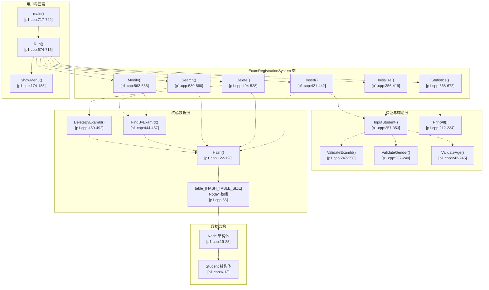

**来源：** [p1/p1.cpp L1-L723](https://github.com/lilong555/DataStruct/blob/660fbbaa/p1/p1.cpp#L1-L723)

 [CLAUDE.md L7-L15](https://github.com/lilong555/DataStruct/blob/660fbbaa/CLAUDE.md#L7-L15)

---

## 数据结构

### Student 结构体

`Student` 结构体定义了系统中存储的考生记录数据模型。

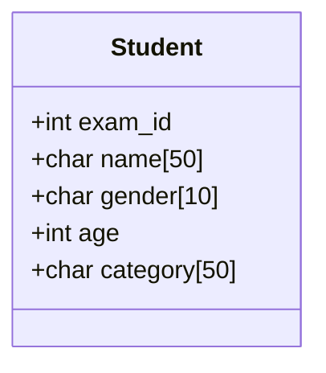

| 字段 | 类型 | 约束 | 说明 |
| --- | --- | --- | --- |
| `exam_id` | `int` | 1-999999 | 唯一考号 |
| `name` | `char[50]` | 1-49 字符 | 考生姓名 |
| `gender` | `char[10]` | "男" 或 "女" | 考生性别 |
| `age` | `int` | 10-100 | 考生年龄 |
| `category` | `char[50]` | 1-49 字符 | 报考类别 |

**来源：** [p1/p1.cpp L6-L13](https://github.com/lilong555/DataStruct/blob/660fbbaa/p1/p1.cpp#L6-L13)

 [p1/p1.cpp L247-L250](https://github.com/lilong555/DataStruct/blob/660fbbaa/p1/p1.cpp#L247-L250)

 [p1/p1.cpp L237-L240](https://github.com/lilong555/DataStruct/blob/660fbbaa/p1/p1.cpp#L237-L240)

 [p1/p1.cpp L242-L245](https://github.com/lilong555/DataStruct/blob/660fbbaa/p1/p1.cpp#L242-L245)

---

### Node 结构体

`Node` 结构体实现哈希表拉链法（separate chaining）所使用的链表节点。

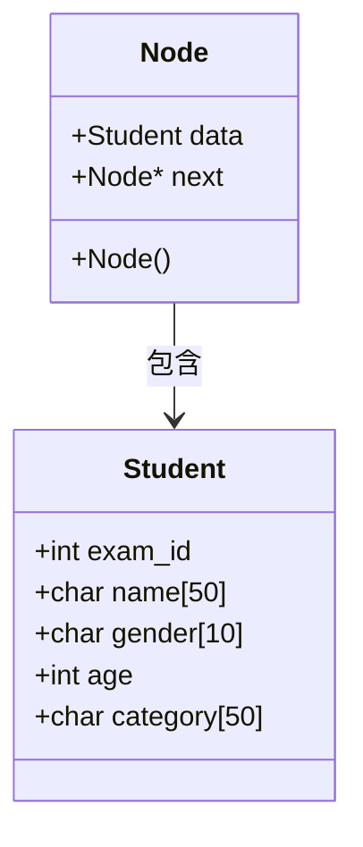

每个 `Node` 包含：

* `data`：用于保存考生记录的 `Student` 结构体
* `next`：指向链中下一个节点的指针（若为最后一个节点则为 nullptr）
* 默认构造函数会将 `next` 初始化为 nullptr

**来源：** [p1/p1.cpp L19-L25](https://github.com/lilong555/DataStruct/blob/660fbbaa/p1/p1.cpp#L19-L25)

---

### 哈希表结构

哈希表使用 `Node*` 指针数组实现，并使用拉链法处理冲突。

```mermaid
flowchart TD

T0["table_[0]"]
T1["table_[1]"]
T2["table_[2]"]
TDOTS["..."]
T996["table_[996]"]
N0_1["Node<br>exam_id: 12345"]
N0_2["Node<br>exam_id: 56789"]
N0_3["nullptr"]
N1_1["Node<br>exam_id: 23456"]
N1_2["nullptr"]
nullptr1["nullptr"]

T0 -.-> N0_1
T1 -.-> N1_1
T2 -.-> nullptr1

subgraph subGraph2 ["索引 1 的链"]
    N1_1
    N1_2
end

subgraph subGraph1 ["索引 0 的链"]
    N0_1
    N0_2
    N0_3
end

subgraph table_[HASH_TABLE_SIZE=997] ["table_[HASH_TABLE_SIZE=997]"]
    T0
    T1
    T2
    TDOTS
    T996
end
```

| 常量 | 值 | 用途 |
| --- | --- | --- |
| `HASH_TABLE_SIZE` | 997 | 使用质数作为桶数量以获得更好的分布 |

在哈希分布较好的情况下，哈希表能够在平均意义下以 O(1) 的时间复杂度完成插入、查找与删除操作。选择 997（质数）有助于降低冲突概率。

**来源：** [p1/p1.cpp L16](https://github.com/lilong555/DataStruct/blob/660fbbaa/p1/p1.cpp#L16-L16)

 [p1/p1.cpp L55](https://github.com/lilong555/DataStruct/blob/660fbbaa/p1/p1.cpp#L55-L55)

 [CLAUDE.md L13-L14](https://github.com/lilong555/DataStruct/blob/660fbbaa/CLAUDE.md#L13-L14)

---

## 哈希函数实现

哈希函数通过乘法哈希将考号映射到哈希表下标。

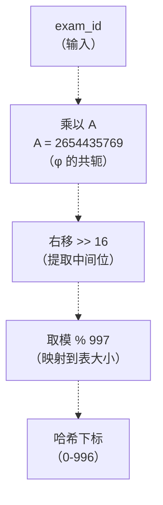

### 算法细节

位于 [p1/p1.cpp L122-L128](https://github.com/lilong555/DataStruct/blob/660fbbaa/p1/p1.cpp#L122-L128) 的 `Hash()` 函数实现了如下算法：

1. **乘法哈希：** `hash = A * exam_id`，其中 `A = 2654435769`
   * `A` 近似于 2^32 / φ（黄金分割比的共轭）
   * 该常数通常能提供较好的分布性质
2. **位提取：** `hash >> 16`
   * 右移 16 位以提取中间比特
   * 中间比特通常比高位或低位更“随机”
3. **映射到表大小：** `result % HASH_TABLE_SIZE`
   * 将哈希值映射到合法桶下标范围 [0, 996]

### 复杂度分析

| 操作 | 时间复杂度 | 空间复杂度 |
| --- | --- | --- |
| 计算哈希 | O(1) | O(1) |
| 插入（平均） | O(1) | O(1) |
| 查找（平均） | O(1) | O(1) |
| 删除（平均） | O(1) | O(1) |
| 最坏情况（全部冲突） | O(n) | O(1) |

**来源：** [p1/p1.cpp L122-L128](https://github.com/lilong555/DataStruct/blob/660fbbaa/p1/p1.cpp#L122-L128)

 [p1/p1.cpp L16](https://github.com/lilong555/DataStruct/blob/660fbbaa/p1/p1.cpp#L16-L16)

---

## 核心操作

### 系统初始化

`Initialize()` 函数用于在系统启动时建立初始的考生数据库。

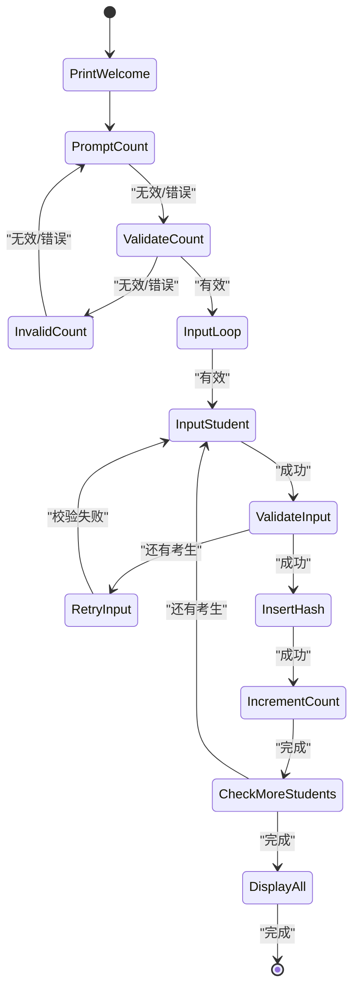

**关键步骤：**

1. 显示欢迎信息与标题 [p1/p1.cpp L358-L361](https://github.com/lilong555/DataStruct/blob/660fbbaa/p1/p1.cpp#L358-L361)
2. 提示输入考生人数并进行校验 [p1/p1.cpp L363-L387](https://github.com/lilong555/DataStruct/blob/660fbbaa/p1/p1.cpp#L363-L387)
3. 对每位考生：
   * 调用 `InputStudent()` 并进行重复考号检查 [p1/p1.cpp L397](https://github.com/lilong555/DataStruct/blob/660fbbaa/p1/p1.cpp#L397-L397)
   * 创建新 `Node`，并插入到对应桶链表头部 [p1/p1.cpp L405-L410](https://github.com/lilong555/DataStruct/blob/660fbbaa/p1/p1.cpp#L405-L410)
   * 递增 `count_` [p1/p1.cpp L412](https://github.com/lilong555/DataStruct/blob/660fbbaa/p1/p1.cpp#L412-L412)
4. 通过 `PrintAll()` 输出所有记录 [p1/p1.cpp L418](https://github.com/lilong555/DataStruct/blob/660fbbaa/p1/p1.cpp#L418-L418)

**来源：** [p1/p1.cpp L356-L419](https://github.com/lilong555/DataStruct/blob/660fbbaa/p1/p1.cpp#L356-L419)

---

### 插入操作

`Insert()` 函数将新的考生记录加入哈希表。

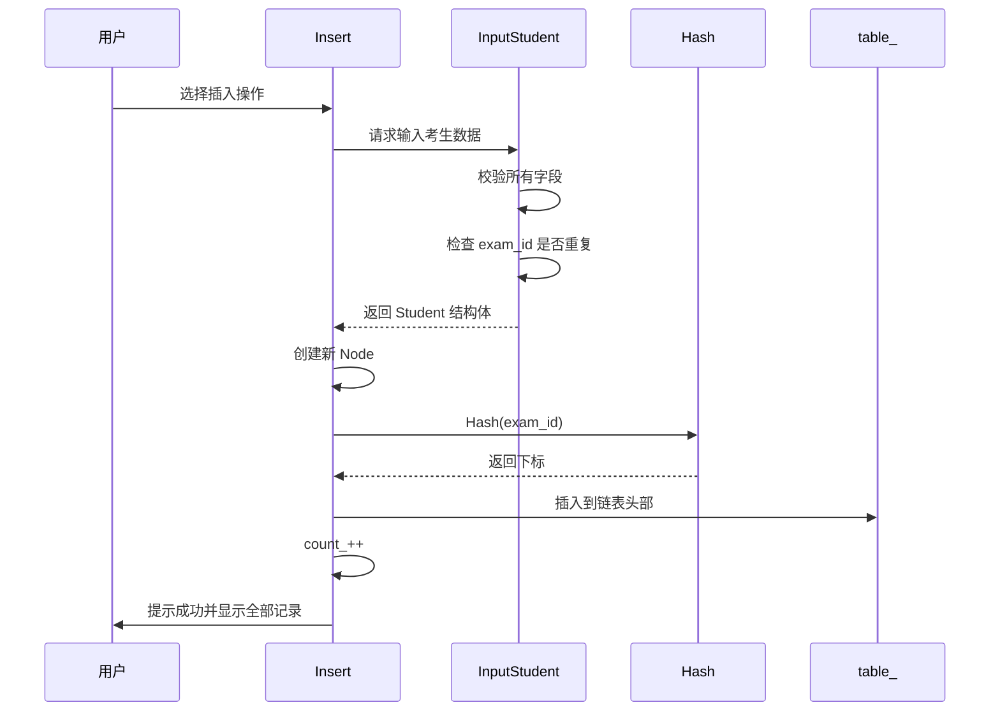

**实现细节：**

* 使用头插法保证插入为 O(1) 时间 [p1/p1.cpp L430-L436](https://github.com/lilong555/DataStruct/blob/660fbbaa/p1/p1.cpp#L430-L436)
* 新节点的 `next` 指向当前链表头
* 更新桶指针指向新节点
* 链内不维护排序或其它顺序

**来源：** [p1/p1.cpp L421-L442](https://github.com/lilong555/DataStruct/blob/660fbbaa/p1/p1.cpp#L421-L442)

---

### 查找操作

`Search()` 函数按考号检索考生记录。

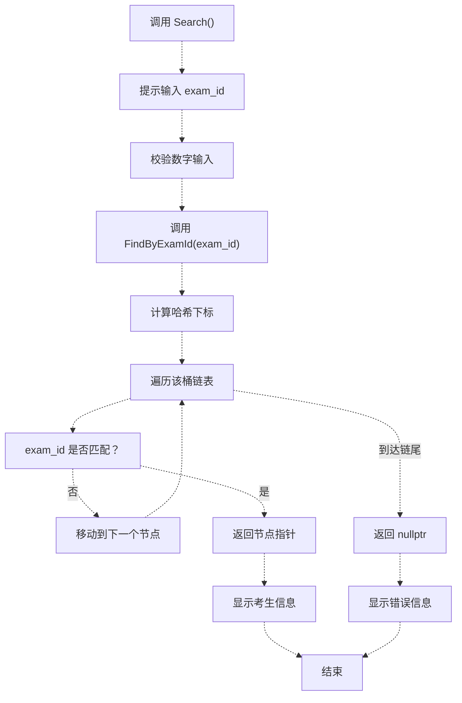

**`FindByExamId()` 中的查找算法：** [p1/p1.cpp L444-L457](https://github.com/lilong555/DataStruct/blob/660fbbaa/p1/p1.cpp#L444-L457)

1. 由 exam_id 计算哈希下标
2. 访问 `table_[index]` 对应的链表
3. 遍历链表，比较 `current->data.exam_id` 与目标值
4. 找到则返回节点指针，否则返回 nullptr

**来源：** [p1/p1.cpp L530-L560](https://github.com/lilong555/DataStruct/blob/660fbbaa/p1/p1.cpp#L530-L560)

 [p1/p1.cpp L444-L457](https://github.com/lilong555/DataStruct/blob/660fbbaa/p1/p1.cpp#L444-L457)

---

### 删除操作

`Delete()` 函数按考号删除考生记录。

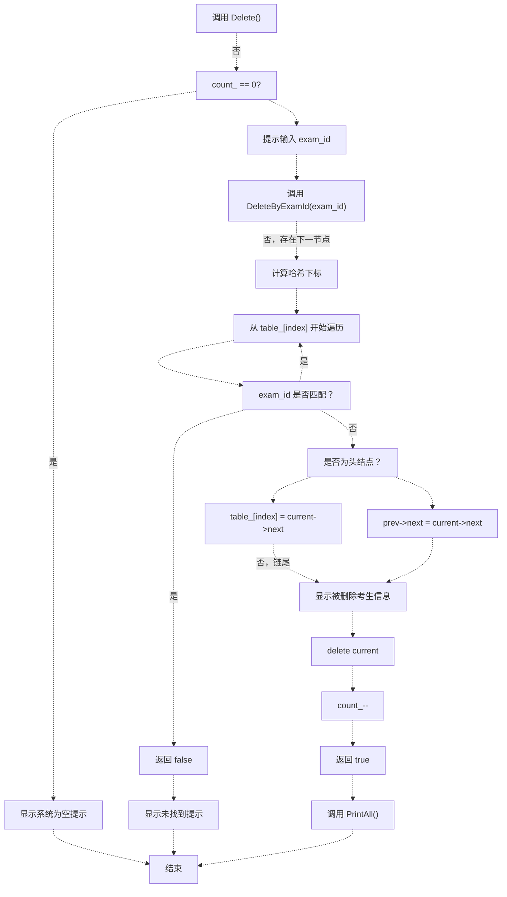

**关键实现细节：**

* 遍历时同时维护 `current` 与 `prev` 指针 [p1/p1.cpp L462-L463](https://github.com/lilong555/DataStruct/blob/660fbbaa/p1/p1.cpp#L462-L463)
* 删除头结点需要单独处理 [p1/p1.cpp L469-L471](https://github.com/lilong555/DataStruct/blob/660fbbaa/p1/p1.cpp#L469-L471)
* 非头结点删除时更新 `prev->next` [p1/p1.cpp L474-L476](https://github.com/lilong555/DataStruct/blob/660fbbaa/p1/p1.cpp#L474-L476)
* 通过 `delete` 释放节点内存 [p1/p1.cpp L483](https://github.com/lilong555/DataStruct/blob/660fbbaa/p1/p1.cpp#L483-L483)
* 递减全局计数 `count_` [p1/p1.cpp L484](https://github.com/lilong555/DataStruct/blob/660fbbaa/p1/p1.cpp#L484-L484)

**来源：** [p1/p1.cpp L494-L528](https://github.com/lilong555/DataStruct/blob/660fbbaa/p1/p1.cpp#L494-L528)

 [p1/p1.cpp L459-L492](https://github.com/lilong555/DataStruct/blob/660fbbaa/p1/p1.cpp#L459-L492)

---

### 修改操作

`Modify()` 函数在保持 exam_id 不变的前提下更新考生信息。

**修改流程：**

| 步骤 | 操作 | 代码位置 |
| --- | --- | --- |
| 1 | 提示输入 exam_id | [p1/p1.cpp L569-L577](https://github.com/lilong555/DataStruct/blob/660fbbaa/p1/p1.cpp#L569-L577) |
| 2 | 调用 `FindByExamId()` | [p1/p1.cpp L579](https://github.com/lilong555/DataStruct/blob/660fbbaa/p1/p1.cpp#L579-L579) |
| 3 | 显示当前信息 | [p1/p1.cpp L582-L585](https://github.com/lilong555/DataStruct/blob/660fbbaa/p1/p1.cpp#L582-L585) |
| 4 | 创建临时 `Student` 结构体 | [p1/p1.cpp L589-L590](https://github.com/lilong555/DataStruct/blob/660fbbaa/p1/p1.cpp#L589-L590) |
| 5 | 输入新姓名并校验 | [p1/p1.cpp L593-L605](https://github.com/lilong555/DataStruct/blob/660fbbaa/p1/p1.cpp#L593-L605) |
| 6 | 输入新性别并校验 | [p1/p1.cpp L608-L619](https://github.com/lilong555/DataStruct/blob/660fbbaa/p1/p1.cpp#L608-L619) |
| 7 | 输入新年龄并校验 | [p1/p1.cpp L622-L638](https://github.com/lilong555/DataStruct/blob/660fbbaa/p1/p1.cpp#L622-L638) |
| 8 | 输入新报考类别并校验 | [p1/p1.cpp L641-L653](https://github.com/lilong555/DataStruct/blob/660fbbaa/p1/p1.cpp#L641-L653) |
| 9 | 更新 `node->data` | [p1/p1.cpp L656](https://github.com/lilong555/DataStruct/blob/660fbbaa/p1/p1.cpp#L656-L656) |
| 10 | 显示全部记录 | [p1/p1.cpp L659](https://github.com/lilong555/DataStruct/blob/660fbbaa/p1/p1.cpp#L659-L659) |

**设计决策：** exam_id 作为哈希键必须保持不变；若修改考号则需要重新计算哈希并可能移动到不同桶中，从而引入重散列（rehashing）与额外复杂度。

**来源：** [p1/p1.cpp L562-L666](https://github.com/lilong555/DataStruct/blob/660fbbaa/p1/p1.cpp#L562-L666)

---

### 统计操作

`Statistics()` 函数用于输出系统中全部考生记录。

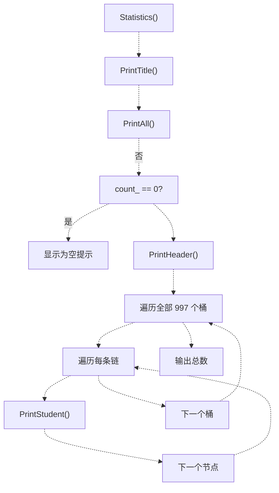

**实现位置：** [p1/p1.cpp L668-L672](https://github.com/lilong555/DataStruct/blob/660fbbaa/p1/p1.cpp#L668-L672)

 [p1/p1.cpp L212-L234](https://github.com/lilong555/DataStruct/blob/660fbbaa/p1/p1.cpp#L212-L234)

该函数本质上是对 `PrintAll()` 的封装；`PrintAll()` 会：

* 遍历所有哈希桶
* 遍历每个桶的链表
* 以表格形式输出考生信息
* 输出考生总数

**来源：** [p1/p1.cpp L668-L672](https://github.com/lilong555/DataStruct/blob/660fbbaa/p1/p1.cpp#L668-L672)

 [p1/p1.cpp L212-L234](https://github.com/lilong555/DataStruct/blob/660fbbaa/p1/p1.cpp#L212-L234)

---

## 输入校验系统

系统实现了较完整的输入校验逻辑，以确保数据一致性与完整性。

### 校验函数

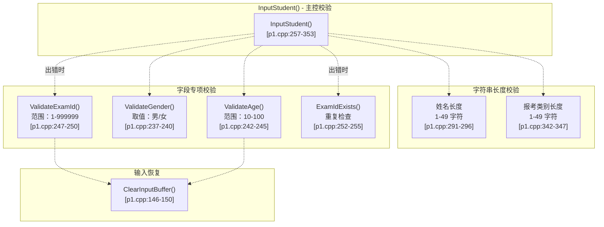

### 校验规则表

| 字段 | 校验函数 | 规则 | 出错恢复 |
| --- | --- | --- | --- |
| exam_id | `ValidateExamId()` | 1 ≤ exam_id ≤ 999999 | 重新输入 |
| exam_id | `ExamIdExists()` | 必须唯一 | 更换其它 ID |
| name | 长度检查 | 1 ≤ length ≤ 49 | 重新输入 |
| gender | `ValidateGender()` | 必须为 "男" 或 "女" | 重新输入 |
| age | `ValidateAge()` | 10 ≤ age ≤ 100 | 重新输入 |
| category | 长度检查 | 1 ≤ length ≤ 49 | 重新输入 |

### 输入循环模式

所有字段输入均采用“可重试循环”模式：

```
while (true) {
    // 提示输入
    // 读取输入
    // 校验输入
    if (valid) break;
    // 输出错误提示
    // 可选：ClearInputBuffer()
}
```

该模式分别用于 exam_id（[p1/p1.cpp L260-L283](https://github.com/lilong555/DataStruct/blob/660fbbaa/p1/p1.cpp#L260-L283)）、姓名（[p1/p1.cpp L286-L299](https://github.com/lilong555/DataStruct/blob/660fbbaa/p1/p1.cpp#L286-L299)）、性别（[p1/p1.cpp L302-L314](https://github.com/lilong555/DataStruct/blob/660fbbaa/p1/p1.cpp#L302-L314)）、年龄（[p1/p1.cpp L317-L334](https://github.com/lilong555/DataStruct/blob/660fbbaa/p1/p1.cpp#L317-L334)）以及报考类别（[p1/p1.cpp L337-L350](https://github.com/lilong555/DataStruct/blob/660fbbaa/p1/p1.cpp#L337-L350)）。

**来源：** [p1/p1.cpp L257-L353](https://github.com/lilong555/DataStruct/blob/660fbbaa/p1/p1.cpp#L257-L353)

 [p1/p1.cpp L237-L250](https://github.com/lilong555/DataStruct/blob/660fbbaa/p1/p1.cpp#L237-L250)

 [p1/p1.cpp L146-L150](https://github.com/lilong555/DataStruct/blob/660fbbaa/p1/p1.cpp#L146-L150)

---

## 用户交互流程

### 主菜单系统

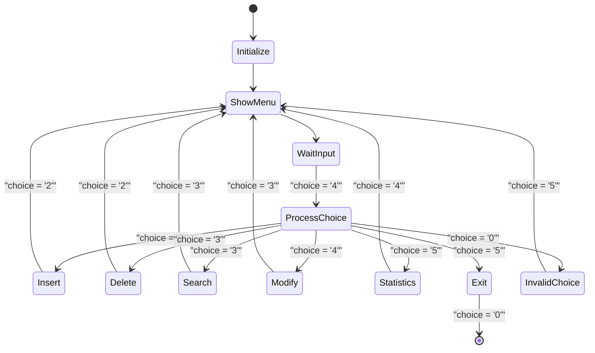

### 菜单显示

位于 [p1/p1.cpp L174-L185](https://github.com/lilong555/DataStruct/blob/660fbbaa/p1/p1.cpp#L174-L185) 的 `ShowMenu()` 函数会显示：

```
----------------------------------------------------------------------
  [1] 插入考生信息
  [2] 删除考生信息
  [3] 查找考生信息
  [4] 修改考生信息
  [5] 统计考生信息
  [0] 退出系统   
----------------------------------------------------------------------
```

### 主循环实现

位于 [p1/p1.cpp L674-L715](https://github.com/lilong555/DataStruct/blob/660fbbaa/p1/p1.cpp#L674-L715) 的 `Run()` 函数实现流程如下：

1. 调用 `Initialize()` 建立初始数据 [p1/p1.cpp L676](https://github.com/lilong555/DataStruct/blob/660fbbaa/p1/p1.cpp#L676-L676)
2. 进入无限循环 [p1/p1.cpp L679](https://github.com/lilong555/DataStruct/blob/660fbbaa/p1/p1.cpp#L679-L679)
3. 通过 `ShowMenu()` 输出菜单 [p1/p1.cpp L681](https://github.com/lilong555/DataStruct/blob/660fbbaa/p1/p1.cpp#L681-L681)
4. 读取用户选择（`char`） [p1/p1.cpp L682-L683](https://github.com/lilong555/DataStruct/blob/660fbbaa/p1/p1.cpp#L682-L683)
5. 根据选项执行 `switch` 分发 [p1/p1.cpp L685-L713](https://github.com/lilong555/DataStruct/blob/660fbbaa/p1/p1.cpp#L685-L713)：
   * `'1'`-`'5'`：调用对应的业务函数
   * `'0'`：打印告别信息并返回
   * 默认：提示错误并清空输入缓冲区

**来源：** [p1/p1.cpp L674-L715](https://github.com/lilong555/DataStruct/blob/660fbbaa/p1/p1.cpp#L674-L715)

 [p1/p1.cpp L174-L185](https://github.com/lilong555/DataStruct/blob/660fbbaa/p1/p1.cpp#L174-L185)

---

## 显示与输出格式化

### 表格格式化系统

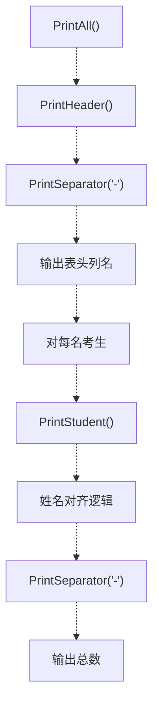

### 输出格式示例

```
----------------------------------------------------------------------
考号    姓名          性别    年龄    报考类别
----------------------------------------------------------------------
12345   张三          男      20      计算机科学
56789   李四          女      22      软件工程
----------------------------------------------------------------------
总计: 2 名考生
```

### 格式化相关函数

| 函数 | 用途 | 代码位置 |
| --- | --- | --- |
| `PrintSeparator()` | 输出水平分隔线 | [p1/p1.cpp L152-L159](https://github.com/lilong555/DataStruct/blob/660fbbaa/p1/p1.cpp#L152-L159) |
| `PrintTitle()` | 输出居中标题 | [p1/p1.cpp L161-L172](https://github.com/lilong555/DataStruct/blob/660fbbaa/p1/p1.cpp#L161-L172) |
| `PrintHeader()` | 输出表格列名 | [p1/p1.cpp L187-L192](https://github.com/lilong555/DataStruct/blob/660fbbaa/p1/p1.cpp#L187-L192) |
| `PrintStudent()` | 输出单条考生记录 | [p1/p1.cpp L194-L210](https://github.com/lilong555/DataStruct/blob/660fbbaa/p1/p1.cpp#L194-L210) |
| `PrintAll()` | 输出完整考生表格 | [p1/p1.cpp L212-L234](https://github.com/lilong555/DataStruct/blob/660fbbaa/p1/p1.cpp#L212-L234) |

**姓名对齐逻辑：** 位于 [p1/p1.cpp L198-L205](https://github.com/lilong555/DataStruct/blob/660fbbaa/p1/p1.cpp#L198-L205) 的 `PrintStudent()` 若姓名字节长度小于 8，会额外输出一个制表符，以便在中文字符存在时保持列对齐。

**来源：** [p1/p1.cpp L152-L234](https://github.com/lilong555/DataStruct/blob/660fbbaa/p1/p1.cpp#L152-L234)

---

## 内存管理

### 构造函数与析构函数

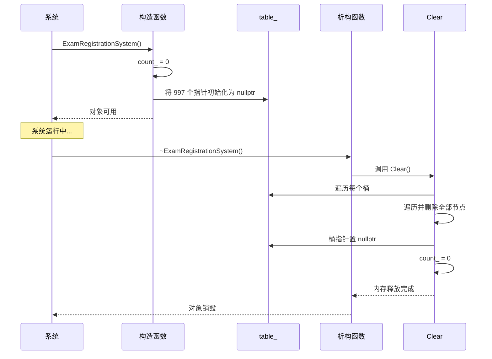

### 资源管理细节

**构造函数** [p1/p1.cpp L108-L114](https://github.com/lilong555/DataStruct/blob/660fbbaa/p1/p1.cpp#L108-L114)：

* 将 `count_` 初始化为 0
* 将哈希表的全部桶指针初始化为 nullptr
* 构造函数本身不进行动态内存分配

**析构函数** [p1/p1.cpp L116-L119](https://github.com/lilong555/DataStruct/blob/660fbbaa/p1/p1.cpp#L116-L119)：

* 调用 `Clear()` 释放所有节点
* 确保系统退出时不泄漏内存

**Clear() 函数** [p1/p1.cpp L130-L144](https://github.com/lilong555/DataStruct/blob/660fbbaa/p1/p1.cpp#L130-L144)：

* 遍历 997 个桶
* 对每个桶，遍历链表
* 使用 `delete` 删除每个节点
* 将桶指针置为 nullptr
* 将 `count_` 重置为 0

### 内存分配点

| 操作 | 分配 | 释放 |
| --- | --- | --- |
| Initialize | 每名考生 `new Node()` | 析构函数 → Clear() |
| Insert | `new Node()` | 删除操作或析构函数 |
| Delete | 无 | `delete current` |

**来源：** [p1/p1.cpp L108-L144](https://github.com/lilong555/DataStruct/blob/660fbbaa/p1/p1.cpp#L108-L144)

 [p1/p1.cpp L405-L410](https://github.com/lilong555/DataStruct/blob/660fbbaa/p1/p1.cpp#L405-L410)

 [p1/p1.cpp L483](https://github.com/lilong555/DataStruct/blob/660fbbaa/p1/p1.cpp#L483-L483)

---

## 编译与运行

### 编译命令

```
g++ -std=c++17 -O2 -Wall -Wextra -pedantic p1/p1.cpp -o output/p1
```

**编译参数：**

* `-std=c++17`：使用 C++17 标准
* `-O2`：优化级别 2
* `-Wall -Wextra -pedantic`：启用更严格的告警以提升代码质量

### 运行程序

```
./output/p1
```

程序启动后会先进行系统初始化，提示输入初始考生数量与信息；初始化完成后进入交互式菜单循环。

### 依赖

系统仅使用标准 C++ 库：

* `<iostream>`：控制台 I/O [p1/p1.cpp L1](https://github.com/lilong555/DataStruct/blob/660fbbaa/p1/p1.cpp#L1-L1)
* `<cmath>`：数学函数（包含但未使用） [p1/p1.cpp L2](https://github.com/lilong555/DataStruct/blob/660fbbaa/p1/p1.cpp#L2-L2)
* `<cstring>`：字符串处理（`strlen`、`strcmp`） [p1/p1.cpp L3](https://github.com/lilong555/DataStruct/blob/660fbbaa/p1/p1.cpp#L3-L3)

**来源：** [p1/p1.cpp L1-L3](https://github.com/lilong555/DataStruct/blob/660fbbaa/p1/p1.cpp#L1-L3)

 [CLAUDE.md L18-L29](https://github.com/lilong555/DataStruct/blob/660fbbaa/CLAUDE.md#L18-L29)

---

## 系统状态与数据流

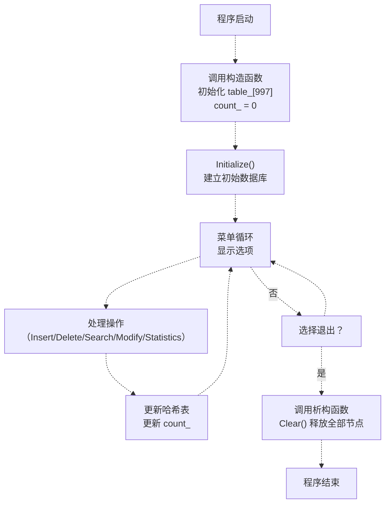

### 状态变量

| 变量 | 类型 | 用途 | 何时更新 |
| --- | --- | --- | --- |
| `table_[HASH_TABLE_SIZE]` | `Node*[997]` | 哈希表桶数组 | Insert、Delete |
| `count_` | `int` | 当前考生总数 | Initialize、Insert、Delete、Clear |

### 不变式

系统维持以下不变式：

1. `count_` 始终等于所有桶链表节点总数
2. 系统中不存在重复的 exam_id
3. 每个 `table_[i]` 要么为 nullptr，要么指向一条有效链表
4. 所有链表均以 nullptr 正确终止

**来源：** [p1/p1.cpp L55-L56](https://github.com/lilong555/DataStruct/blob/660fbbaa/p1/p1.cpp#L55-L56)

 [p1/p1.cpp L108-L144](https://github.com/lilong555/DataStruct/blob/660fbbaa/p1/p1.cpp#L108-L144)

 [p1/p1.cpp L356-L715](https://github.com/lilong555/DataStruct/blob/660fbbaa/p1/p1.cpp#L356-L715)
