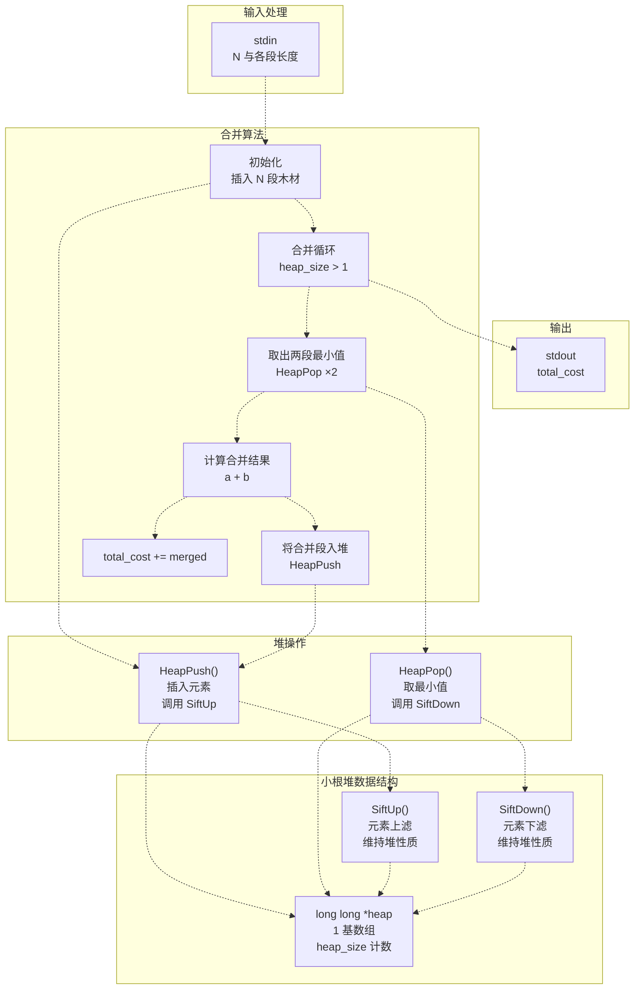
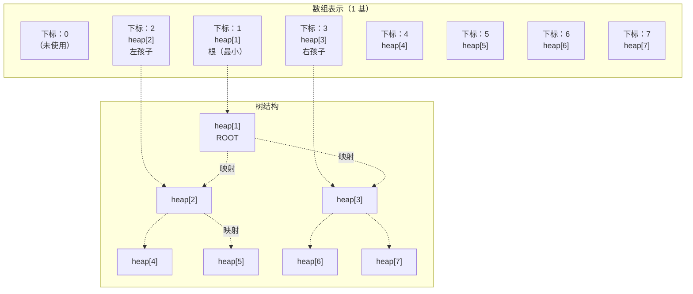
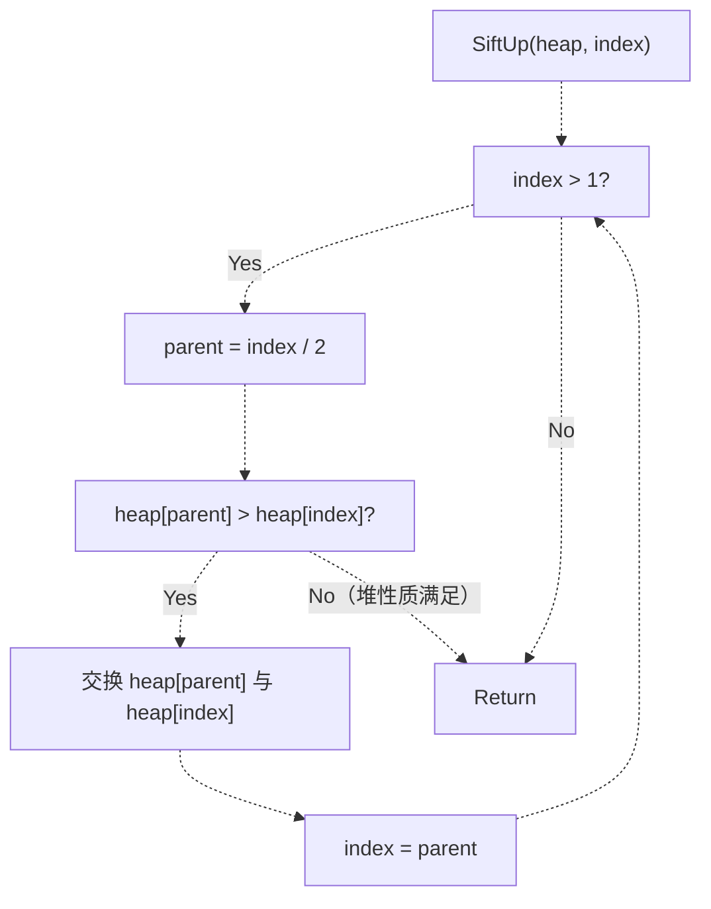
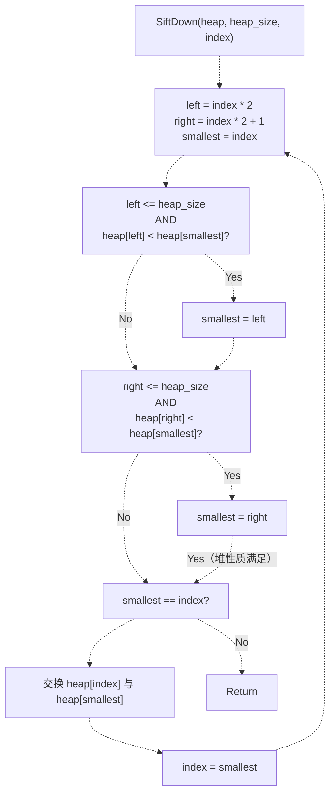
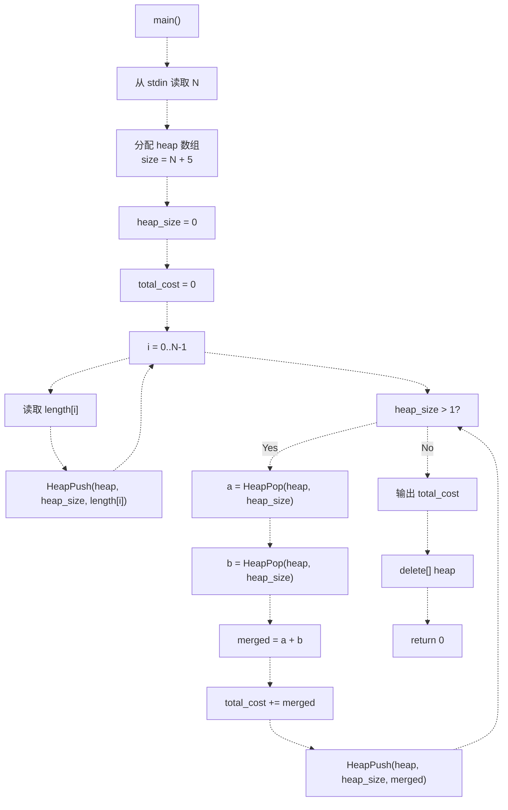

# 项目七：修理牧场（最小花费）

> **相关源文件**
> * [p7/p7.cpp](https://github.com/lilong555/DataStruct/blob/660fbbaa/p7/p7.cpp)

## 目的与范围

本文档对项目七「修理牧场（Repair Ranch）」进行完整技术说明。该项目使用小根堆数据结构与贪心算法求解“最优木材合并”问题：将 N 段木材合并为一段，每次只能合并两段，合并代价等于两段长度之和，目标是使总代价最小。该策略等价于哈夫曼式合并（Huffman-style merging）。

本文覆盖小根堆实现、堆操作以及贪心合并算法。如需了解仓库内其他数据结构实现，请参见 [Data Structures Reference](数据结构参考.md)。如需跨项目的算法复杂度对照，请参见 [Algorithms Reference](算法参考.md)。

**来源：** [p7/p7.cpp L1-L112](https://github.com/lilong555/DataStruct/blob/660fbbaa/p7/p7.cpp#L1-L112)

---

## 问题描述

修理牧场问题可抽象为如下木材切割/合并场景：

* 输入：N 段已知长度的木材
* 目标：将所有木材合并为一段
* 约束：每次只能合并两段
* 代价：一次合并的代价为两段长度之和
* 优化目标：使所有合并操作的总代价最小

该问题等价于“最优二叉树构造”（哈夫曼编码）问题：最优策略是每次选择当前最短的两段木材进行合并。

**来源：** [p7/p7.cpp L3-L8](https://github.com/lilong555/DataStruct/blob/660fbbaa/p7/p7.cpp#L3-L8)

---

## 系统架构



**图示：项目七系统架构与数据流**

该图展示了从输入到输出的完整处理管线。系统由 4 部分组成：（1）基于 1 基数组的小根堆及其 `heap_size` 管理，（2）堆维护操作（`SiftUp`、`SiftDown`），（3）对外堆操作（`HeapPush`、`HeapPop`），以及（4）主贪心合并算法：反复取出最小两段、合并并回插，累计总成本。

**来源：** [p7/p7.cpp L1-L112](https://github.com/lilong555/DataStruct/blob/660fbbaa/p7/p7.cpp#L1-L112)

---

## 小根堆实现

### 数据结构

小根堆使用 1 基下标的 `long long` 动态数组实现，其中：

* 下标 1 保存根（最小值）
* 对于下标为 `i` 的结点： * 父结点下标 `i / 2` * 左孩子下标 `i * 2` * 右孩子下标 `i * 2 + 1`
* `heap_size` 记录当前堆内元素数量

**堆数组分配：**

```xml
<FileRef file-url="https://github.com/lilong555/DataStruct/blob/660fbbaa/p7/p7.cpp#L86-L86" min=86  file-path="p7/p7.cpp">Hii</FileRef>: long long *heap = new long long[(n > 0 ? n : 1) + 5];
```

分配时会比 `n` 多预留一些空间以提高安全性；并且由于 1 基下标的设计，下标 0 不使用。

**来源：** [p7/p7.cpp L85-L87](https://github.com/lilong555/DataStruct/blob/660fbbaa/p7/p7.cpp#L85-L87)

### 堆结构可视化



**图示：1 基数组到二叉树的映射**

该图展示了 1 基数组表示与“概念上的二叉树结构”之间的关系。父子关系遵循：parent = index/2，left_child = index*2，right_child = index*2+1。

**来源：** [p7/p7.cpp L85-L87](https://github.com/lilong555/DataStruct/blob/660fbbaa/p7/p7.cpp#L85-L87)

---

## 堆的核心操作

### SiftUp（上滤）

`SiftUp` 通过不断将元素向上移动，直到父结点更小或元素到达根，从而维持小根堆性质。

**算法：**

1. 从指定下标开始
2. 与父结点（index/2）比较
3. 若父结点 > 当前结点，则交换并继续向上
4. 否则停止（堆性质满足）



**图示：SiftUp 流程**

**实现：** [p7/p7.cpp L11-L25](https://github.com/lilong555/DataStruct/blob/660fbbaa/p7/p7.cpp#L11-L25)

**时间复杂度：** O(log N)（树高）

**来源：** [p7/p7.cpp L11-L25](https://github.com/lilong555/DataStruct/blob/660fbbaa/p7/p7.cpp#L11-L25)

### SiftDown（下滤）

`SiftDown` 通过不断将元素向下移动，直到其小于等于两个孩子或到达叶结点，从而维持小根堆性质。

**算法：**

1. 从指定下标开始
2. 计算左右孩子（index*2 与 index*2+1）
3. 在当前结点与左右孩子中找最小者
4. 若最小者不是当前结点，则交换并继续从新位置下滤
5. 否则停止（堆性质满足）



**图示：SiftDown 流程**

**实现：** [p7/p7.cpp L27-L54](https://github.com/lilong555/DataStruct/blob/660fbbaa/p7/p7.cpp#L27-L54)

**时间复杂度：** O(log N)（树高）

**来源：** [p7/p7.cpp L27-L54](https://github.com/lilong555/DataStruct/blob/660fbbaa/p7/p7.cpp#L27-L54)

### HeapPush（入堆）

向堆中插入新元素，同时维持小根堆性质。

**算法：**

1. `heap_size` 自增
2. 将值放到 `heap[heap_size]`（末尾新位置）
3. 调用 `SiftUp` 恢复堆性质

**实现：** [p7/p7.cpp L56-L60](https://github.com/lilong555/DataStruct/blob/660fbbaa/p7/p7.cpp#L56-L60)

**时间复杂度：** O(log N)

**来源：** [p7/p7.cpp L56-L60](https://github.com/lilong555/DataStruct/blob/660fbbaa/p7/p7.cpp#L56-L60)

### HeapPop（出堆）

取出并返回最小元素（堆顶），同时维持小根堆性质。

**算法：**

1. 保存 `heap[1]`（将要返回的最小值）
2. 将 `heap[heap_size]` 移到 `heap[1]`（堆尾替换堆顶）
3. `heap_size` 自减
4. 调用 `SiftDown(heap, heap_size, 1)` 恢复堆性质
5. 返回保存的最小值

**实现：** [p7/p7.cpp L62-L71](https://github.com/lilong555/DataStruct/blob/660fbbaa/p7/p7.cpp#L62-L71)

**时间复杂度：** O(log N)

**来源：** [p7/p7.cpp L62-L71](https://github.com/lilong555/DataStruct/blob/660fbbaa/p7/p7.cpp#L62-L71)

---

## 主算法：贪心合并

主算法使用小根堆在每一步高效找出两段最短木材，并进行合并，从而实现最优策略。

### 算法步骤

| 步骤 | 操作 | 代码参考 |
| --- | --- | --- |
| 1 | 读取 N（段数） | [p7/p7.cpp L79-L83](https://github.com/lilong555/DataStruct/blob/660fbbaa/p7/p7.cpp#L79-L83) |
| 2 | 分配 1 基堆数组 | [p7/p7.cpp L86](https://github.com/lilong555/DataStruct/blob/660fbbaa/p7/p7.cpp#L86-L86) |
| 3 | 初始化 heap_size=0 | [p7/p7.cpp L87](https://github.com/lilong555/DataStruct/blob/660fbbaa/p7/p7.cpp#L87-L87) |
| 4 | 读取 N 个长度并入堆 | [p7/p7.cpp L89-L94](https://github.com/lilong555/DataStruct/blob/660fbbaa/p7/p7.cpp#L89-L94) |
| 5 | total_cost=0 | [p7/p7.cpp L97](https://github.com/lilong555/DataStruct/blob/660fbbaa/p7/p7.cpp#L97-L97) |
| 6 | while heap_size > 1 执行合并循环 | [p7/p7.cpp L98-L106](https://github.com/lilong555/DataStruct/blob/660fbbaa/p7/p7.cpp#L98-L106) |
| 7 | 取两最小值 a、b | [p7/p7.cpp L100-L101](https://github.com/lilong555/DataStruct/blob/660fbbaa/p7/p7.cpp#L100-L101) |
| 8 | merged = a + b | [p7/p7.cpp L103](https://github.com/lilong555/DataStruct/blob/660fbbaa/p7/p7.cpp#L103-L103) |
| 9 | total_cost += merged | [p7/p7.cpp L104](https://github.com/lilong555/DataStruct/blob/660fbbaa/p7/p7.cpp#L104-L104) |
| 10 | merged 入堆 | [p7/p7.cpp L105](https://github.com/lilong555/DataStruct/blob/660fbbaa/p7/p7.cpp#L105-L105) |
| 11 | 输出 total_cost | [p7/p7.cpp L108](https://github.com/lilong555/DataStruct/blob/660fbbaa/p7/p7.cpp#L108-L108) |
| 12 | 释放堆数组 | [p7/p7.cpp L109](https://github.com/lilong555/DataStruct/blob/660fbbaa/p7/p7.cpp#L109-L109) |

**来源：** [p7/p7.cpp L74-L111](https://github.com/lilong555/DataStruct/blob/660fbbaa/p7/p7.cpp#L74-L111)

### 流程图



**图示：主算法执行流程**

**来源：** [p7/p7.cpp L74-L111](https://github.com/lilong555/DataStruct/blob/660fbbaa/p7/p7.cpp#L74-L111)

---

## 示例执行轨迹

输入示例：

```
3
5 8 2
```

### 执行表

| 步骤 | 堆状态 | 操作 | a | b | merged | total_cost |
| --- | --- | --- | --- | --- | --- | --- |
| Init | `[2, 5, 8]` | 全部输入入堆后的状态 | - | - | - | 0 |
| 1 | `[2, 5, 8]` | 取出两最小值 | 2 | 5 | 7 | 0 |
| 1 | `[7, 8]` | 累加代价并回插合并段 | - | - | - | 7 |
| 2 | `[7, 8]` | 取出两最小值 | 7 | 8 | 15 | 7 |
| 2 | `[15]` | 累加代价并回插合并段 | - | - | - | 22 |
| End | `[15]` | heap_size = 1，退出循环 | - | - | - | 22 |

**输出：** `22`

### 可视化轨迹

```mermaid
stateDiagram-v2
    [*] --> Initial Heap: [2, 5, 8]total_cost = 0 : "HeapPop x2"
    Initial Heap: [2, 5, 8]total_cost = 0 --> After Pop: a=2, b=5Heap: [] : "HeapPop x2"
    After Pop: a=2, b=5Heap: [] --> After Merge: merged=7total_cost = 7Heap: [7, 8] : "cost += 7, HeapPush(7)"
    After Merge: merged=7total_cost = 7Heap: [7, 8] --> After Pop: a=7, b=8Heap: [] : "HeapPop x2"
    After Pop: a=7, b=8Heap: [] --> After Merge: merged=15total_cost = 22Heap: [15] : "cost += 15, HeapPush(15)"
    After Merge: merged=15total_cost = 22Heap: [15] --> Loop Exit: heap_size=1Output: 22 : "heap_size ≤ 1"
    Loop Exit: heap_size=1Output: 22 --> [*] : "heap_size ≤ 1"
```



**图示：示例执行的状态转换**

**解释：** 算法始终合并当前最短的两段。第一次合并：2 + 5 = 7（成本 7）；第二次合并：7 + 8 = 15（成本 15）；总成本 22。该策略是最优的，因为更短的段会在后续合并中被多次累加，先合并短段可降低其对总成本的“倍增贡献”。

**来源：** [p7/p7.cpp L98-L106](https://github.com/lilong555/DataStruct/blob/660fbbaa/p7/p7.cpp#L98-L106)

---

## 输入/输出格式

### 输入规范

* **第 1 行**：整数 `N`（1 ≤ N ≤ 20,000）——木材段数
* **第 2 行**：`N` 个空格分隔的整数，表示各段长度
* **数据类型**：使用 `long long` 以处理大数并避免溢出

**输入读取：** [p7/p7.cpp L79-L94](https://github.com/lilong555/DataStruct/blob/660fbbaa/p7/p7.cpp#L79-L94)

### 输出规范

* **单行输出**：一个整数，表示最小总成本
* **特殊情况**：若 N ≤ 1，则成本为 0（无需合并）

**输出：** [p7/p7.cpp L108](https://github.com/lilong555/DataStruct/blob/660fbbaa/p7/p7.cpp#L108-L108)

### I/O 优化

```cpp
std::ios::sync_with_stdio(false);
std::cin.tie(nullptr);
```

程序通过 I/O 优化提高读写性能，见 [p7/p7.cpp L76-L77](https://github.com/lilong555/DataStruct/blob/660fbbaa/p7/p7.cpp#L76-L77)。

**来源：** [p7/p7.cpp L76-L83](https://github.com/lilong555/DataStruct/blob/660fbbaa/p7/p7.cpp#L76-L83)

 [p7/p7.cpp L108](https://github.com/lilong555/DataStruct/blob/660fbbaa/p7/p7.cpp#L108-L108)

---

## 复杂度分析

### 时间复杂度

| 操作 | 复杂度 | 次数 | 总计 |
| --- | --- | --- | --- |
| N 个元素初始入堆 | O(log N) | N 次 | O(N log N) |
| 主合并循环迭代次数 | - | N - 1 次 | - |
| 合并循环中的 HeapPop | O(log N) | 2(N-1) 次 | O(N log N) |
| 合并循环中的 HeapPush | O(log N) | N - 1 次 | O(N log N) |
| **总体** | - | - | **O(N log N)** |

**分析：** 主导操作是堆的插入与删除，每次 O(log N)。合并循环运行 N-1 次（将 N 段缩减为 1 段），每次执行 2 次 pop 与 1 次 push。总堆操作数为 N + 3(N-1) = 4N - 3，故总体为 O(N log N)。

**来源：** [p7/p7.cpp L3-L8](https://github.com/lilong555/DataStruct/blob/660fbbaa/p7/p7.cpp#L3-L8)

### 空间复杂度

| 组成 | 空间 | 说明 |
| --- | --- | --- |
| 堆数组 | O(N) | 动态数组大小为 N+5 |
| 变量 | O(1) | `heap_size`、`total_cost`、循环计数等 |
| **总计** | **O(N)** | 线性空间 |

空间复杂度主要由堆数组存储决定。算法在堆上原地操作，额外空间为常量级。

**来源：** [p7/p7.cpp L86](https://github.com/lilong555/DataStruct/blob/660fbbaa/p7/p7.cpp#L86-L86)

---

## 关键设计决策

### 采用 1 基下标的原因

堆结构使用 1 基数组（下标 0 不用）以简化父子下标计算：

* **父结点**：`index / 2`（无需调整）
* **左孩子**：`index * 2`（无需 +1）
* **右孩子**：`index * 2 + 1`

与 0 基下标相比（父：(index-1)/2、左：2*index+1、右：2*index+2），1 基公式更简洁。

**来源：** [p7/p7.cpp L11-L54](https://github.com/lilong555/DataStruct/blob/660fbbaa/p7/p7.cpp#L11-L54)

### 匿名命名空间的辅助函数

所有堆操作函数（`SiftUp`、`SiftDown`、`HeapPush`、`HeapPop`）都定义在匿名命名空间中（见 [p7/p7.cpp L9-L72](https://github.com/lilong555/DataStruct/blob/660fbbaa/p7/p7.cpp#L9-L72)），从而获得内部链接属性，避免与其他模块链接时出现命名冲突。

**来源：** [p7/p7.cpp L9-L72](https://github.com/lilong555/DataStruct/blob/660fbbaa/p7/p7.cpp#L9-L72)

### 贪心策略的正确性

贪心策略（每次合并两段最短木材）之所以最优，原因包括：

1. **成本结构**：合并 A 与 B 的代价为 (A+B)，合并后产生的新段后续还可能被再次合并
2. **倍增效应**：越早被合并的段，越可能在后续多次参与累加
3. **最优子结构**：为了最小化总成本，应尽可能让较小值先被合并，降低其对总成本的贡献

该结论可形式化证明为与哈夫曼编码的最优前缀码树构造等价。

**来源：** [p7/p7.cpp L3-L8](https://github.com/lilong555/DataStruct/blob/660fbbaa/p7/p7.cpp#L3-L8)

---

## 边界情况与特殊处理

| 情况 | 条件 | 行为 | 代码参考 |
| --- | --- | --- | --- |
| 空输入 | N = 0 | 不插入元素，循环不执行 | [p7/p7.cpp L98](https://github.com/lilong555/DataStruct/blob/660fbbaa/p7/p7.cpp#L98-L98) |
| 单段木材 | N = 1 | `heap_size > 1` 为假，成本为 0 | [p7/p7.cpp L98](https://github.com/lilong555/DataStruct/blob/660fbbaa/p7/p7.cpp#L98-L98) |
| 两段木材 | N = 2 | 循环执行 1 次：合并两段，成本为其和 | [p7/p7.cpp L98-L106](https://github.com/lilong555/DataStruct/blob/660fbbaa/p7/p7.cpp#L98-L106) |
| 大数处理 | 溢出风险 | 所有计算使用 `long long`（64 位） | [p7/p7.cpp L86-L103](https://github.com/lilong555/DataStruct/blob/660fbbaa/p7/p7.cpp#L86-L103) |
| 分配安全 | n = 0 | 至少分配 1 个元素：`(n > 0 ? n : 1)` | [p7/p7.cpp L86](https://github.com/lilong555/DataStruct/blob/660fbbaa/p7/p7.cpp#L86-L86) |

**来源：** [p7/p7.cpp L86](https://github.com/lilong555/DataStruct/blob/660fbbaa/p7/p7.cpp#L86-L86)

 [p7/p7.cpp L91](https://github.com/lilong555/DataStruct/blob/660fbbaa/p7/p7.cpp#L91-L91)

 [p7/p7.cpp L96-L106](https://github.com/lilong555/DataStruct/blob/660fbbaa/p7/p7.cpp#L96-L106)

---

## 与其他项目的对比

| 方面 | 项目 7（小根堆） | 项目 8（Prim 最小生成树） | 项目 10（堆排序） |
| --- | --- | --- | --- |
| **堆类型** | 小根堆 | 未使用 | 大根堆（升序排序） |
| **下标体系** | 1 基 | N/A | 视实现而定 |
| **主算法** | 哈夫曼式合并 | 贪心图算法 | 原地堆排序 |
| **交互方式** | 批处理 | 交互式菜单 | 交互式菜单 |
| **堆操作** | Push、Pop | N/A | Heapify、Extract |
| **复杂度** | O(N log N) | 邻接矩阵下 O(V²) | O(N log N) |
| **问题域** | 优化（成本） | 图（MST） | 排序比较 |

如需了解项目八 Prim 算法，请参见 [Project 8: Power Grid Cost Simulation](项目八-电网建设造价模拟.md)。如需了解项目十堆排序实现，请参见 [Sorting Algorithm Implementations](排序算法实现说明.md)。

**来源：** [p7/p7.cpp L1-L112](https://github.com/lilong555/DataStruct/blob/660fbbaa/p7/p7.cpp#L1-L112)

---

## 构建与运行

### 编译

```
g++ -std=c++17 -O2 -Wall -Wextra -pedantic p7/p7.cpp -o output/p7
```

如需完整构建说明与环境配置，请参见 [Getting Started](快速开始.md)。

### 运行

```
./output/p7
```

**输入示例：**

```
3
5 8 2
```

**期望输出：**

```
22
```

### 使用文件重定向测试

```
./output/p7 < test_input.txt
```

**来源：** [p7/p7.cpp L1-L112](https://github.com/lilong555/DataStruct/blob/660fbbaa/p7/p7.cpp#L1-L112)
