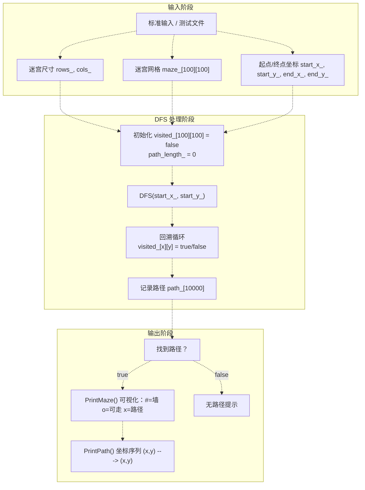
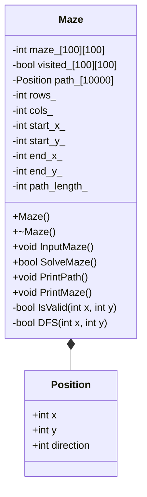
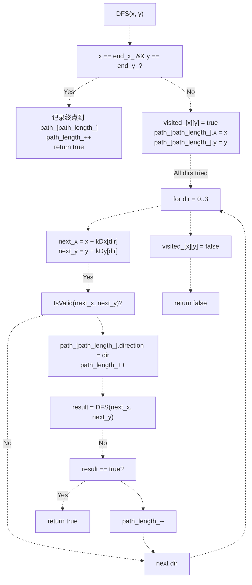

# 项目三：勇闯迷宫游戏

> **相关源文件**
> * [p3/CODE_EXPLANATION.md](https://github.com/lilong555/DataStruct/blob/660fbbaa/p3/CODE_EXPLANATION.md)
> * [p3/README.md](https://github.com/lilong555/DataStruct/blob/660fbbaa/p3/README.md)
> * [p3/maze_game.cpp](https://github.com/lilong555/DataStruct/blob/660fbbaa/p3/maze_game.cpp)

## 目的与范围

本文档说明项目三（p3）：一个迷宫寻路游戏。该项目使用深度优先搜索（DFS）与回溯，在基于网格的迷宫中寻找从起点到终点的一条路径。系统从标准输入读取迷宫配置，使用递归回溯计算路径，并输出解的可视化地图以及路径坐标序列。

如需了解本仓库中的其他图算法，请参见 [Project 8: Power Grid Cost Simulation](项目八-电网建设造价模拟.md)（最小生成树）。如需跨项目的算法复杂度对照，请参见 [Algorithms Reference](算法参考.md)。

**来源：** [p3/maze_game.cpp L1-L249](https://github.com/lilong555/DataStruct/blob/660fbbaa/p3/maze_game.cpp#L1-L249)

 [p3/CODE_EXPLANATION.md L1-L253](https://github.com/lilong555/DataStruct/blob/660fbbaa/p3/CODE_EXPLANATION.md#L1-L253)

 [p3/README.md L1-L113](https://github.com/lilong555/DataStruct/blob/660fbbaa/p3/README.md#L1-L113)

---

## 系统架构

迷宫游戏采用批处理式流程：先一次性读取全部输入，再进行寻路计算，输出可视化与文本结果，最后结束程序。



**来源：** [p3/maze_game.cpp L78-L94](https://github.com/lilong555/DataStruct/blob/660fbbaa/p3/maze_game.cpp#L78-L94)

 [p3/maze_game.cpp L156-L160](https://github.com/lilong555/DataStruct/blob/660fbbaa/p3/maze_game.cpp#L156-L160)

 [p3/maze_game.cpp L224-L249](https://github.com/lilong555/DataStruct/blob/660fbbaa/p3/maze_game.cpp#L224-L249)

---

## 核心数据结构

### Position 结构体

`Position` 用于存储路径遍历过程中每一步的状态信息。

| 字段 | 类型 | 用途 |
| --- | --- | --- |
| `x` | `int` | 迷宫网格中的行坐标 |
| `y` | `int` | 迷宫网格中的列坐标 |
| `direction` | `int` | 到达该位置后下一步的方向（0-3 为 下/右/上/左，-1 表示终点） |

该结构体定义在 `Maze` 类的私有部分，见 [p3/maze_game.cpp L31-L35](https://github.com/lilong555/DataStruct/blob/660fbbaa/p3/maze_game.cpp#L31-L35)。

**用途：** 通过同时记录位置与移动方向，支持路径重建，使算法在探索过程中能够记录完整路径。

**来源：** [p3/maze_game.cpp L31-L35](https://github.com/lilong555/DataStruct/blob/660fbbaa/p3/maze_game.cpp#L31-L35)

 [p3/CODE_EXPLANATION.md L28-L37](https://github.com/lilong555/DataStruct/blob/660fbbaa/p3/CODE_EXPLANATION.md#L28-L37)

### Maze 类设计



**成员变量：**

| 变量 | 类型 | 用途 |
| --- | --- | --- |
| `maze_[kMaxSize][kMaxSize]` | `int[100][100]` | 网格表示：0=可走，1=墙 |
| `visited_[kMaxSize][kMaxSize]` | `bool[100][100]` | 记录当前搜索路径中已访问的格子 |
| `path_[kMaxSize * kMaxSize]` | `Position[10000]` | 以“栈”形式记录已找到路径的位置序列 |
| `rows_`, `cols_` | `int` | 迷宫尺寸 |
| `start_x_`, `start_y_` | `int` | 起点坐标 |
| `end_x_`, `end_y_` | `int` | 终点坐标 |
| `path_length_` | `int` | `path_` 当前已记录的位置数量 |

**公有方法：**

| 方法 | 返回 | 用途 |
| --- | --- | --- |
| `InputMaze()` | `void` | 从标准输入读取迷宫配置 |
| `SolveMaze()` | `bool` | 发起 DFS 搜索，找到路径返回 true |
| `PrintPath()` | `void` | 输出路径坐标序列 |
| `PrintMaze()` | `void` | 输出带路径标记的可视化网格 |

**私有方法：**

| 方法 | 返回 | 用途 |
| --- | --- | --- |
| `IsValid(int x, int y)` | `bool` | 判断坐标是否越界、可通行、且未访问 |
| `DFS(int x, int y)` | `bool` | 递归回溯搜索实现 |

**来源：** [p3/maze_game.cpp L17-L52](https://github.com/lilong555/DataStruct/blob/660fbbaa/p3/maze_game.cpp#L17-L52)

 [p3/CODE_EXPLANATION.md L41-L67](https://github.com/lilong555/DataStruct/blob/660fbbaa/p3/CODE_EXPLANATION.md#L41-L67)

---

## DFS 回溯算法

### 算法流程

核心寻路逻辑在 `DFS` 方法中实现（[p3/maze_game.cpp L113-L150](https://github.com/lilong555/DataStruct/blob/660fbbaa/p3/maze_game.cpp#L113-L150)）。算法在每个位置尝试四个方向（上下左右）并递归探索。



**方向探索顺序：** 算法按 `kDx` 与 `kDy` 定义的顺序（[p3/maze_game.cpp L10-L11](https://github.com/lilong555/DataStruct/blob/660fbbaa/p3/maze_game.cpp#L10-L11)）尝试方向：

* 方向 0：下（x+1, y）
* 方向 1：右（x, y+1）
* 方向 2：上（x-1, y）
* 方向 3：左（x, y-1）

**来源：** [p3/maze_game.cpp L113-L150](https://github.com/lilong555/DataStruct/blob/660fbbaa/p3/maze_game.cpp#L113-L150)

 [p3/CODE_EXPLANATION.md L70-L124](https://github.com/lilong555/DataStruct/blob/660fbbaa/p3/CODE_EXPLANATION.md#L70-L124)

### visited 状态管理

回溯算法使用 `visited_` 布尔数组避免成环，关键操作包括：

**标记为已访问**（[p3/maze_game.cpp L124](https://github.com/lilong555/DataStruct/blob/660fbbaa/p3/maze_game.cpp#L124-L124)）：

```
visited_[x][y] = true;
```

该操作防止算法在当前搜索路径中重复访问同一格子。

**回溯时取消标记**（[p3/maze_game.cpp L148](https://github.com/lilong555/DataStruct/blob/660fbbaa/p3/maze_game.cpp#L148-L148)）：

```
visited_[x][y] = false;
```

这是非常关键的一步：它允许该格子在后续的其他路径中再次被使用。若不清除，可能导致漏解（当某个格子属于多条可行路径时）。

**合法性检查**（[p3/maze_game.cpp L102-L105](https://github.com/lilong555/DataStruct/blob/660fbbaa/p3/maze_game.cpp#L102-L105)）：

```
bool Maze::IsValid(int x, int y) {
  return x >= 0 && x < rows_ && y >= 0 && y < cols_ && 
         maze_[x][y] == 0 && !visited_[x][y];
}
```

**来源：** [p3/maze_game.cpp L102-L105](https://github.com/lilong555/DataStruct/blob/660fbbaa/p3/maze_game.cpp#L102-L105)

 [p3/maze_game.cpp L124](https://github.com/lilong555/DataStruct/blob/660fbbaa/p3/maze_game.cpp#L124-L124)

 [p3/maze_game.cpp L148](https://github.com/lilong555/DataStruct/blob/660fbbaa/p3/maze_game.cpp#L148-L148)

 [p3/CODE_EXPLANATION.md L105-L124](https://github.com/lilong555/DataStruct/blob/660fbbaa/p3/CODE_EXPLANATION.md#L105-L124)

### 路径重建

`path_` 数组存储了从起点到终点的位置序列。算法在探索过程中记录位置：

**记录当前位置**（[p3/maze_game.cpp L125-L126](https://github.com/lilong555/DataStruct/blob/660fbbaa/p3/maze_game.cpp#L125-L126)）：

```
path_[path_length_].x = x;
path_[path_length_].y = y;
```

**递归前记录方向**（[p3/maze_game.cpp L134-L135](https://github.com/lilong555/DataStruct/blob/660fbbaa/p3/maze_game.cpp#L134-L135)）：

```
path_[path_length_].direction = dir;
path_length_++;
```

**回退**（[p3/maze_game.cpp L143](https://github.com/lilong555/DataStruct/blob/660fbbaa/p3/maze_game.cpp#L143-L143)）：

```
path_length_--;
```

当某方向递归返回 false（该方向无法找到通路）时，`path_length_` 自减，从路径中移除这次失败尝试。

**来源：** [p3/maze_game.cpp L125-L143](https://github.com/lilong555/DataStruct/blob/660fbbaa/p3/maze_game.cpp#L125-L143)

 [p3/CODE_EXPLANATION.md L110-L116](https://github.com/lilong555/DataStruct/blob/660fbbaa/p3/CODE_EXPLANATION.md#L110-L116)

---

## 输入与输出格式

### 输入格式

程序按如下顺序从标准输入读取数据：

| 行号 | 内容 | 示例 |
| --- | --- | --- |
| 1 | `rows cols` | `7 7` |
| 2 到 rows+1 | 迷宫矩阵（空格分隔）：0=可走，1=墙 | `1 0 1 1 1 1 1` |
| rows+2 | `start_x start_y`（0 基） | `0 0` |
| rows+3 | `end_x end_y`（0 基） | `4 5` |

**输入处理：** `InputMaze()` 位于 [p3/maze_game.cpp L78-L94](https://github.com/lilong555/DataStruct/blob/660fbbaa/p3/maze_game.cpp#L78-L94)，会读取全部输入并用中文提示用户。

**来源：** [p3/maze_game.cpp L78-L94](https://github.com/lilong555/DataStruct/blob/660fbbaa/p3/maze_game.cpp#L78-L94)

 [p3/CODE_EXPLANATION.md L127-L147](https://github.com/lilong555/DataStruct/blob/660fbbaa/p3/CODE_EXPLANATION.md#L127-L147)

 [p3/README.md L3-L25](https://github.com/lilong555/DataStruct/blob/660fbbaa/p3/README.md#L3-L25)

### 输出格式

#### 迷宫可视化输出

`PrintMaze()`（[p3/maze_game.cpp L184-L219](https://github.com/lilong555/DataStruct/blob/660fbbaa/p3/maze_game.cpp#L184-L219)）输出带路径标记的网格图，符号含义如下：

| 符号 | 含义 |
| --- | --- |
| `#` | 墙（maze_[i][j] == 1） |
| `o` | 可通行格子 |
| `x` | 路径上的格子 |

输出示例格式：

```markdown
迷宫地图：
    0列  1列  2列  3列  4列  
0行  #   x   #   #   #   
1行  #   x   #   o   o   
2行  #   x   x   x   #
```

**实现说明：** 程序在 [p3/maze_game.cpp L188-L198](https://github.com/lilong555/DataStruct/blob/660fbbaa/p3/maze_game.cpp#L188-L198) 创建临时字符数组 `display[kMaxSize][kMaxSize]`，用于在原迷宫之上叠加路径显示。

#### 路径坐标序列

`PrintPath()`（[p3/maze_game.cpp L165-L179](https://github.com/lilong555/DataStruct/blob/660fbbaa/p3/maze_game.cpp#L165-L179)）将路径输出为坐标序列：

```
(1,1) ---> (2,1) ---> (3,1) ---> (3,2) ---> (3,3)
```

**坐标换算：** 内部使用 0 基坐标；为了便于阅读，输出时将其转换为 1 基（[p3/maze_game.cpp L173](https://github.com/lilong555/DataStruct/blob/660fbbaa/p3/maze_game.cpp#L173-L173)）：

```cpp
std::cout << "(" << path_[i].x + 1 << "," << path_[i].y + 1 << ")";
```

**来源：** [p3/maze_game.cpp L165-L219](https://github.com/lilong555/DataStruct/blob/660fbbaa/p3/maze_game.cpp#L165-L219)

 [p3/CODE_EXPLANATION.md L137-L147](https://github.com/lilong555/DataStruct/blob/660fbbaa/p3/CODE_EXPLANATION.md#L137-L147)

---

## 编译与测试

### 编译

项目按仓库统一编译参数进行构建（最低标准为 C++11）：

```
g++ -o output/p3 p3/maze_game.cpp -std=c++17 -O2 -Wall -Wextra -pedantic
```

从 p3/README.md 读取的“独立编译”方式：

```
g++ -o maze_game maze_game.cpp -std=c++11 -Wall
```

**头文件依赖：** 程序仅使用三个标准头文件，符合课程要求：

* `<iostream>`：标准 I/O（[p3/maze_game.cpp L1](https://github.com/lilong555/DataStruct/blob/660fbbaa/p3/maze_game.cpp#L1-L1)）
* `<cmath>`：数学函数（课程要求）（[p3/maze_game.cpp L2](https://github.com/lilong555/DataStruct/blob/660fbbaa/p3/maze_game.cpp#L2-L2)）
* `<cstring>`：数组初始化的内存操作（[p3/maze_game.cpp L3](https://github.com/lilong555/DataStruct/blob/660fbbaa/p3/maze_game.cpp#L3-L3)）

**来源：** [p3/maze_game.cpp L1-L3](https://github.com/lilong555/DataStruct/blob/660fbbaa/p3/maze_game.cpp#L1-L3)

 [p3/README.md L68-L84](https://github.com/lilong555/DataStruct/blob/660fbbaa/p3/README.md#L68-L84)

### 测试输入文件

项目提供 `test_input.txt` 用于自动测试，可通过重定向输入：

```
./output/p3 < p3/test_input.txt
```

[p3/README.md L1-L66](https://github.com/lilong555/DataStruct/blob/660fbbaa/p3/README.md#L1-L66) 中记录了测试用例类别：

| 类别 | 说明 | 示例 |
| --- | --- | --- |
| 基本功能 | 简单可解的迷宫 | 5×5 且路径清晰 |
| 复杂迷宫 | 需要回溯的大迷宫 | 课程要求的 7×7 |
| 无解 | 起点与终点不连通 | 起终点被墙隔开 |
| 边界情况 | 边界条件 | 起点等于终点、1×1 迷宫 |

**来源：** [p3/README.md L1-L113](https://github.com/lilong555/DataStruct/blob/660fbbaa/p3/README.md#L1-L113)

 [p3/CODE_EXPLANATION.md L219-L237](https://github.com/lilong555/DataStruct/blob/660fbbaa/p3/CODE_EXPLANATION.md#L219-L237)

---

## 复杂度分析

### 时间复杂度

**最坏情况：** O(4^(m×n))，其中 m 为行数、n 为列数

在最坏情况下，算法可能探索所有可能路径：每个格子最多尝试 4 个方向，递归深度可达 m×n。

**实际表现：** 通常远优于最坏情况，原因包括：

* `visited_` 阻止在当前路径中重复访问同一格子
* 找到终点后提前结束
* 墙会剪枝大量不可行分支

**最好情况：** O(m+n)

若起点到终点存在直达路径，算法在很少探索下即可找到解。

**来源：** [p3/CODE_EXPLANATION.md L176-L185](https://github.com/lilong555/DataStruct/blob/660fbbaa/p3/CODE_EXPLANATION.md#L176-L185)

### 空间复杂度

**总体：** O(m×n)

| 数据结构 | 空间 | 用途 |
| --- | --- | --- |
| `maze_[100][100]` | O(m×n) | 网格存储 |
| `visited_[100][100]` | O(m×n) | 访问标记 |
| `path_[10000]` | O(m×n) | 路径存储（最多 m×n 个位置） |
| 递归栈 | O(m×n) | 最坏深度为 m×n |

**常量：** 该实现使用定长数组，并在 [p3/maze_game.cpp L6](https://github.com/lilong555/DataStruct/blob/660fbbaa/p3/maze_game.cpp#L6-L6) 定义 `kMaxSize = 100`，因此最大迷宫尺寸为 100×100。

**来源：** [p3/maze_game.cpp L6](https://github.com/lilong555/DataStruct/blob/660fbbaa/p3/maze_game.cpp#L6-L6)

 [p3/CODE_EXPLANATION.md L186-L192](https://github.com/lilong555/DataStruct/blob/660fbbaa/p3/CODE_EXPLANATION.md#L186-L192)

---

## 算法特性与局限

### 当前实现性质

**路径保证：** 该算法能找到 *一条* 路径，但不保证 *最短* 路径。DFS 深度优先探索并返回第一条找到的解。

**方向优先级：** `kDx` 与 `kDy` 定义的固定探索顺序（下、右、上、左，见 [p3/maze_game.cpp L10-L11](https://github.com/lilong555/DataStruct/blob/660fbbaa/p3/maze_game.cpp#L10-L11)）会影响“多解时最终找到哪条路径”。

**只返回一个解：** 找到第一条可行路径后即终止，即使存在多条路径。

**来源：** [p3/maze_game.cpp L10-L11](https://github.com/lilong555/DataStruct/blob/660fbbaa/p3/maze_game.cpp#L10-L11)

 [p3/CODE_EXPLANATION.md L195-L216](https://github.com/lilong555/DataStruct/blob/660fbbaa/p3/CODE_EXPLANATION.md#L195-L216)

### 可扩展方向

[p3/CODE_EXPLANATION.md L195-L216](https://github.com/lilong555/DataStruct/blob/660fbbaa/p3/CODE_EXPLANATION.md#L195-L216) 讨论了若干改进方向：

| 改进项 | 说明 | 价值 |
| --- | --- | --- |
| BFS 实现 | 以广度优先替换 DFS | 保证最短路径 |
| 启发式搜索 | 实现 A* 算法 | 大迷宫更快收敛 |
| 多解输出 | 找到第一解后继续搜索 | 展示全部可行路径 |
| 双向搜索 | 从起点与终点同时搜索 | 减少搜索空间 |

**来源：** [p3/CODE_EXPLANATION.md L195-L216](https://github.com/lilong555/DataStruct/blob/660fbbaa/p3/CODE_EXPLANATION.md#L195-L216)

---

## 代码风格与规范

该实现遵循 Google C++ Style Guide 的常见约定：

**命名规范：**

* 常量：`kPascalCase`（例如 `kMaxSize`、`kDirections`）
* 类名：`PascalCase`（例如 `Maze`、`Position`）
* 函数：`PascalCase`（例如 `InputMaze`、`SolveMaze`）
* 成员变量：`snake_case_`（末尾下划线，例如 `rows_`、`path_length_`）

**代码格式：**

* 2 空格缩进（[p3/maze_game.cpp L20-L52](https://github.com/lilong555/DataStruct/blob/660fbbaa/p3/maze_game.cpp#L20-L52)）
* 函数左大括号与声明同一行
* 控制语句后空格：`if (condition)`
* 运算符两侧留空格：`x + 1`

**文档注释：**

* 类与函数使用 Doxygen 风格注释（[p3/maze_game.cpp L13-L16](https://github.com/lilong555/DataStruct/blob/660fbbaa/p3/maze_game.cpp#L13-L16)）
* 复杂逻辑使用行内注释

**来源：** [p3/maze_game.cpp L1-L249](https://github.com/lilong555/DataStruct/blob/660fbbaa/p3/maze_game.cpp#L1-L249)

 [p3/CODE_EXPLANATION.md L151-L173](https://github.com/lilong555/DataStruct/blob/660fbbaa/p3/CODE_EXPLANATION.md#L151-L173)
