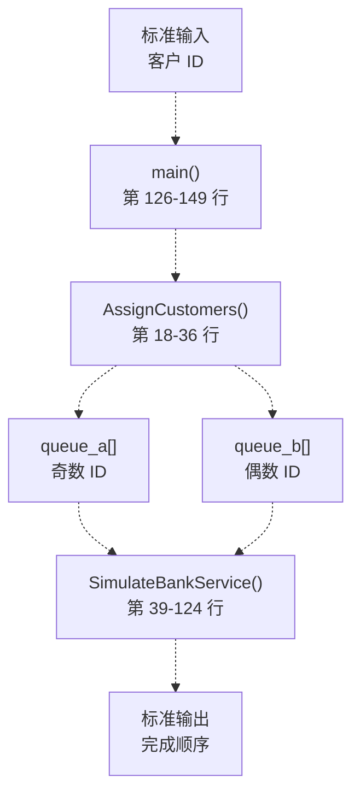
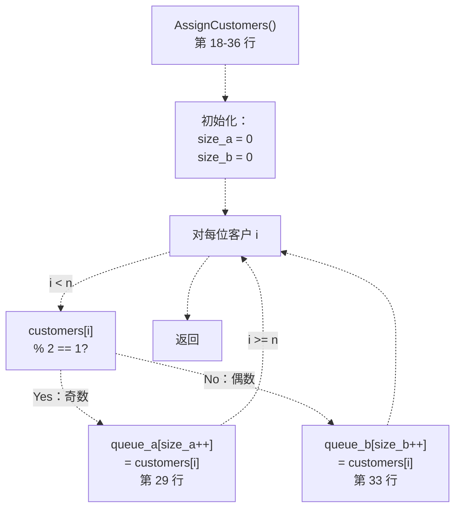
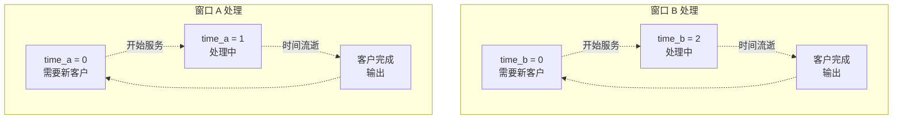
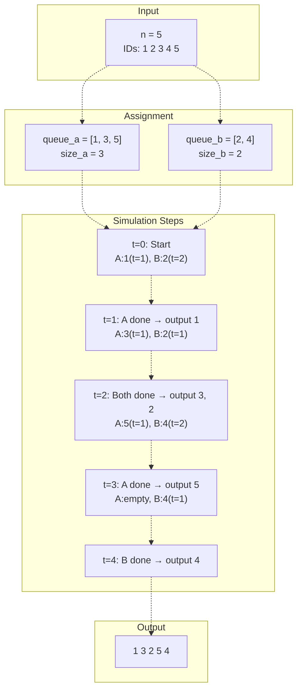
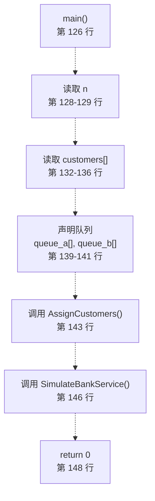

# 项目五：银行业务模拟

> **相关源文件**
> * [p5/bank_service.cpp](https://github.com/lilong555/DataStruct/blob/660fbbaa/p5/bank_service.cpp)
> * [p5/bank_service.exe](https://github.com/lilong555/DataStruct/blob/660fbbaa/p5/bank_service.exe)

## 目的与范围

本文档说明项目五实现的银行业务模拟系统。系统模拟双窗口服务：客户按 ID 奇偶性被分配到不同窗口，两个窗口具有不同处理速度。仿真按客户“完成服务”的先后顺序输出客户 ID。

如需了解跨项目的队列数据结构概念，请参见 [Data Structures Reference](数据结构参考.md)。如需算法复杂度对照，请参见 [Algorithms Reference](算法参考.md)。

**来源：** [p5/bank_service.cpp L1-L150](https://github.com/lilong555/DataStruct/blob/660fbbaa/p5/bank_service.cpp#L1-L150)

## 系统概览

该银行业务模拟是一个批处理系统，用于演示“不同服务速率下的队列管理”。系统读取客户 ID，分配到对应队列，然后仿真服务过程并输出完成顺序。

### 架构图



**来源：** [p5/bank_service.cpp L126-L149](https://github.com/lilong555/DataStruct/blob/660fbbaa/p5/bank_service.cpp#L126-L149)

 [p5/bank_service.cpp L18-L36](https://github.com/lilong555/DataStruct/blob/660fbbaa/p5/bank_service.cpp#L18-L36)

 [p5/bank_service.cpp L39-L124](https://github.com/lilong555/DataStruct/blob/660fbbaa/p5/bank_service.cpp#L39-L124)

## 数据结构

### Customer 结构体

系统定义了 `Customer` 结构体，但当前实现并未使用它，而是用更简单的整型数组来完成仿真：

```
struct Customer {
    int id;           // 客户 ID
    int finish_time;  // 完成服务时间
    char window;      // 窗口类型 'A' 或 'B'
}
```

**来源：** [p5/bank_service.cpp L10-L15](https://github.com/lilong555/DataStruct/blob/660fbbaa/p5/bank_service.cpp#L10-L15)

### 队列表示

| 数组 | 用途 | 填充规则 |
| --- | --- | --- |
| `customers[]` | 输入缓冲 | 从 stdin 读取的所有客户 ID |
| `queue_a[]` | 窗口 A 队列 | 奇数客户（id % 2 == 1） |
| `queue_b[]` | 窗口 B 队列 | 偶数客户（id % 2 == 0） |
| `size_a`, `size_b` | 队列长度 | 各队列中的客户数量 |

**来源：** [p5/bank_service.cpp L132-L141](https://github.com/lilong555/DataStruct/blob/660fbbaa/p5/bank_service.cpp#L132-L141)

### 常量

* `kMaxCustomers = 1000`：系统可处理的最大客户数

**来源：** [p5/bank_service.cpp L7](https://github.com/lilong555/DataStruct/blob/660fbbaa/p5/bank_service.cpp#L7-L7)

## 客户分配逻辑

### AssignCustomers 函数

`AssignCustomers` 按 ID 奇偶性将客户分配到窗口队列。



### 分配对照表

| 客户 ID | 奇偶性 | 去向 | 处理时间 |
| --- | --- | --- | --- |
| 1, 3, 5, ... | 奇数 | 窗口 A（`queue_a`） | 1 单位 |
| 2, 4, 6, ... | 偶数 | 窗口 B（`queue_b`） | 2 单位 |

**来源：** [p5/bank_service.cpp L18-L36](https://github.com/lilong555/DataStruct/blob/660fbbaa/p5/bank_service.cpp#L18-L36)

 [p5/bank_service.cpp L27-L34](https://github.com/lilong555/DataStruct/blob/660fbbaa/p5/bank_service.cpp#L27-L34)

## 仿真算法

### SimulateBankService 函数

核心仿真逻辑会并发处理两个队列，跟踪各窗口剩余时间，并在客户完成服务时输出。

### 状态变量

```mermaid
stateDiagram-v2
    Check if customers remainin either queue --> BothActive : "Both queues empty"
    Check if customers remainin either queue --> Output queue_a[index_a]index_a++lines 103-111 : "Only queue_a has customers"
    Check if customers remainin either queue --> Output queue_b[index_b]index_b++lines 112-120 : "Only queue_b has customers"
    Check if customers remainin either queue --> [*] : "Both queues empty"
    BothActive --> time_a = 1
    BothActive --> time_b = 2 : "time_b == 0"
    time_a = 1 --> Compare time_a and time_b
    time_b = 2 --> Compare time_a and time_b : "time_b == 0"
    BothActive --> Compare time_a and time_b : "Times already set"
    Compare time_a and time_b --> Output queue_a[index_a]index_a++time_b -= time_atime_a = 0
    Compare time_a and time_b --> Output queue_b[index_b]index_b++time_a -= time_btime_b = 0 : "time_a > time_bline 76-85"
    Compare time_a and time_b --> Output queue_a[index_a]then queue_b[index_b]index_a++, index_b++time_a = 0, time_b = 0 : "time_a == time_bline 87-101"
    Output queue_a[index_a]index_a++time_b -= time_atime_a = 0 --> Check if customers remainin either queue
    Output queue_b[index_b]index_b++time_a -= time_btime_b = 0 --> Check if customers remainin either queue : "time_b == 0"
    Output queue_a[index_a]then queue_b[index_b]index_a++, index_b++time_a = 0, time_b = 0 --> Check if customers remainin either queue : "Times already set"
    Output queue_a[index_a]index_a++lines 103-111 --> Check if customers remainin either queue : "Only queue_b has customers"
    Output queue_b[index_b]index_b++lines 112-120 --> Check if customers remainin either queue : "Only queue_b has customers"
```

**来源：** [p5/bank_service.cpp L39-L124](https://github.com/lilong555/DataStruct/blob/660fbbaa/p5/bank_service.cpp#L39-L124)

 [p5/bank_service.cpp L42-L46](https://github.com/lilong555/DataStruct/blob/660fbbaa/p5/bank_service.cpp#L42-L46)

### 处理逻辑细节

仿真主要遵循以下原则：

#### 时间管理



#### 比较分支

| 条件 | 动作 | 代码位置 |
| --- | --- | --- |
| `time_a < time_b` | 输出 A，令 time_b 减去 time_a | [p5/bank_service.cpp L65-L74](https://github.com/lilong555/DataStruct/blob/660fbbaa/p5/bank_service.cpp#L65-L74) |
| `time_a > time_b` | 输出 B，令 time_a 减去 time_b | [p5/bank_service.cpp L76-L85](https://github.com/lilong555/DataStruct/blob/660fbbaa/p5/bank_service.cpp#L76-L85) |
| `time_a == time_b` | A 先输出，再输出 B（A 优先） | [p5/bank_service.cpp L87-L101](https://github.com/lilong555/DataStruct/blob/660fbbaa/p5/bank_service.cpp#L87-L101) |
| 仅 A 还有客户 | 依次输出 A | [p5/bank_service.cpp L103-L111](https://github.com/lilong555/DataStruct/blob/660fbbaa/p5/bank_service.cpp#L103-L111) |
| 仅 B 还有客户 | 依次输出 B | [p5/bank_service.cpp L112-L120](https://github.com/lilong555/DataStruct/blob/660fbbaa/p5/bank_service.cpp#L112-L120) |

**来源：** [p5/bank_service.cpp L49-L121](https://github.com/lilong555/DataStruct/blob/660fbbaa/p5/bank_service.cpp#L49-L121)

### 输出格式控制

仿真使用布尔标志 `first` 保持输出格式正确：

* 第一个输出前不加空格
* 后续输出前加一个空格
* 最终以换行结尾

**来源：** [p5/bank_service.cpp L47](https://github.com/lilong555/DataStruct/blob/660fbbaa/p5/bank_service.cpp#L47-L47)

 [p5/bank_service.cpp L68-L69](https://github.com/lilong555/DataStruct/blob/660fbbaa/p5/bank_service.cpp#L68-L69)

 [p5/bank_service.cpp L123](https://github.com/lilong555/DataStruct/blob/660fbbaa/p5/bank_service.cpp#L123-L123)

## 输入/输出规范

### 输入格式

```
n
id_1 id_2 id_3 ... id_n
```

其中：

* `n`：客户数量（1 ≤ n ≤ 1000）
* `id_i`：客户 ID（整数）

### 输出格式

```
id_a id_b id_c ... id_z
```

按完成服务的先后顺序输出客户 ID（空格分隔）。

### 示例轨迹



**来源：** [p5/bank_service.cpp L126-L149](https://github.com/lilong555/DataStruct/blob/660fbbaa/p5/bank_service.cpp#L126-L149)

## main 函数流程



**来源：** [p5/bank_service.cpp L126-L149](https://github.com/lilong555/DataStruct/blob/660fbbaa/p5/bank_service.cpp#L126-L149)

## 复杂度分析

### 时间复杂度

| 操作 | 复杂度 | 说明 |
| --- | --- | --- |
| `AssignCustomers` | O(n) | 单次遍历所有客户 |
| `SimulateBankService` | O(n) | 每位客户仅处理一次 |
| **总计** | **O(n)** | 与客户数量线性相关 |

### 空间复杂度

| 组成 | 复杂度 | 说明 |
| --- | --- | --- |
| `customers[]` | O(n) | 存放输入 ID |
| `queue_a[]`、`queue_b[]` | O(n) | 最坏情况下所有客户都在同一队列 |
| **总计** | **O(n)** | 线性空间 |

**来源：** [p5/bank_service.cpp L7](https://github.com/lilong555/DataStruct/blob/660fbbaa/p5/bank_service.cpp#L7-L7)

 [p5/bank_service.cpp L132-L141](https://github.com/lilong555/DataStruct/blob/660fbbaa/p5/bank_service.cpp#L132-L141)

## 实现说明

### 关键设计决策

1. **数组队列**：使用整型数组而非链式结构，获得 O(1) 访问与更低开销
2. **时间仿真**：跟踪各窗口剩余处理时间，而非绝对时间戳
3. **优先规则**：两窗口同时完成时窗口 A 先输出（line 89-97）
4. **无动态分配**：所有数组在栈上以固定上限大小分配

### 处理速度差异

窗口间 2:1 的速度比会带来有趣的调度现象：

* 窗口 A 每单位时间可处理的客户数是窗口 B 的两倍
* 奇偶数量均衡并不保证完成时间完全一致
* 奇偶分流策略在仿真中自然形成一定负载均衡

**来源：** [p5/bank_service.cpp L57](https://github.com/lilong555/DataStruct/blob/660fbbaa/p5/bank_service.cpp#L57-L57)

 [p5/bank_service.cpp L61](https://github.com/lilong555/DataStruct/blob/660fbbaa/p5/bank_service.cpp#L61-L61)

## 与课程概念的关联

本项目体现了：

* **队列管理**：双队列在不同服务速率下的处理
* **仿真算法**：带时间跟踪的离散事件仿真
* **优先级调度**：通过速度差异隐式体现优先级
* **批处理流程**：典型的输入-处理-输出管线

如需与仓库内其他队列相关系统对比，请参见 [Projects Overview](项目概览.md)。

**来源：** [p5/bank_service.cpp L1-L150](https://github.com/lilong555/DataStruct/blob/660fbbaa/p5/bank_service.cpp#L1-L150)
