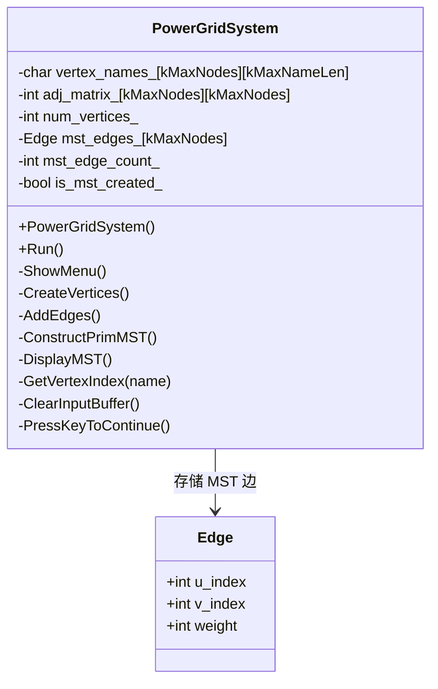
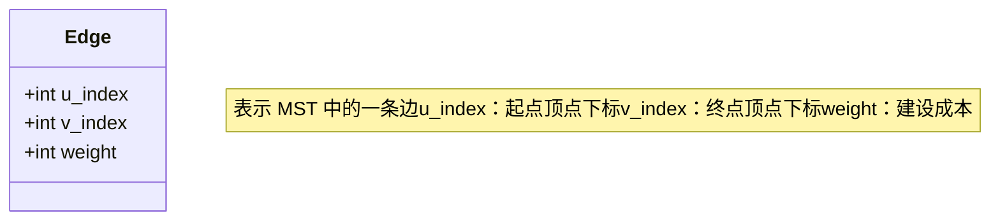
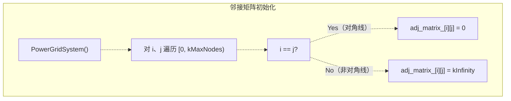
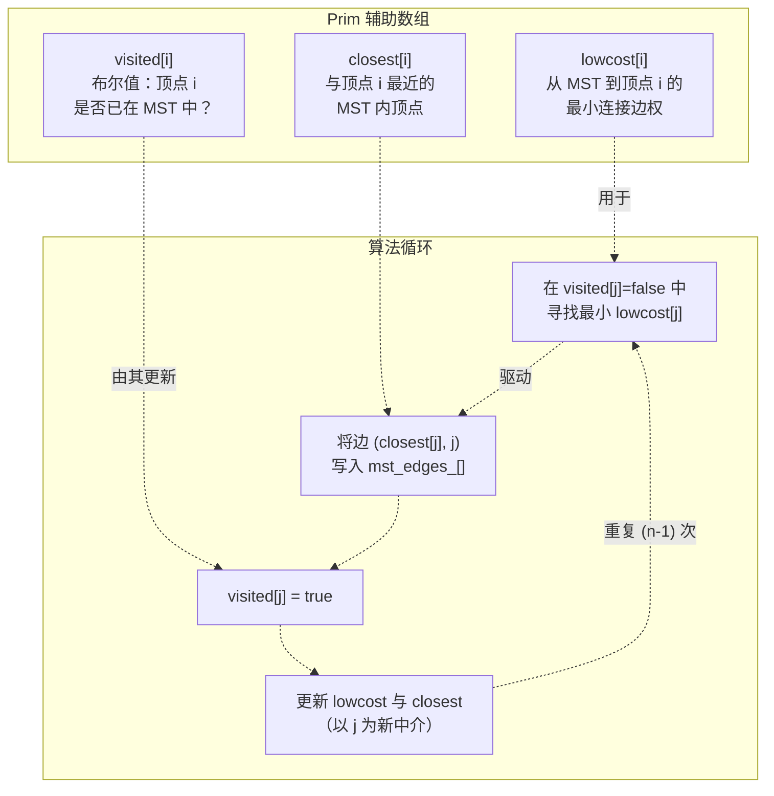
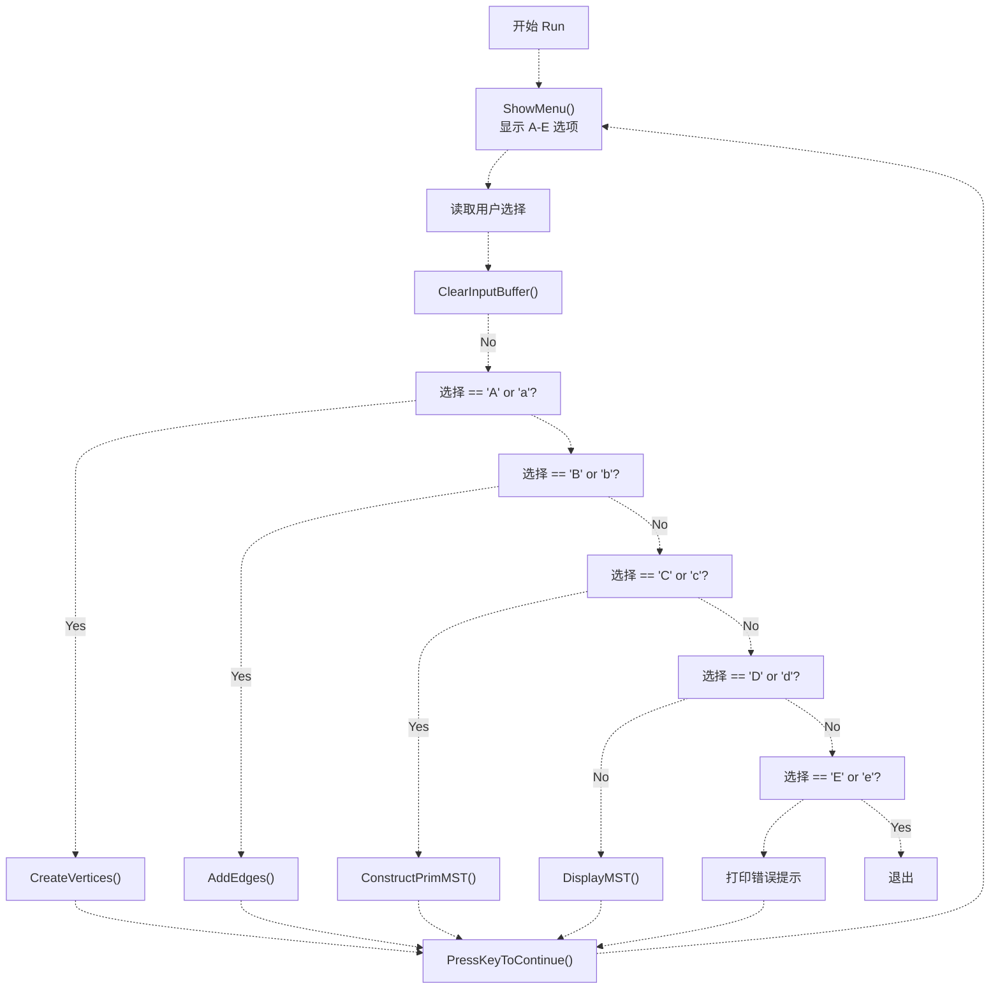
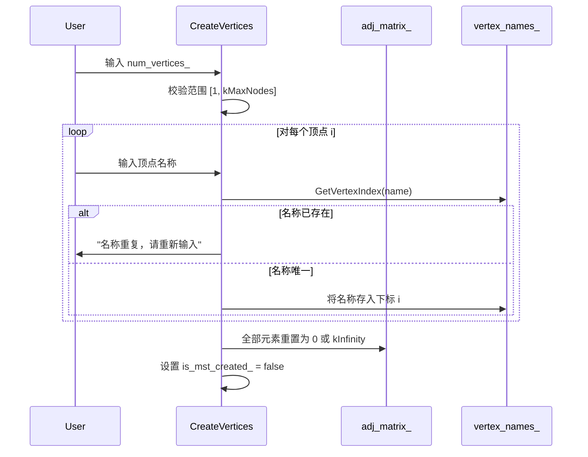
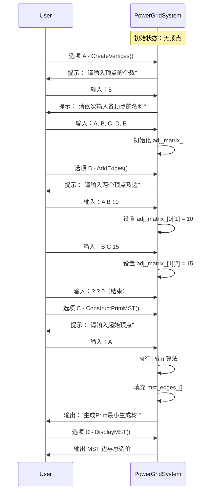

# 项目八：电网建设造价模拟

> **相关源文件**
> * [p8/p8.cpp](https://github.com/lilong555/DataStruct/blob/660fbbaa/p8/p8.cpp)

## 目的与范围

本文档说明项目八：使用 Prim 算法计算无向带权图的最小生成树（MST），从而实现电网建设造价最小化系统。系统将电网顶点建模为“地点”，将边建模为“地点之间的建设成本”，并通过最小生成树找到一组最优连接方案：在保证所有地点连通的前提下，使总建设成本最小。

如需了解 MST 算法与图论概念，请参见 [Algorithms Reference](算法参考.md)。如需 Prim 算法实现细节，请参见 [Prim's Algorithm Implementation](Prim算法实现.md)。如需跨项目的图数据结构对比，请参见 [Data Structures Reference](数据结构参考.md)。

**来源：** [p8/p8.cpp L1-L365](https://github.com/lilong555/DataStruct/blob/660fbbaa/p8/p8.cpp#L1-L365)

---

## 系统概览

`PowerGridSystem` 类提供菜单式交互界面，用于构建并分析电网网络。系统通常按 4 个阶段使用：创建顶点、添加边、使用 Prim 算法构造 MST、显示结果。

### PowerGridSystem 类结构



**来源：** [p8/p8.cpp L18-L48](https://github.com/lilong555/DataStruct/blob/660fbbaa/p8/p8.cpp#L18-L48)

 [p8/p8.cpp L11-L16](https://github.com/lilong555/DataStruct/blob/660fbbaa/p8/p8.cpp#L11-L16)

---

## 数据结构

### 核心成员数据

`PowerGridSystem` 维护若干关键数据结构：

| 成员变量 | 类型 | 用途 | 规模约束 |
| --- | --- | --- | --- |
| `vertex_names_` | `char[kMaxNodes][kMaxNameLen]` | 保存顶点名称字符串 | 最多 100 个顶点，每名 50 字符 |
| `adj_matrix_` | `int[kMaxNodes][kMaxNodes]` | 图边权的邻接矩阵 | 最大 100×100 |
| `num_vertices_` | `int` | 当前顶点数量 | 1 到 `kMaxNodes` |
| `mst_edges_` | `Edge[kMaxNodes]` | 保存 MST 结果边 | 最多 `num_vertices_ - 1` 条 |
| `mst_edge_count_` | `int` | 当前 MST 边数 | 0 到 `num_vertices_ - 1` |
| `is_mst_created_` | `bool` | MST 是否有效的标志 | 图变化时重置 |

**来源：** [p8/p8.cpp L39-L48](https://github.com/lilong555/DataStruct/blob/660fbbaa/p8/p8.cpp#L39-L48)

### Edge 结构体

`Edge` 用于封装最小生成树中的一条边：



**来源：** [p8/p8.cpp L11-L16](https://github.com/lilong555/DataStruct/blob/660fbbaa/p8/p8.cpp#L11-L16)

### 常量

```javascript
const int kMaxNodes = 100;      // 图的最大顶点数
const int kMaxNameLen = 50;     // 顶点名称的最大字符数
const int kInfinity = 2147483647; // 无边的哨兵值（INT_MAX）
```

邻接矩阵用 `kInfinity` 表示“不存在边”，对角线用 `0` 表示自环代价为 0（即不考虑自环）。

**来源：** [p8/p8.cpp L5-L8](https://github.com/lilong555/DataStruct/blob/660fbbaa/p8/p8.cpp#L5-L8)

---

## 图表示

### 邻接矩阵结构

系统使用邻接矩阵表示无向带权图。矩阵初始化使用特定哨兵值：



**矩阵性质：**

* **对角线元素**（`i == j`）：设为 `0`（无自环）
* **非对角元素**（`i != j`）：设为 `kInfinity`（初始无边）
* **对称性**：无向图满足 `adj_matrix_[i][j] == adj_matrix_[j][i]`

**来源：** [p8/p8.cpp L50-L65](https://github.com/lilong555/DataStruct/blob/660fbbaa/p8/p8.cpp#L50-L65)

### 顶点名称管理

顶点以字符串名称形式存储于 `vertex_names_`。`GetVertexIndex()` 提供“名称→下标”的映射：

```javascript
int PowerGridSystem::GetVertexIndex(const char *name) const
{
    for (int i = 0; i < num_vertices_; ++i)
    {
        if (strcmp(vertex_names_[i], name) == 0)
        {
            return i;
        }
    }
    return -1; // 未找到顶点
}
```

这样既能在交互界面中使用友好的字符串名称，又能在内部使用整数下标进行高效数组访问。

**来源：** [p8/p8.cpp L335-L345](https://github.com/lilong555/DataStruct/blob/660fbbaa/p8/p8.cpp#L335-L345)

---

## Prim 算法实现

### 算法概览

`ConstructPrimMST()` 实现 Prim 算法：一种贪心策略，通过每次选择“连接当前生成树与未访问顶点”的最小边权边，逐步扩展生成树。

**时间复杂度：** O(V²)，V 为顶点数  
**空间复杂度：** O(V)（辅助数组）

详见 [Prim's Algorithm Implementation](Prim算法实现.md)。

### 算法核心数据结构



**来源：** [p8/p8.cpp L227-L311](https://github.com/lilong555/DataStruct/blob/660fbbaa/p8/p8.cpp#L227-L311)

### 算法执行流程

```mermaid
stateDiagram-v2
    Find unvisited vertex k with min lowcost[k] --> k found? : "Yes"
    k found? --> Graph disconnected : "No (k == -1)"
    Graph disconnected --> [*]
    Added n-1 edges? --> Find unvisited vertex k with min lowcost[k] : "No"
    Added n-1 edges? --> is_mst_created_ = true : "Yes"
    is_mst_created_ = true --> [*] : "Yes"
```

**来源：** [p8/p8.cpp L247-L311](https://github.com/lilong555/DataStruct/blob/660fbbaa/p8/p8.cpp#L247-L311)

---

## 菜单式交互界面

### 菜单系统架构

`Run()` 实现事件循环，处理用户菜单选择：



**来源：** [p8/p8.cpp L67-L112](https://github.com/lilong555/DataStruct/blob/660fbbaa/p8/p8.cpp#L67-L112)

### 菜单操作

| 菜单项 | 方法 | 描述 | 前置条件 |
| --- | --- | --- | --- |
| A | `CreateVertices()` | 定义顶点及其名称 | 无 |
| B | `AddEdges()` | 添加顶点之间的带权边 | 必须先创建顶点 |
| C | `ConstructPrimMST()` | 使用 Prim 算法构造 MST | 顶点与边必须存在 |
| D | `DisplayMST()` | 显示 MST 边与总造价 | 必须已构造 MST |
| E | Exit | 结束程序 | 无 |

**来源：** [p8/p8.cpp L114-L124](https://github.com/lilong555/DataStruct/blob/660fbbaa/p8/p8.cpp#L114-L124)

---

## 操作细节

### 创建顶点（选项 A）

`CreateVertices()` 用于建立图的顶点集合：

**输入校验：**

1. 顶点数量必须在 1 到 `kMaxNodes`（100）之间
2. 顶点名称必须唯一（通过 `GetVertexIndex()` 检查）
3. 若名称重复则提示重新输入

**副作用：**

* 将邻接矩阵重置为初始状态（对角线=0，非对角线=`kInfinity`）
* 设置 `is_mst_created_ = false`（使之前的 MST 失效）



**来源：** [p8/p8.cpp L126-L167](https://github.com/lilong555/DataStruct/blob/660fbbaa/p8/p8.cpp#L126-L167)

### 添加边（选项 B）

`AddEdges()` 用于向邻接矩阵写入边权：

**输入格式：** `vertex1 vertex2 weight`

* 结束输入信号：`? ? 0`
* 边为双向（无向图）

**校验规则：**

1. 两个顶点必须存在于 `vertex_names_`
2. 不允许自环（`u_idx != v_idx`）
3. 权值必须为正（`weight > 0`）

**实现：**

```
// Undirected graph: set weight for both directions
adj_matrix_[u_idx][v_idx] = weight;
adj_matrix_[v_idx][u_idx] = weight;
```

当边被添加或修改时，`is_mst_created_` 会被重置为 `false`，以确保 MST 需要重新计算。

**来源：** [p8/p8.cpp L169-L225](https://github.com/lilong555/DataStruct/blob/660fbbaa/p8/p8.cpp#L169-L225)

### 构造 MST（选项 C）

`ConstructPrimMST()` 执行核心算法。详细过程请参见 [Prim's Algorithm Implementation](Prim算法实现.md)。

**关键步骤：**

1. 提示用户输入起始顶点名称
2. 校验起始顶点存在
3. 初始化 Prim 辅助数组（`lowcost`、`closest`、`visited`）
4. 执行 (n-1) 次迭代，寻找 (n-1) 条边
5. 将结果边写入 `mst_edges_[]`
6. 成功时设置 `is_mst_created_ = true`

**不连通图处理：** 若某轮迭代中找不到可达新顶点（`k == -1`），算法会提前终止并输出错误提示。

**来源：** [p8/p8.cpp L227-L311](https://github.com/lilong555/DataStruct/blob/660fbbaa/p8/p8.cpp#L227-L311)

### 显示 MST（选项 D）

`DisplayMST()` 输出已计算的最小生成树：

**输出格式：**

```
vertex1-(weight)-vertex2
vertex3-(weight)-vertex4
...
总造价: total_cost
```

**实现：**

```cpp
for (int i = 0; i < mst_edge_count_; ++i)
{
    int u = mst_edges_[i].u_index;
    int v = mst_edges_[i].v_index;
    int w = mst_edges_[i].weight;
    total_cost += w;
    std::cout << vertex_names_[u] << "-(" << w << ")-" << vertex_names_[v] << "\n";
}
```

总造价为 MST 中所有边权之和。

**来源：** [p8/p8.cpp L313-L333](https://github.com/lilong555/DataStruct/blob/660fbbaa/p8/p8.cpp#L313-L333)

---

## 状态管理

### 系统状态转换

```css
#mermaid-enkzj12sldb{font-family:ui-sans-serif,-apple-system,system-ui,Segoe UI,Helvetica;font-size:16px;fill:#ccc;}@keyframes edge-animation-frame{from{stroke-dashoffset:0;}}@keyframes dash{to{stroke-dashoffset:0;}}#mermaid-enkzj12sldb .edge-animation-slow{stroke-dasharray:9,5!important;stroke-dashoffset:900;animation:dash 50s linear infinite;stroke-linecap:round;}#mermaid-enkzj12sldb .edge-animation-fast{stroke-dasharray:9,5!important;stroke-dashoffset:900;animation:dash 20s linear infinite;stroke-linecap:round;}#mermaid-enkzj12sldb .error-icon{fill:#333;}#mermaid-enkzj12sldb .error-text{fill:#cccccc;stroke:#cccccc;}#mermaid-enkzj12sldb .edge-thickness-normal{stroke-width:1px;}#mermaid-enkzj12sldb .edge-thickness-thick{stroke-width:3.5px;}#mermaid-enkzj12sldb .edge-pattern-solid{stroke-dasharray:0;}#mermaid-enkzj12sldb .edge-thickness-invisible{stroke-width:0;fill:none;}#mermaid-enkzj12sldb .edge-pattern-dashed{stroke-dasharray:3;}#mermaid-enkzj12sldb .edge-pattern-dotted{stroke-dasharray:2;}#mermaid-enkzj12sldb .marker{fill:#666;stroke:#666;}#mermaid-enkzj12sldb .marker.cross{stroke:#666;}#mermaid-enkzj12sldb svg{font-family:ui-sans-serif,-apple-system,system-ui,Segoe UI,Helvetica;font-size:16px;}#mermaid-enkzj12sldb p{margin:0;}#mermaid-enkzj12sldb defs #statediagram-barbEnd{fill:#666;stroke:#666;}#mermaid-enkzj12sldb g.stateGroup text{fill:#222;stroke:none;font-size:10px;}#mermaid-enkzj12sldb g.stateGroup text{fill:#ccc;stroke:none;font-size:10px;}#mermaid-enkzj12sldb g.stateGroup .state-title{font-weight:bolder;fill:#fff;}#mermaid-enkzj12sldb g.stateGroup rect{fill:#111;stroke:#222;}#mermaid-enkzj12sldb g.stateGroup line{stroke:#666;stroke-width:1;}#mermaid-enkzj12sldb .transition{stroke:#666;stroke-width:1;fill:none;}#mermaid-enkzj12sldb .stateGroup .composit{fill:#f4f4f4;border-bottom:1px;}#mermaid-enkzj12sldb .stateGroup .alt-composit{fill:#e0e0e0;border-bottom:1px;}#mermaid-enkzj12sldb .state-note{stroke:#333;fill:#222;}#mermaid-enkzj12sldb .state-note text{fill:#ccc;stroke:none;font-size:10px;}#mermaid-enkzj12sldb .stateLabel .box{stroke:none;stroke-width:0;fill:#111;opacity:0.5;}#mermaid-enkzj12sldb .edgeLabel .label rect{fill:#111;opacity:0.5;}#mermaid-enkzj12sldb .edgeLabel{background-color:#161616;text-align:center;}#mermaid-enkzj12sldb .edgeLabel p{background-color:#161616;}#mermaid-enkzj12sldb .edgeLabel rect{opacity:0.5;background-color:#161616;fill:#161616;}#mermaid-enkzj12sldb .edgeLabel .label text{fill:#ccc;}#mermaid-enkzj12sldb .label div .edgeLabel{color:#ccc;}#mermaid-enkzj12sldb .stateLabel text{fill:#fff;font-size:10px;font-weight:bold;}#mermaid-enkzj12sldb .node circle.state-start{fill:#666;stroke:#666;}#mermaid-enkzj12sldb .node .fork-join{fill:#666;stroke:#666;}#mermaid-enkzj12sldb .node circle.state-end{fill:#222;stroke:#f4f4f4;stroke-width:1.5;}#mermaid-enkzj12sldb .end-state-inner{fill:#f4f4f4;stroke-width:1.5;}#mermaid-enkzj12sldb .node rect{fill:#111;stroke:#222;stroke-width:1px;}#mermaid-enkzj12sldb .node polygon{fill:#111;stroke:#222;stroke-width:1px;}#mermaid-enkzj12sldb #statediagram-barbEnd{fill:#666;}#mermaid-enkzj12sldb .statediagram-cluster rect{fill:#111;stroke:#222;stroke-width:1px;}#mermaid-enkzj12sldb .cluster-label,#mermaid-enkzj12sldb .nodeLabel{color:#fff;}#mermaid-enkzj12sldb .statediagram-cluster rect.outer{rx:5px;ry:5px;}#mermaid-enkzj12sldb .statediagram-state .divider{stroke:#222;}#mermaid-enkzj12sldb .statediagram-state .title-state{rx:5px;ry:5px;}#mermaid-enkzj12sldb .statediagram-cluster.statediagram-cluster .inner{fill:#f4f4f4;}#mermaid-enkzj12sldb .statediagram-cluster.statediagram-cluster-alt .inner{fill:#161616;}#mermaid-enkzj12sldb .statediagram-cluster .inner{rx:0;ry:0;}#mermaid-enkzj12sldb .statediagram-state rect.basic{rx:5px;ry:5px;}#mermaid-enkzj12sldb .statediagram-state rect.divider{stroke-dasharray:10,10;fill:#161616;}#mermaid-enkzj12sldb .note-edge{stroke-dasharray:5;}#mermaid-enkzj12sldb .statediagram-note rect{fill:#222;stroke:#333;stroke-width:1px;rx:0;ry:0;}#mermaid-enkzj12sldb .statediagram-note rect{fill:#222;stroke:#333;stroke-width:1px;rx:0;ry:0;}#mermaid-enkzj12sldb .statediagram-note text{fill:#ccc;}#mermaid-enkzj12sldb .statediagram-note .nodeLabel{color:#ccc;}#mermaid-enkzj12sldb .statediagram .edgeLabel{color:red;}#mermaid-enkzj12sldb #dependencyStart,#mermaid-enkzj12sldb #dependencyEnd{fill:#666;stroke:#666;stroke-width:1;}#mermaid-enkzj12sldb .statediagramTitleText{text-anchor:middle;font-size:18px;fill:#ccc;}#mermaid-enkzj12sldb :root{--mermaid-font-family:"trebuchet ms",verdana,arial,sans-serif;}PowerGridSystem()CreateVertices()AddEdges()ConstructPrimMST() successDisplayMST()AddEdges() modifies graphCreateVertices() resetsAddEdges() continuesCreateVertices() redefinesnum_vertices_ = 0is_mst_created_ = falsenum_vertices_ > 0adj_matrix_ initializedis_mst_created_ = falseadj_matrix_ populatedis_mst_created_ = falsemst_edges_[] filledmst_edge_count_ setis_mst_created_ = trueDisplayReady
```

**不变式：**

* 只有当 `mst_edges_[]` 中存在有效 MST 时，`is_mst_created_` 才为 true
* 修改顶点或边会将 `is_mst_created_` 重置为 false
* `DisplayMST()` 需要 `is_mst_created_ = true`

**来源：** [p8/p8.cpp L50-L65](https://github.com/lilong555/DataStruct/blob/660fbbaa/p8/p8.cpp#L50-L65)

 [p8/p8.cpp L165-L166](https://github.com/lilong555/DataStruct/blob/660fbbaa/p8/p8.cpp#L165-L166)

 [p8/p8.cpp L223-L224](https://github.com/lilong555/DataStruct/blob/660fbbaa/p8/p8.cpp#L223-L224)

 [p8/p8.cpp L310](https://github.com/lilong555/DataStruct/blob/660fbbaa/p8/p8.cpp#L310-L310)

---

## 使用流程

### 典型交互会话



**来源：** [p8/p8.cpp L67-L112](https://github.com/lilong555/DataStruct/blob/660fbbaa/p8/p8.cpp#L67-L112)

---

## 实现说明

### 输入缓冲区管理

系统使用两个工具方法处理输入流状态：

**`ClearInputBuffer()`**：清除错误标志并丢弃剩余输入

```cpp
void PowerGridSystem::ClearInputBuffer() const
{
    std::cin.clear();              // Clear error flags
    std::cin.ignore(10000, '\n');  // Discard up to 10000 chars or newline
}
```

**`PressKeyToContinue()`**：暂停执行，等待用户确认

```cpp
void PowerGridSystem::PressKeyToContinue() const
{
    std::cout << "按回车键继续...";
    std::cin.get();  // Wait for Enter key
}
```

**来源：** [p8/p8.cpp L347-L357](https://github.com/lilong555/DataStruct/blob/660fbbaa/p8/p8.cpp#L347-L357)

### 错误处理

系统在多个层次进行输入校验：

| 校验类型 | 位置 | 错误响应 |
| --- | --- | --- |
| 顶点数量非法 | `CreateVertices()` | 输出错误并提前返回 |
| 顶点名称重复 | `CreateVertices()` | 提示该顶点重新输入 |
| 边中顶点不存在 | `AddEdges()` | 跳过该边，继续输入循环 |
| 自环边 | `AddEdges()` | 跳过该边，继续输入循环 |
| 边权非正 | `AddEdges()` | 跳过该边，继续输入循环 |
| 起始顶点非法 | `ConstructPrimMST()` | 输出错误并提前返回 |
| 图不连通 | `ConstructPrimMST()` | 输出错误并提前返回 |
| 未计算 MST | `DisplayMST()` | 输出错误并提前返回 |

所有校验提示信息均为中文，符合系统的目标使用场景。

**来源：** [p8/p8.cpp L128-L142](https://github.com/lilong555/DataStruct/blob/660fbbaa/p8/p8.cpp#L128-L142)

 [p8/p8.cpp L183-L221](https://github.com/lilong555/DataStruct/blob/660fbbaa/p8/p8.cpp#L183-L221)

 [p8/p8.cpp L240-L245](https://github.com/lilong555/DataStruct/blob/660fbbaa/p8/p8.cpp#L240-L245)

 [p8/p8.cpp L284-L289](https://github.com/lilong555/DataStruct/blob/660fbbaa/p8/p8.cpp#L284-L289)

 [p8/p8.cpp L315-L319](https://github.com/lilong555/DataStruct/blob/660fbbaa/p8/p8.cpp#L315-L319)

---

## 复杂度分析

### 空间复杂度

| 数据结构 | 大小 | 贡献 |
| --- | --- | --- |
| `vertex_names_` | O(V×L) | V 个顶点，L 字符/名称 |
| `adj_matrix_` | O(V²) | 邻接矩阵 |
| `mst_edges_` | O(V) | 最多 V-1 条边 |
| Prim 局部数组 | O(V) | `lowcost`、`closest`、`visited` |
| **总计** | **O(V² + V×L)** | **由邻接矩阵主导** |

其中 V 为顶点数，L 为名称最大长度。

### 时间复杂度

| 操作 | 复杂度 | 说明 |
| --- | --- | --- |
| 构造函数 | O(V²) | 初始化邻接矩阵 |
| `CreateVertices()` | O(V²) | 重置矩阵 + O(V) 名称检查 |
| `AddEdges()` | O(E×V) | E 条边，每条边 O(V) 查找下标 |
| `ConstructPrimMST()` | **O(V²)** | **V 次迭代 × 每次 O(V) 找最小值** |
| `DisplayMST()` | O(V) | 输出 V-1 条边 |
| `GetVertexIndex()` | O(V) | 线性查找 |

邻接矩阵表示使 Prim 算法呈 O(V²)。若使用邻接表 + 优先队列可达到 O((V+E) log V)，但在稠密图（E ≈ V²）场景下，本实现仍是合理选择。

**来源：** [p8/p8.cpp L50-L65](https://github.com/lilong555/DataStruct/blob/660fbbaa/p8/p8.cpp#L50-L65)

 [p8/p8.cpp L126-L167](https://github.com/lilong555/DataStruct/blob/660fbbaa/p8/p8.cpp#L126-L167)

 [p8/p8.cpp L169-L225](https://github.com/lilong555/DataStruct/blob/660fbbaa/p8/p8.cpp#L169-L225)

 [p8/p8.cpp L227-L311](https://github.com/lilong555/DataStruct/blob/660fbbaa/p8/p8.cpp#L227-L311)

 [p8/p8.cpp L313-L333](https://github.com/lilong555/DataStruct/blob/660fbbaa/p8/p8.cpp#L313-L333)

 [p8/p8.cpp L335-L345](https://github.com/lilong555/DataStruct/blob/660fbbaa/p8/p8.cpp#L335-L345)

---

## 与其他项目的对比

该电网系统与仓库内其他项目存在可对照的共性：

| 方面 | 项目 8（电网） | 项目 3（迷宫） | 项目 7（修理牧场） |
| --- | --- | --- | --- |
| **核心算法** | Prim MST（贪心） | DFS（回溯） | 哈夫曼式合并（贪心） |
| **图类型** | 无向带权图 | 隐式网格图 | 隐式合并树 |
| **数据结构** | 邻接矩阵 | 二维数组网格 | 小根堆（1 基） |
| **复杂度** | O(V²) | O(V+E) | O(N log N) |
| **交互方式** | 菜单交互 | 单次批处理 | 单次批处理 |
| **状态保持** | 维护图状态 | 无状态 | 无状态 |

如需更详细的算法对比，请参见 [Algorithms Reference](算法参考.md)。

**来源：** 根据仓库结构与项目描述推断

---

## 构建与运行

### 编译

```
cd p8
g++ -std=c++17 -O2 -Wall -Wextra -pedantic p8.cpp -o ../output/p8
```

### 运行

```
cd output
./p8
```

程序将显示菜单界面并等待用户输入。

### 示例会话

```
**              电网造价模拟系统              **
================================================
**              A --- 创建电网顶点            **
**              B --- 添加电网的边            **
**              C --- 构造最小生成树          **
**              D --- 显示最小生成树          **
**              E --- 退出  程序              **
================================================
请选择操作: A
请输入顶点的个数: 4
请依次输入各顶点的名称:
A B C D

请选择操作: B
请输入两个顶点及边: A B 5
请输入两个顶点及边: A C 10
请输入两个顶点及边: B C 8
请输入两个顶点及边: B D 12
请输入两个顶点及边: C D 6
请输入两个顶点及边: ? ? 0

请选择操作: C
请输入起始顶点: A
生成Prim最小生成树!

请选择操作: D
最小生成树的边如下:
A-(5)-B
B-(8)-C
C-(6)-D
总造价: 19
```

**来源：** [p8/p8.cpp L1-L365](https://github.com/lilong555/DataStruct/blob/660fbbaa/p8/p8.cpp#L1-L365)
