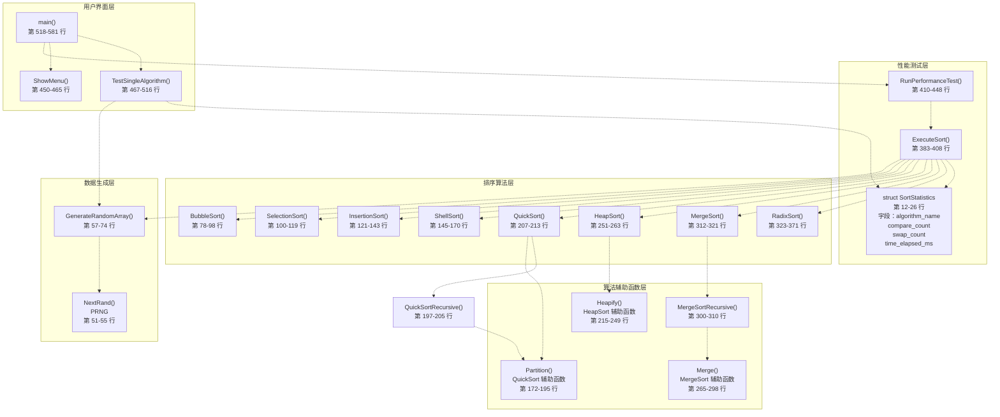
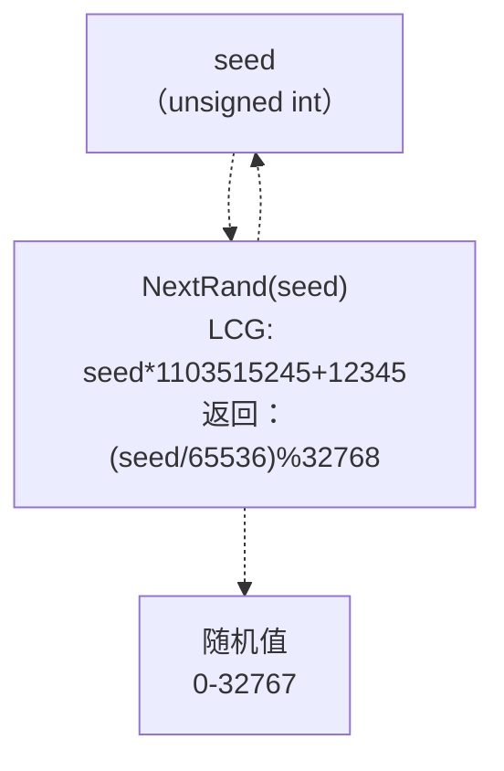
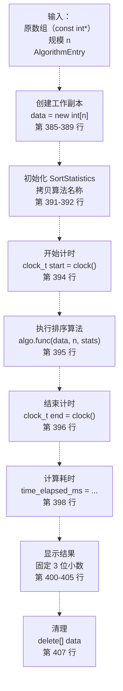
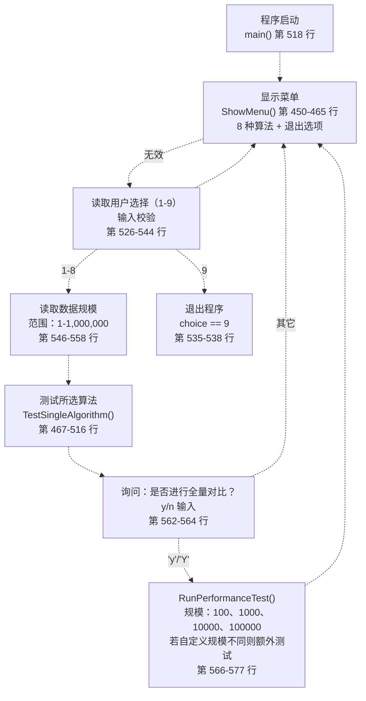
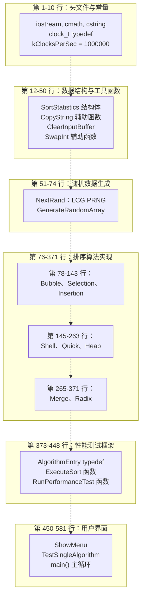

# 项目十：排序算法比较

> **相关源文件**
> * [p10/10_sorting_comparison.cpp](https://github.com/lilong555/DataStruct/blob/660fbbaa/p10/10_sorting_comparison.cpp)

## 目的与范围

项目十实现了一个完整的排序算法对比工具，用于对 8 种基础排序算法的性能特征进行实测比较。系统会生成指定规模的随机整数数组，并依次运行每种算法，同时统计三个关键指标：执行时间（毫秒）、比较次数、交换/移动次数。本项目以可量化的数据来验证算法复杂度分析中的 Big-O 理论预测。

本项目的实现集中在单一源文件中：[p10/10_sorting_comparison.cpp L1-L582](https://github.com/lilong555/DataStruct/blob/660fbbaa/p10/10_sorting_comparison.cpp#L1-L582)，并遵循严格的教学约束：只允许使用三个标准库头文件（`iostream`、`cmath`、`cstring`）。因此，通常由 STL/标准库提供的计时与随机数生成机制，需要在本项目中手动实现。

关于本仓库中其他数据结构实现，请参阅 [数据结构参考](数据结构参考.md)。关于跨项目的复杂度理论与算法分析，请参阅 [算法参考](算法参考.md)。

**来源：** [p10/10_sorting_comparison.cpp L1-L10](https://github.com/lilong555/DataStruct/blob/660fbbaa/p10/10_sorting_comparison.cpp#L1-L10)

---

## 系统架构

系统按五个功能层组织：数据生成、算法实现、统计收集、性能测量与用户交互。整体遵循“关注点分离”的结构：每个排序算法都是独立函数，并通过 `SortStatistics` 引用记录其关键操作计数。



**来源：** [p10/10_sorting_comparison.cpp L1-L582](https://github.com/lilong555/DataStruct/blob/660fbbaa/p10/10_sorting_comparison.cpp#L1-L582)

---

## 核心数据结构

### SortStatistics 结构体

`SortStatistics` 结构体是系统的核心数据收集单元，用于在算法执行过程中累计性能指标。每个排序函数都会接收一个 `SortStatistics` 的引用，并在关键操作处递增计数器。

| 字段 | 类型 | 用途 |
| --- | --- | --- |
| `algorithm_name` | `char[32]` | 固定长度字符串，用于存储算法标识（中文名） |
| `compare_count` | `long long` | 统计元素比较次数（例如 `arr[i] > arr[j]`） |
| `swap_count` | `long long` | 统计元素移动次数（交换、挪动或写入） |
| `time_elapsed_ms` | `double` | 执行耗时（毫秒） |

**实现细节：**

* 构造函数将各字段初始化为 0/空串 [p10/10_sorting_comparison.cpp L19-L25](https://github.com/lilong555/DataStruct/blob/660fbbaa/p10/10_sorting_comparison.cpp#L19-L25)
* 使用 `long long` 存放计数器，避免在大规模测试（最高 100,000 元素）时溢出
* 由于头文件限制，计时采用对 `clock()` 的自定义声明与封装 [p10/10_sorting_comparison.cpp L8-L10](https://github.com/lilong555/DataStruct/blob/660fbbaa/p10/10_sorting_comparison.cpp#L8-L10)

**来源：** [p10/10_sorting_comparison.cpp L12-L26](https://github.com/lilong555/DataStruct/blob/660fbbaa/p10/10_sorting_comparison.cpp#L12-L26)

### AlgorithmEntry 结构体

`AlgorithmEntry` 结构体提供算法分发表（函数指针表），使菜单系统与批量测试能够以统一方式遍历并调用各算法实现。

```javascript
struct AlgorithmEntry {
    const char *name;      // 算法显示名称
    SortFunc func;         // 指向具体排序实现的函数指针
};
```

类型别名：`typedef void (*SortFunc)(int *, int, SortStatistics &);` 定义了所有排序函数的统一签名 [p10/10_sorting_comparison.cpp L375](https://github.com/lilong555/DataStruct/blob/660fbbaa/p10/10_sorting_comparison.cpp#L375-L375)

算法表会在 `ExecuteSort` 与 `TestSingleAlgorithm` 中以相同顺序实例化：

```
1. 冒泡排序 (BubbleSort)
2. 选择排序 (SelectionSort)
3. 直接插入排序 (InsertionSort)
4. 希尔排序 (ShellSort)
5. 快速排序 (QuickSort)
6. 堆排序 (HeapSort)
7. 归并排序 (MergeSort)
8. 基数排序 (RadixSort)
```

**来源：** [p10/10_sorting_comparison.cpp L375-L381](https://github.com/lilong555/DataStruct/blob/660fbbaa/p10/10_sorting_comparison.cpp#L375-L381)

 [p10/10_sorting_comparison.cpp L425-L433](https://github.com/lilong555/DataStruct/blob/660fbbaa/p10/10_sorting_comparison.cpp#L425-L433)

 [p10/10_sorting_comparison.cpp L482-L490](https://github.com/lilong555/DataStruct/blob/660fbbaa/p10/10_sorting_comparison.cpp#L482-L490)

---

## 随机数据生成系统

### PRNG 实现

由于禁止使用 `<random>` 头文件，系统自行实现了线性同余生成器（LCG），公式为：`seed = seed * 1103515245 + 12345`。这与 glibc 的 `rand()` 所使用的 PRNG 相同。



**关键实现细节：**

* 使用无符号 32 位算术，让溢出自然发生 [p10/10_sorting_comparison.cpp L52-L54](https://github.com/lilong555/DataStruct/blob/660fbbaa/p10/10_sorting_comparison.cpp#L52-L54)
* 通过除以 65536 再对 32768 取模，提取中间比特以提高随机性质量
* 种子初始化为 `123456789u`，使结果可复现且随机性足够 [p10/10_sorting_comparison.cpp L65](https://github.com/lilong555/DataStruct/blob/660fbbaa/p10/10_sorting_comparison.cpp#L65-L65)

### 数组生成

`GenerateRandomArray` 通过两次调用 `NextRand` 组合出更大的随机值，适用于排序演示：

```
unsigned int r1 = NextRand(seed);
unsigned int r2 = NextRand(seed);
unsigned int val = (r1 << 15) ^ r2;
arr[i] = (int)(val % 1000000u);
```

生成的整数范围为 [0, 999999]，对于最多 100,000 元素的数组具有足够的离散度 [p10/10_sorting_comparison.cpp L68-L71](https://github.com/lilong555/DataStruct/blob/660fbbaa/p10/10_sorting_comparison.cpp#L68-L71)

**来源：** [p10/10_sorting_comparison.cpp L51-L74](https://github.com/lilong555/DataStruct/blob/660fbbaa/p10/10_sorting_comparison.cpp#L51-L74)

---

## 排序算法实现

### 简单的 O(N²) 算法

#### BubbleSort

经典冒泡排序，带“提前终止”优化。当一轮扫描没有发生交换时可提前结束。算法在每次元素比较时计数，并在出现逆序时交换元素。

**算法实现：** [p10/10_sorting_comparison.cpp L78-L98](https://github.com/lilong555/DataStruct/blob/660fbbaa/p10/10_sorting_comparison.cpp#L78-L98)

**复杂度：**

* 时间：最坏/平均 O(N²)，最好 O(N)（已排序且由 `swapped` 标志检测到）
* 空间：O(1) 原地
* 比较次数：平均约 N²/2
* 交换次数：平均约 N²/2（最坏情况）

**统计计数：**

* 每次成对比较时递增 `compare_count`（第 85 行）
* 每次交换时递增 `swap_count`（第 89 行）

#### SelectionSort

在未排序区间中找到最小元素并放到开头；在交换次数方面通常优于冒泡排序。

**算法实现：** [p10/10_sorting_comparison.cpp L100-L119](https://github.com/lilong555/DataStruct/blob/660fbbaa/p10/10_sorting_comparison.cpp#L100-L119)

**复杂度：**

* 时间：始终为 O(N²)（无提前退出）
* 空间：O(1) 原地
* 比较次数：始终为 N²/2
* 交换次数：N-1（每轮外循环最多交换一次）

**关键特性：** 选择排序在简单算法中交换次数最低；当“写入代价高”时具有参考价值。

#### InsertionSort

通过不断将新元素插入到已排序区间的正确位置来构建有序数组。

**算法实现：** [p10/10_sorting_comparison.cpp L121-L143](https://github.com/lilong555/DataStruct/blob/660fbbaa/p10/10_sorting_comparison.cpp#L121-L143)

**复杂度：**

* 时间：最坏/平均 O(N²)，最好 O(N)（接近有序）
* 空间：O(1) 原地
* 比较次数：平均约 N²/4
* 交换/移动次数：平均约 N²/4（将元素右移视为移动次数）

**统计说明：** 第 132 行在元素右移时递增 `swap_count`，不仅统计最终落位。这样会略微抬高计数，但能更真实地反映内存写入次数。

**来源：** [p10/10_sorting_comparison.cpp L78-L143](https://github.com/lilong555/DataStruct/blob/660fbbaa/p10/10_sorting_comparison.cpp#L78-L143)

### 优化的比较类算法

#### ShellSort

希尔排序通过“增量（gap）序列”对插入排序进行改进，使得早期能够进行长距离移动。这里使用的 gap 序列为：n/2、n/4、n/8、...、1。

**算法实现：** [p10/10_sorting_comparison.cpp L145-L170](https://github.com/lilong555/DataStruct/blob/660fbbaa/p10/10_sorting_comparison.cpp#L145-L170)

**复杂度：**

* 时间：约 O(N^(4/3)) 到 O(N²)（与 gap 序列有关）
* 空间：O(1) 原地
* 实际表现：通常明显快于简单的 O(N²) 算法

**gap 序列说明：** 该实现使用 `gap = n/2; gap /= 2` 的基本序列。更复杂的序列（如 Sedgewick）可能具有更好性能，但实现更复杂。

#### QuickSort

分治排序算法，通过划分（partition）实现；本实现使用“最后一个元素”作为枢轴（pivot）。

**算法实现：** [p10/10_sorting_comparison.cpp L197-L213](https://github.com/lilong555/DataStruct/blob/660fbbaa/p10/10_sorting_comparison.cpp#L197-L213)

**辅助函数：**

* `Partition`： [p10/10_sorting_comparison.cpp L172-L195](https://github.com/lilong555/DataStruct/blob/660fbbaa/p10/10_sorting_comparison.cpp#L172-L195) - Lomuto 划分方案
* `QuickSortRecursive`： [p10/10_sorting_comparison.cpp L197-L205](https://github.com/lilong555/DataStruct/blob/660fbbaa/p10/10_sorting_comparison.cpp#L197-L205) - 递归分治步骤

**复杂度：**

* 时间：平均 O(N log N)，最坏 O(N²)（若数组已排序且使用末元素 pivot）
* 空间：平均 O(log N)（递归栈）
* 比较次数：平均约 2N ln N
* 交换次数：平均约 N ln N / 3

**实现细节：** 第 182-186 行在 `i == j` 时避免不必要的交换，从而降低 swap 计数。

#### HeapSort

构建最大堆，并反复取出最大元素完成排序。

**算法实现：** [p10/10_sorting_comparison.cpp L251-L263](https://github.com/lilong555/DataStruct/blob/660fbbaa/p10/10_sorting_comparison.cpp#L251-L263)

**辅助函数：**

* `Heapify`： [p10/10_sorting_comparison.cpp L215-L249](https://github.com/lilong555/DataStruct/blob/660fbbaa/p10/10_sorting_comparison.cpp#L215-L249) - 迭代式下滤（sift-down）恢复堆性质

**复杂度：**

* 时间：始终为 O(N log N)（无最坏退化）
* 空间：O(1) 原地
* 比较次数：约 2N log N
* 交换次数：约 N log N

**堆结构：** 采用 0 下标数组表示。对下标 `i` 的节点：

* 左子：`2*i + 1`
* 右子：`2*i + 2`

**来源：** [p10/10_sorting_comparison.cpp L145-L263](https://github.com/lilong555/DataStruct/blob/660fbbaa/p10/10_sorting_comparison.cpp#L145-L263)

### 分治算法

#### MergeSort

递归地将数组划分为两半分别排序，再合并两段有序子数组。

**算法实现：** [p10/10_sorting_comparison.cpp L312-L321](https://github.com/lilong555/DataStruct/blob/660fbbaa/p10/10_sorting_comparison.cpp#L312-L321)

**辅助函数：**

* `MergeSortRecursive`： [p10/10_sorting_comparison.cpp L300-L310](https://github.com/lilong555/DataStruct/blob/660fbbaa/p10/10_sorting_comparison.cpp#L300-L310) - 递归划分
* `Merge`： [p10/10_sorting_comparison.cpp L265-L298](https://github.com/lilong555/DataStruct/blob/660fbbaa/p10/10_sorting_comparison.cpp#L265-L298) - 两路归并

**复杂度：**

* 时间：始终 O(N log N)（保证）
* 空间：O(N)（需要辅助数组）
* 比较次数：约 N log N
* 交换/移动次数：约 N log N（在 merge 过程中按写入次数统计）

**内存管理：** 在 `MergeSort` 中只分配一次临时数组，并在递归过程中复用 [p10/10_sorting_comparison.cpp L318](https://github.com/lilong555/DataStruct/blob/660fbbaa/p10/10_sorting_comparison.cpp#L318-L318)

**统计说明：** `Merge` 函数会对每次写入临时数组的操作递增 `swap_count`（第 282、287、292 行），这能准确刻画内存写入，但会导致计数高于“物理交换次数”。

**来源：** [p10/10_sorting_comparison.cpp L265-L321](https://github.com/lilong555/DataStruct/blob/660fbbaa/p10/10_sorting_comparison.cpp#L265-L321)

### 非比较类算法

#### RadixSort

基数排序从低位到高位逐位处理整数；每一位使用计数排序作为子过程。

**算法实现：** [p10/10_sorting_comparison.cpp L323-L371](https://github.com/lilong555/DataStruct/blob/660fbbaa/p10/10_sorting_comparison.cpp#L323-L371)

**复杂度：**

* 时间：O(d*N)，其中 d 为位数（≈ log₁₀(max_value)）
* 空间：O(N) 输出数组 + O(10) 计数数组
* 比较次数：0（非比较算法）
* 交换/移动次数：O(d*N) 数组写入

**实现细节：**

* 十进制取位：`(arr[i] / exp) % 10` [p10/10_sorting_comparison.cpp L350](https://github.com/lilong555/DataStruct/blob/660fbbaa/p10/10_sorting_comparison.cpp#L350-L350)
* 每一位使用稳定的计数排序，保证相同数字的相对顺序
* 通过检测最大值 [p10/10_sorting_comparison.cpp L330-L337](https://github.com/lilong555/DataStruct/blob/660fbbaa/p10/10_sorting_comparison.cpp#L330-L337) 决定需要进行几轮

**性能特征：** 对于 ≤ 999,999（6 位） 的整数，RadixSort 恰好进行 6 轮，因此对测试数据范围表现为可预测的 O(6*N) = O(N)。

**来源：** [p10/10_sorting_comparison.cpp L323-L371](https://github.com/lilong555/DataStruct/blob/660fbbaa/p10/10_sorting_comparison.cpp#L323-L371)

---

## 算法复杂度汇总

下表汇总了 8 种算法的理论与实践复杂度特征：

| 算法 | 时间（最好） | 时间（平均） | 时间（最坏） | 空间 | 稳定 | 比较次数 | 交换/移动次数 |
| --- | --- | --- | --- | --- | --- | --- | --- |
| BubbleSort | O(N) | O(N²) | O(N²) | O(1) | Yes | ~N²/2 | ~N²/2 |
| SelectionSort | O(N²) | O(N²) | O(N²) | O(1) | No | N²/2 | N-1 |
| InsertionSort | O(N) | O(N²) | O(N²) | O(1) | Yes | ~N²/4 | ~N²/4 |
| ShellSort | O(N log N) | O(N^(4/3)) | O(N²) | O(1) | No | Varies | Varies |
| QuickSort | O(N log N) | O(N log N) | O(N²) | O(log N) | No | ~2N ln N | ~N ln N/3 |
| HeapSort | O(N log N) | O(N log N) | O(N log N) | O(1) | No | ~2N log N | ~N log N |
| MergeSort | O(N log N) | O(N log N) | O(N log N) | O(N) | Yes | ~N log N | ~N log N |
| RadixSort | O(d*N) | O(d*N) | O(d*N) | O(N+k) | Yes | 0 | ~d*N |

**关键观察：**

* **保证 O(N log N)**：HeapSort 与 MergeSort 不会退化
* **交换次数最少**：SelectionSort（始终 N-1）
* **稳定算法**：BubbleSort、InsertionSort、MergeSort、RadixSort
* **原地算法**：除 MergeSort 与 RadixSort 外其余皆为原地
* **非比较算法**：RadixSort（比较次数为 0）

**来源：** [p10/10_sorting_comparison.cpp L78-L371](https://github.com/lilong555/DataStruct/blob/660fbbaa/p10/10_sorting_comparison.cpp#L78-L371)

---

## 性能测量系统

### 计时机制

由于头文件约束禁止使用 `<chrono>`，系统改用 POSIX `clock()` 并通过自定义声明进行封装：

```javascript
typedef long clock_t;
extern "C" clock_t clock(void);
static const clock_t kClocksPerSec = 1000000;  // Linux/WSL2
```

[p10/10_sorting_comparison.cpp L8-L10](https://github.com/lilong555/DataStruct/blob/660fbbaa/p10/10_sorting_comparison.cpp#L8-L10)

**时间计算：**

```
clock_t start = clock();
algo.func(data, n, stats);
clock_t end = clock();
stats.time_elapsed_ms = (double)(end - start) * 1000.0 / (double)kClocksPerSec;
```

[p10/10_sorting_comparison.cpp L394-L398](https://github.com/lilong555/DataStruct/blob/660fbbaa/p10/10_sorting_comparison.cpp#L394-L398)

常量 `kClocksPerSec = 1000000` 假设 `clock()` 在 POSIX 系统上以微秒为单位返回（CLOCKS_PER_SEC = 1000000）。这与 Windows 上常见的 CLOCKS_PER_SEC = 1000 不同。

### ExecuteSort 函数

`ExecuteSort` 负责组织一次算法执行并收集指标：



**关键设计决策：**

* 复制原数组，避免修改原始数据；从而可以让多种算法在同一份数据上对比运行
* 统一设置 3 位小数的固定精度输出 [p10/10_sorting_comparison.cpp L400-L401](https://github.com/lilong555/DataStruct/blob/660fbbaa/p10/10_sorting_comparison.cpp#L400-L401)
* 输出使用制表符分隔，便于复制到表格软件做进一步分析

**来源：** [p10/10_sorting_comparison.cpp L383-L408](https://github.com/lilong555/DataStruct/blob/660fbbaa/p10/10_sorting_comparison.cpp#L383-L408)

### RunPerformanceTest 函数

在同一份随机数据上执行全部 8 种算法，并输出对比结果：

```cpp
void RunPerformanceTest(int n) {
    int *original = GenerateRandomArray(n);
    
    AlgorithmEntry algorithms[] = {
        {"冒泡排序", BubbleSort},
        {"选择排序", SelectionSort},
        // ... 所有 8 种算法
    };
    
    std::cout << "数据规模: " << n << "\n";
    std::cout << "排序算法\t时间\t\t比较次数\t交换次数\n";
    
    for (int i = 0; i < 8; ++i) {
        ExecuteSort(original, n, algorithms[i]);
    }
    
    delete[] original;
}
```

[p10/10_sorting_comparison.cpp L410-L448](https://github.com/lilong555/DataStruct/blob/660fbbaa/p10/10_sorting_comparison.cpp#L410-L448)

**输出格式：**

```
============================================================
数据规模: 10000
排序算法        时间            比较次数        交换次数
------------------------------------------------------------
冒泡排序        123.456 ms      49995000        24997500
选择排序        78.901 ms       49995000        9999
...
============================================================
```

**来源：** [p10/10_sorting_comparison.cpp L410-L448](https://github.com/lilong555/DataStruct/blob/660fbbaa/p10/10_sorting_comparison.cpp#L410-L448)

---

## 用户界面系统

### 菜单系统

交互式菜单支持用户指定数据规模，对单个算法进行测试：



**菜单输出：** [p10/10_sorting_comparison.cpp L450-L465](https://github.com/lilong555/DataStruct/blob/660fbbaa/p10/10_sorting_comparison.cpp#L450-L465)

```
**************************************************
**              排序算法比较                    **
==================================================
** 1 ---- 冒泡排序                              **
** 2 ---- 选择排序                              **
** 3 ---- 直接插入排序                          **
** 4 ---- 希尔排序                              **
** 5 ---- 快速排序                              **
** 6 ---- 堆排序                                **
** 7 ---- 归并排序                              **
** 8 ---- 基数排序                              **
** 9 ---- 退出程序                              **
==================================================
```

### TestSingleAlgorithm 函数

执行一个算法并输出详细指标：

```cpp
void TestSingleAlgorithm(int choice, int n) {
    int *data = GenerateRandomArray(n);
    
    AlgorithmEntry algorithms[] = { /* ... */ };
    
    SortStatistics stats;
    // 拷贝算法名称
    
    clock_t start = clock();
    algorithms[choice - 1].func(data, n, stats);
    clock_t end = clock();
    
    // 输出详细结果
    std::cout << "算法: " << stats.algorithm_name << "\n";
    std::cout << "数据规模: " << n << "\n";
    std::cout << "执行时间: " << stats.time_elapsed_ms << " ms\n";
    std::cout << "比较次数: " << stats.compare_count << "\n";
    std::cout << "交换次数: " << stats.swap_count << "\n";
    
    delete[] data;
}
```

[p10/10_sorting_comparison.cpp L467-L516](https://github.com/lilong555/DataStruct/blob/660fbbaa/p10/10_sorting_comparison.cpp#L467-L516)

**输入校验：**

* 算法选择仅允许 1-8 [p10/10_sorting_comparison.cpp L492-L497](https://github.com/lilong555/DataStruct/blob/660fbbaa/p10/10_sorting_comparison.cpp#L492-L497)
* 数据规模范围为 1-1,000,000 [p10/10_sorting_comparison.cpp L554-L558](https://github.com/lilong555/DataStruct/blob/660fbbaa/p10/10_sorting_comparison.cpp#L554-L558)
* 非法输入会触发 `ClearInputBuffer()` [p10/10_sorting_comparison.cpp L38-L42](https://github.com/lilong555/DataStruct/blob/660fbbaa/p10/10_sorting_comparison.cpp#L38-L42) 清理输入缓冲区

**来源：** [p10/10_sorting_comparison.cpp L450-L516](https://github.com/lilong555/DataStruct/blob/660fbbaa/p10/10_sorting_comparison.cpp#L450-L516)

 [p10/10_sorting_comparison.cpp L518-L581](https://github.com/lilong555/DataStruct/blob/660fbbaa/p10/10_sorting_comparison.cpp#L518-L581)

---

## 批量性能测试

### 标准测试规模

当用户选择“全量对比”时，系统会在四个预设规模上自动执行全部算法：

| 规模 | 元素数量 | 用途 |
| --- | --- | --- |
| 100 | 100 | 小规模数据，开销极低 |
| 1,000 | 1,000 | 中等规模，复杂度差异开始明显 |
| 10,000 | 10,000 | 大规模，突出 O(N²) 与 O(N log N) 的差距 |
| 100,000 | 100,000 | 超大规模，测试实际可运行上限 |

**实现位置：** [p10/10_sorting_comparison.cpp L566-L577](https://github.com/lilong555/DataStruct/blob/660fbbaa/p10/10_sorting_comparison.cpp#L566-L577)

```
if (perform_full_test == 'y' || perform_full_test == 'Y') {
    RunPerformanceTest(100);
    RunPerformanceTest(1000);
    RunPerformanceTest(10000);
    RunPerformanceTest(100000);
    
    // 若用户自定义规模不在预设集合中，则补充一次测试
    if (n != 100 && n != 1000 && n != 10000 && n != 100000) {
        RunPerformanceTest(n);
    }
}
```

### 预期性能规律

结合理论复杂度与经验现象，可预期出现如下规律：

**当 N=100：**

* 所有算法通常在 &lt;10ms 内完成（低于可靠计时分辨率）
* 由于常数项更小，O(N²) 算法可能反而快于 O(N log N)
* 由于 O(6*N) 的线性行为，RadixSort 通常最快

**当 N=10,000：**

* O(N²) 算法：约 100-1000ms（BubbleSort 最慢）
* O(N log N) 算法：约 1-10ms（QuickSort 通常最快）
* RadixSort：稳定 &lt;5ms
* 比较/交换计数能够清晰验证 Big-O 预测

**当 N=100,000：**

* O(N²) 算法：基本不可用（>10 秒，甚至数分钟）
* O(N log N) 算法：约 50-500ms
* 由于缓存局部性较差，HeapSort 往往慢于 QuickSort/MergeSort
* RadixSort 仍保持近似线性扩展（约 50ms）

**来源：** [p10/10_sorting_comparison.cpp L566-L577](https://github.com/lilong555/DataStruct/blob/660fbbaa/p10/10_sorting_comparison.cpp#L566-L577)

---

## 教学设计约束

### 限制头文件

本项目的实现仅允许包含三个标准库头文件：

```c
#include <iostream>   // 控制台 I/O
#include <cmath>      // 数学函数（实际未使用）
#include <cstring>    // strncpy 等字符串拷贝
```

[p10/10_sorting_comparison.cpp L1-L3](https://github.com/lilong555/DataStruct/blob/660fbbaa/p10/10_sorting_comparison.cpp#L1-L3)

**影响：**

* **不能使用 `<algorithm>`**：需要手写 `swap()` → `SwapInt` [p10/10_sorting_comparison.cpp L44-L49](https://github.com/lilong555/DataStruct/blob/660fbbaa/p10/10_sorting_comparison.cpp#L44-L49)
* **不能使用 `<random>`**：需要手写 PRNG → `NextRand` [p10/10_sorting_comparison.cpp L51-L55](https://github.com/lilong555/DataStruct/blob/660fbbaa/p10/10_sorting_comparison.cpp#L51-L55)
* **不能使用 `<chrono>`**：需要通过 extern 声明使用 POSIX `clock()` [p10/10_sorting_comparison.cpp L8-L10](https://github.com/lilong555/DataStruct/blob/660fbbaa/p10/10_sorting_comparison.cpp#L8-L10)
* **不能使用 `<vector>`**：需要使用原始数组并手动管理内存
* **不能使用 `<string>`**：需要使用 C 风格 `char[]` 与 `strncpy` [p10/10_sorting_comparison.cpp L28-L36](https://github.com/lilong555/DataStruct/blob/660fbbaa/p10/10_sorting_comparison.cpp#L28-L36)

该约束迫使学习者理解 STL 通常屏蔽掉的底层实现细节。

### 手动内存管理

所有动态内存均通过原始 `new`/`delete` 成对管理：

| 分配内容 | 分配位置 | 释放位置 |
| --- | --- | --- |
| 随机数组 | `GenerateRandomArray` [line 64](https://github.com/lilong555/DataStruct/blob/660fbbaa/line 64) | 由调用方负责 |
| 工作数组 | `ExecuteSort` [line 385](https://github.com/lilong555/DataStruct/blob/660fbbaa/line 385) | [line 407](https://github.com/lilong555/DataStruct/blob/660fbbaa/line 407) 处 `delete[]` |
| 归并临时数组 | `MergeSort` [line 318](https://github.com/lilong555/DataStruct/blob/660fbbaa/line 318) | [line 320](https://github.com/lilong555/DataStruct/blob/660fbbaa/line 320) 处 `delete[]` |
| 基数输出数组 | `RadixSort` [line 339](https://github.com/lilong555/DataStruct/blob/660fbbaa/line 339) | [line 370](https://github.com/lilong555/DataStruct/blob/660fbbaa/line 370) 处 `delete[]` |

**无 RAII：** 由于不存在智能指针或容器，必须手动跟踪资源生命周期。代码在返回前都会正确释放分配的内存。

**来源：** [p10/10_sorting_comparison.cpp L1-L3](https://github.com/lilong555/DataStruct/blob/660fbbaa/p10/10_sorting_comparison.cpp#L1-L3)

 [p10/10_sorting_comparison.cpp L28-L49](https://github.com/lilong555/DataStruct/blob/660fbbaa/p10/10_sorting_comparison.cpp#L28-L49)

---

## 使用示例

### 示例 1：用 5000 个元素测试冒泡排序

```
请选择排序算法：1
请输入要产生的随机数个数：5000

算法: 冒泡排序
数据规模: 5000
执行时间: 67.234 ms
比较次数: 12497500
交换次数: 6248750

是否对所有算法进行性能比较测试？(y/n): n
```

### 示例 2：按标准规模进行全量对比

```
请选择排序算法：5
请输入要产生的随机数个数：10000

算法: 快速排序
数据规模: 10000
执行时间: 2.345 ms
比较次数: 138542
交换次数: 12873

是否对所有算法进行性能比较测试？(y/n): y

============================================================
数据规模: 100
排序算法        时间            比较次数        交换次数
------------------------------------------------------------
冒泡排序        0.123 ms        4950            2475
选择排序        0.089 ms        4950            99
直接插入排序    0.067 ms        2534            2434
希尔排序        0.045 ms        876             543
快速排序        0.034 ms        547             87
堆排序          0.056 ms        652             234
归并排序        0.043 ms        541             672
基数排序        0.028 ms        0               600
============================================================

[... similar output for 1000, 10000, 100000, and 10000 (user's choice) ...]
```

**来源：** [p10/10_sorting_comparison.cpp L518-L581](https://github.com/lilong555/DataStruct/blob/660fbbaa/p10/10_sorting_comparison.cpp#L518-L581)

---

## 代码组织概览

该“单文件架构”采用自上而下的清晰组织方式：



该组织方式便于快速定位：算法按复杂度类别分组，工具函数先于其使用位置出现，而主驱动代码按 C++ 习惯放在文件末尾。

**来源：** [p10/10_sorting_comparison.cpp L1-L582](https://github.com/lilong555/DataStruct/blob/660fbbaa/p10/10_sorting_comparison.cpp#L1-L582)
