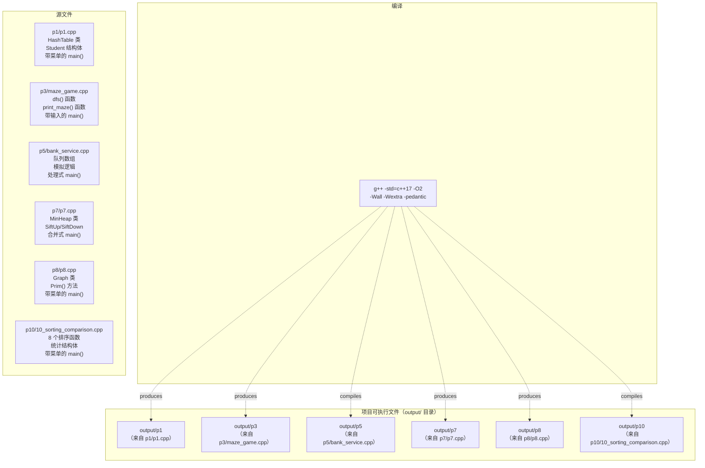
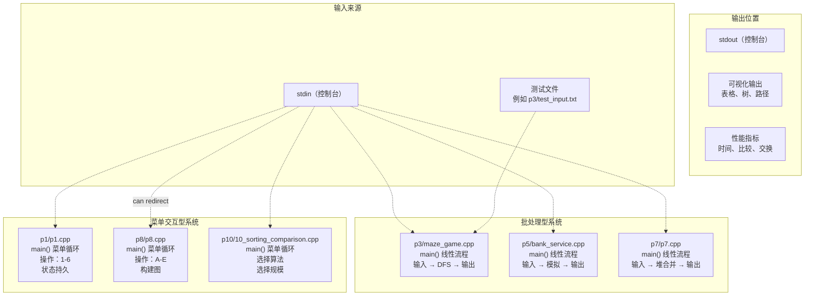
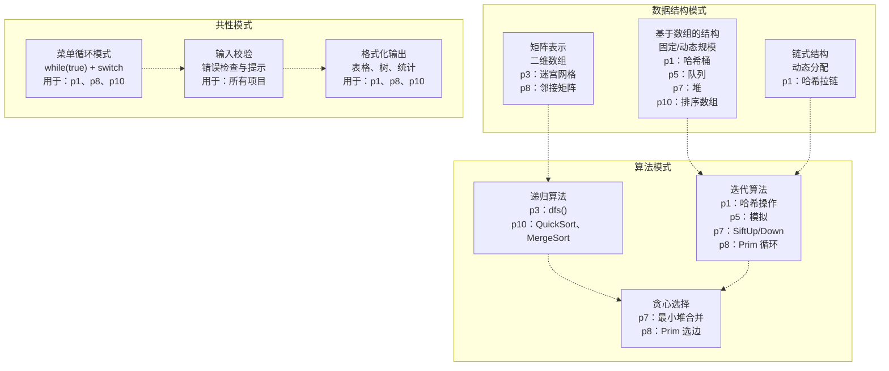

# 项目概览

> **相关源文件**
> * [README.md](https://github.com/lilong555/DataStruct/blob/660fbbaa/README.md)

本页面对 DataStruct 仓库中的 6 个项目进行总体对比与分类。每个项目都是一个独立的课程设计练习，通过控制台程序演示不同的数据结构与算法。各项目的详细说明请参见对应 Wiki 页面：[Project 1](项目一-考试报名系统.md)、[Project 3](项目三-勇闯迷宫游戏.md)、[Project 5](项目五-银行业务模拟.md)、[Project 7](项目七-修理牧场（最小花费）.md)、[Project 8](项目八-电网建设造价模拟.md)、[Project 10](项目十-排序算法比较.md)。所有项目通用的构建说明请参见 [Getting Started](快速开始.md)。跨项目的数据结构与算法参考请参见 [Data Structures Reference](数据结构参考.md) 与 [Algorithms Reference](算法参考.md)。

## 项目目录

本仓库包含 6 个项目，分别实现不同的数据结构与算法概念：

| 项目 | 目录 | 文件 | 中文名称 | 英文名称 | 主要数据结构 | 主要算法 |
| --- | --- | --- | --- | --- | --- | --- |
| **P1** | `p1/` | `p1.cpp` | 考试报名系统 | Exam Registration System | 哈希表（拉链法） | 基于哈希的 CRUD 操作 |
| **P3** | `p3/` | `maze_game.cpp` | 勇闯迷宫游戏 | Maze Game | 二维数组、访问标记数组 | DFS（深度优先搜索）+ 回溯 |
| **P5** | `p5/` | `bank_service.cpp` | 银行业务 | Bank Service Simulation | 队列 | 基于规则的顾客分流与调度 |
| **P7** | `p7/` | `p7.cpp` | 修理牧场 | Repair Ranch (Minimum Cost) | 最小堆（数组实现） | 哈夫曼式贪心合并 |
| **P8** | `p8/` | `p8.cpp` | 电网建设造价模拟系统 | Power Grid Cost Simulation | 图（邻接矩阵） | Prim 最小生成树 |
| **P10** | `p10/` | `10_sorting_comparison.cpp` | 排序算法比较 | Sorting Algorithm Comparison | 数组 | 8 种排序算法 + 性能统计 |

**来源：**[README.md L1-L56](https://github.com/lilong555/DataStruct/blob/660fbbaa/README.md#L1-L56)

## 代码组织与文件结构

所有项目都采用扁平化组织结构：每个项目在独立目录中自包含。编译系统在所有项目之间保持一致。



**标题：**项目编译与构建产物结构

**来源：**[README.md L16-L40](https://github.com/lilong555/DataStruct/blob/660fbbaa/README.md#L16-L40)

## 数据结构实现映射

每个项目实现一种特定的数据结构，并服务于不同的使用场景。下表将具体实现细节映射到代码实体。

| 项目 | 数据结构 | 实现细节 | 关键代码实体 | 容量/规模限制 |
| --- | --- | --- | --- | --- |
| **P1** | 哈希表 | 拉链法：链表处理冲突，997 个桶（质数） | `HashTable` 类、`Student` 结构体、`hash()` 函数 | 固定 997 桶数组 |
| **P3** | 二维网格 + 栈 | 迷宫网格数组、访问标记数组、递归隐式栈 | `maze[][]` 数组、`visited[][]` 数组、递归 `dfs()` 函数 | 用户指定 行×列 |
| **P5** | 两个队列 | A/B 两窗口分别队列，数组实现 | `queueA[]`、`queueB[]` 数组，`frontA/rearA/frontB/rearB` 下标 | 固定最大容量 |
| **P7** | 最小堆 | 1 下标数组二叉堆 | `MinHeap` 类、`heap[]` 数组、`SiftUp()`、`SiftDown()` 方法 | 随输入 N 动态变化 |
| **P8** | 邻接矩阵 | 带权图的稠密矩阵表示 | `Graph` 类、`edges[][]` 矩阵、`vertices[]` 数组 | 最大 100 个顶点 |
| **P10** | 数组 | 针对不同排序算法的多种数组用法 | 原始数组 `int arr[]`、归并/基数的临时数组 | 规模：100 到 100000 |

**来源：**[README.md L1-L56](https://github.com/lilong555/DataStruct/blob/660fbbaa/README.md#L1-L56)

## 算法复杂度分析

下表对各项目的时间与空间复杂度特征进行对比：

| 项目 | 主要操作 | 时间复杂度 | 空间复杂度 | 算法类型 |
| --- | --- | --- | --- | --- |
| **P1** | 哈希插入/查找/删除 | 平均 O(1)，最坏 O(n) | 拉链总计 O(n) | 哈希 + 冲突处理 |
| **P3** | DFS 迷宫寻路 | O(V + E) = O(行 × 列) | `visited` 为 O(行 × 列) | 图遍历 + 回溯 |
| **P5** | 队列模拟 | O(N) 线性处理 | 队列存储 O(N) | 顺序处理 + 调度规则 |
| **P7** | 堆合并操作 | 总计 O(N log N) | 堆数组 O(N) | 贪心 + 堆 |
| **P8** | Prim 构造 MST | 邻接矩阵为 O(V²) | 矩阵 O(V²) | 贪心图算法 |
| **P10** | 多种排序算法 | O(N²) 到 O(N log N) | O(1) 到 O(N) | 比较类/非比较类排序 |

### P10 排序复杂度详情

项目十同时实现多种复杂度层级不同的算法：

| 算法 | 平均时间复杂度 | 最坏时间复杂度 | 空间复杂度 | 稳定性 |
| --- | --- | --- | --- | --- |
| BubbleSort | O(N²) | O(N²) | O(1) | 是 |
| SelectionSort | O(N²) | O(N²) | O(1) | 否 |
| InsertionSort | O(N²) | O(N²) | O(1) | 是 |
| ShellSort | O(N log N) ~ O(N²) | O(N²) | O(1) | 否 |
| QuickSort | O(N log N) | O(N²) | O(log N)（栈） | 否 |
| HeapSort | O(N log N) | O(N log N) | O(1) | 否 |
| MergeSort | O(N log N) | O(N log N) | O(N) | 是 |
| RadixSort | O(d × N)，d 为位数 | O(d × N) | O(N + k) | 是 |

**来源：**[README.md L42-L50](https://github.com/lilong555/DataStruct/blob/660fbbaa/README.md#L42-L50)

## 交互模式分类

项目遵循两种不同的交互范式，从而决定了用户体验与使用场景。



**标题：**用户交互模式与 I/O 流程

### 菜单交互型系统

**P1、P8、P10** 实现了可持续的交互会话：

* **P1**（`p1.cpp`）：菜单 1-6：插入、删除、查找、修改、统计、退出
* **P8**（`p8.cpp`）：菜单 A-E：创建顶点、添加边、构造 MST、显示、退出
* **P10**（`10_sorting_comparison.cpp`）：菜单：选择算法、选择规模、对比模式

这类系统会在多次操作之间保持状态，允许用户逐步构建数据结构并反复执行操作。

### 批处理型系统

**P3、P5、P7** 遵循“输入 → 处理 → 输出”的线性流程：

* **P3**（`maze_game.cpp`）：读取迷宫规模与地图，执行 DFS，输出路径
* **P5**（`bank_service.cpp`）：读取顾客编号，模拟排队处理，输出完成顺序
* **P7**（`p7.cpp`）：读取木头长度，执行基于堆的合并，输出最小花费

这类系统通常一次性读入全部输入，完成一次计算后结束程序。

**来源：**[README.md L42-L50](https://github.com/lilong555/DataStruct/blob/660fbbaa/README.md#L42-L50)

## 输入/输出规范

下表列出了各项目的输入输出要求：

| 项目 | 输入格式 | 输出格式 | 示例命令 |
| --- | --- | --- | --- |
| **P1** | 初始：人数 + 记录；菜单：操作码 + 数据 | 考生表格、操作结果、统计信息 | `./output/p1` |
| **P3** | 迷宫行列；迷宫矩阵（0/1）；起点坐标；终点坐标 | 迷宫可视化（含路径标记）；路径坐标或“无路径” | `./output/p3 < p3/test_input.txt` |
| **P5** | 单行：`N id1 id2 ... idN` | 业务完成顺序（顾客编号） | `./output/p5` |
| **P7** | N；N 个木头长度 | 最小总花费（整数） | `./output/p7` |
| **P8** | 菜单交互：顶点名；边信息 | MST 边与权值；总造价 | `./output/p8` |
| **P10** | 菜单选择：算法编号；数据规模 | 统计信息：时间（ms）、比较次数、交换次数 | `./output/p10` |

**来源：**[README.md L42-L50](https://github.com/lilong555/DataStruct/blob/660fbbaa/README.md#L42-L50)

## 编译系统

所有项目使用相同的编译参数以保证行为一致并进行统一优化。编译命令见 [README.md L23-L28](https://github.com/lilong555/DataStruct/blob/660fbbaa/README.md#L23-L28)。

### 编译参数

```
g++ -std=c++17 -O2 -Wall -Wextra -pedantic <source> -o <output>
```

| 参数 | 目的 |
| --- | --- |
| `-std=c++17` | 启用 C++17 语言标准特性 |
| `-O2` | 二级优化（平衡编译耗时与运行性能） |
| `-Wall` | 启用常见告警 |
| `-Wextra` | 启用额外告警检查 |
| `-pedantic` | 严格遵循 ISO C++ 标准 |

### 特殊约束：项目十

项目十有一个特殊的教学约束：仅允许使用三个标准库头文件（`iostream`、`cmath`、`cstring`），如 [README.md L50](https://github.com/lilong555/DataStruct/blob/660fbbaa/README.md#L50-L50) 所述。

这会迫使开发者手动实现所需的数据结构，而不是直接使用 `std::vector`、`std::priority_queue` 等 STL 容器。

**来源：**[README.md L16-L50](https://github.com/lilong555/DataStruct/blob/660fbbaa/README.md#L16-L50)

## 跨项目代码模式分析

尽管各项目相互独立，但它们在实现模式与编码习惯上存在共性。



**标题：**跨项目的共性实现模式

**来源：**[README.md L1-L56](https://github.com/lilong555/DataStruct/blob/660fbbaa/README.md#L1-L56)

## 教学顺序与复杂度

项目按顺序安排，以逐步提升算法与实现复杂度：

| 顺序 | 项目 | 概念难度 | 实现复杂度 | 认知负担 |
| --- | --- | --- | --- | --- |
| 1 | **P1** - 哈希表 | 中等 | 低~中 | 基础数据结构 + 冲突处理 |
| 2 | **P5** - 队列模拟 | 低 | 低 | 线性结构 + 规则逻辑 |
| 3 | **P3** - 迷宫 DFS | 中~高 | 中 | 递归、回溯、状态管理 |
| 4 | **P7** - 最小堆 | 中等 | 中 | 数组中的树结构、堆性质 |
| 5 | **P8** - Prim 最小生成树 | 高 | 高 | 图表示、贪心算法 |
| 6 | **P10** - 排序对比 | 很高 | 很高 | 多算法实现 + 性能分析 |

### 技能成长路径

项目顺序对应的能力逐步进阶如下：

1. **P1**：线性结构、哈希、CRUD、菜单系统
2. **P5**：队列操作、模拟逻辑、优先规则
3. **P3**：图遍历、递归、回溯、状态跟踪
4. **P7**：树结构、堆性质、贪心优化
5. **P8**：复杂图、邻接矩阵、MST 算法
6. **P10**：算法分析、性能统计、经验对比

**来源：**[README.md L1-L56](https://github.com/lilong555/DataStruct/blob/660fbbaa/README.md#L1-L56)

## 构建产物与版本控制

所有编译得到的可执行文件都会放在 `output/` 目录中，并通过 `.gitignore` 从版本控制中排除。这样可以保持仓库整洁，避免二进制文件造成仓库膨胀。

### output/ 目录结构

```markdown
output/
├── p1          # 考试报名系统可执行文件
├── p3          # 勇闯迷宫游戏可执行文件
├── p5          # 银行业务模拟可执行文件
├── p7          # 修理牧场（最小花费）可执行文件
├── p8          # 电网建设造价（MST）可执行文件
└── p10         # 排序算法比较可执行文件
```

编译前需要先创建 `output/` 目录，可使用：

```
mkdir -p output
```

**来源：**[README.md L21-L40](https://github.com/lilong555/DataStruct/blob/660fbbaa/README.md#L21-L40)

## 总结对比矩阵

下表提供一个快速对照，用于比较各项目的关键特征：

| 特征 | P1 | P3 | P5 | P7 | P8 | P10 |
| --- | --- | --- | --- | --- | --- | --- |
| **数据结构** | 哈希表 | 二维数组 | 队列 | 最小堆 | 图 | 数组 |
| **算法** | 哈希 | DFS | 模拟 | 贪心 | Prim 最小生成树 | 8 种排序 |
| **时间复杂度** | 平均 O(1) | O(V+E) | O(N) | O(N log N) | O(V²) | O(N²) 到 O(N log N) |
| **交互方式** | 菜单 | 批处理 | 批处理 | 批处理 | 菜单 | 菜单 |
| **可视化输出** | 表格 | 迷宫图 | 编号序列 | 花费 | 树 | 指标 |
| **状态管理** | 持久 | 单次运行 | 单次运行 | 单次运行 | 持久 | 持久 |
| **输入复杂度** | 高 | 中 | 低 | 低 | 高 | 中 |
| **代码规模估计** | ~500 | ~200 | ~100 | ~300 | ~400 | ~800 |

**来源：**[README.md L1-L56](https://github.com/lilong555/DataStruct/blob/660fbbaa/README.md#L1-L56)
